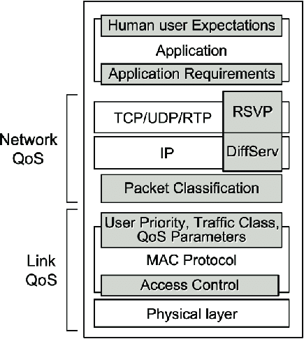

# QoS (Quality Of Service)
The only reason we need QoS is because of one single problem: **network congestion.**
Think of your network connection as a highway.
- Bandwidth is the number of lanes (e.g., a 3-lane highway).
- Data Packets are the cars on that highway.

When the highway is mostly empty, everything is great. All cars (packets) can travel at the speed limit (low delay) and arrive when they're expected.

### The Problem: A Traffic Jam
Congestion is a traffic jam. It's what happens when too many cars try to use the same section of highway at the same time.
This jam causes all the problems:
- **Delay**: Everyone slows down.
- **Jitter**: The traffic is stop-and-go (inconsistent delay).
- **Packet Loss**: The on-ramp gets so backed up that the router (the "traffic cop") has to stop cars from getting on. It just drops them ("Sorry, we're full").

### The "Best-Effort" Model (No QoS)
Now, imagine this highway has no rules. This is the "Best-Effort" model—the default state of the internet.
On this "no-rules" highway, you have:
- An ambulance with a patient (a voice call packet)
- A gravel truck (a file download packet)
- A family car going on vacation (a web browsing packet)

In the "Best-Effort" model, everyone is treated equally. 
You can see the problem: **not all traffic is equally important.**
- The ambulance (voice call) must get there fast, with no stops (low delay, low jitter).
- The gravel truck (file download) doesn't care. It can be late, it can stop and go. As long as all the gravel (data) eventually arrives, it's fine.

### The Solution: QoS (The Traffic Rules)
QoS is simply the "traffic management system" for the highway.
It's the set of **tools and rules** that lets the network stop treating all "cars" equally.

- Classification & Marking: This is the first step. The network "looks" at the cars. It says, "That's an ambulance! That's a gravel truck." It "marks" them (with those DSCP tags we mentioned) so other routers can instantly see what they are.
- Queuing & Prioritization: This is the action. Now that we know what's what, we can create special lanes.
    - We create a high-priority "emergency lane" (a Priority Queue).
    - The router ("traffic cop") is given a simple rule: "Always let the ambulance go first."
    - It will stop sending gravel trucks for a moment to let the ambulance cut the line and go straight through.

That's it. That's the entire concept of QoS from the ground up.

## QoS Parameters: The Metrics
These are the key metrics used to measure the "quality" of your network's performance. When we talk about designing for QoS, we're really talking about how to control these specific values for different types of traffic.
### 1. Delay (or Latency): 
The time it takes for a packet to travel from its source to its destination. High delay is bad for real-time applications like voice calls (you get that annoying lag) or online gaming.

### 2. Jitter: 
The variation in delay. It's not just about the delay, but how consistent that delay is. If packet 1 arrives in 20ms, packet 2 in 80ms, and packet 3 in 30ms, you have high jitter. This is a major problem for voice and video, as it causes robotic-sounding audio or glitchy, stuttering video streams.

### 3. Packet Loss: 
The percentage of packets that are sent but never arrive at the destination. They get dropped along the way, usually due to network congestion (a router's queue is full). For a file download, a lost packet just gets re-sent (TCP handles this), but for a live video call, that packet is gone for good, causing a momentary freeze or artifact.

### 4. Throughput: 
The actual amount of data that can be successfully transferred over a path in a given time. This is the "bandwidth" you actually get, which is often less than the theoretical maximum. You need high throughput for things like 4K video streaming or large file transfers.

### 5. Reliability: 
A broader measure, often combining packet loss and availability (is the network even up?). It's the probability that the network will perform to its expected standard. For a critical satellite link (e.g., emergency services), reliability is paramount.

### 6. Fairness: 
This ensures that different traffic flows get their "fair share" of network resources. Without fairness mechanisms, a single user downloading a huge file could potentially "starve" all other users' traffic, hogging all the bandwidth.

## QoS Layers: Where It Happened
QoS isn't one single thing; it's a set of actions and policies applied at different layers of the network stack.

    

### Application Layer: 
This is where the requirements are born. The application itself (e.g., Netflix, Zoom, your online game) knows what kind of service it needs. A Zoom call knows it needs low delay and low jitter. A background email sync knows it's not time-sensitive. This "service class" (video, voice, data) is the "why" that informs all the QoS actions at the layers below.

### Network QoS (The "Policy" Layer)
This part of the diagram (the top half) is all about the end-to-end strategy. This is where the network classifies traffic and marks it with a policy, mostly happening at Layer 3 (IP).

#### DiffServ (Differentiated Services): 
The most common model. It "marks" packets at the edge of the network with a code (called a DSCP code) in the IP header. Routers in the middle (the "core") don't track individual flows; they just read this simple mark and give the packet the "differentiated" treatment it's supposed to get (e.g., "put this in the high-priority queue"). It's scalable and "coarse-grained."

#### IntServ (Integrated Services): 
An older model that is "fine-grained." Applications would use a signaling protocol (like RSVP) to explicitly reserve a path with guaranteed bandwidth and delay before sending data. It's like booking a private lane on the highway. It provides strong guarantees but is not very scalable and is rarely used on the public internet.

### Link QoS (The "Action" Layer)
This part of the diagram (the bottom half) is all about hop-by-hop enforcement. This is where each router, switch, or (in our case) satellite acts on the policy set by the Network QoS layer.
- This happens at the MAC Protocol layer (Layer 2) and the Physical Layer (Layer 1).
- When a packet with a "Class 1" (high priority) mark arrives at the satellite's transmitter, the MAC Protocol (the scheduler) sees that mark.
- It then uses its Access Control (like its priority queues) to send that "Class 1" packet before the "Class 4" packet.
- This is the "traffic cop" on the highway who sees the ambulance's flashing lights (the DiffServ mark) and waves it into the emergency lane (the priority queue).

## QoS Control Models: The Strategies
These are the overall "philosophies" or "architectures" for how to manage QoS.
### Best-Effort: 
This is the default model of the public internet. There are no guarantees. The network simply tries its "best" to deliver every packet, but if there's congestion, packets get delayed or dropped. It's a "first-in, first-out" free-for-all.
### Integrated Services (IntServ):
As described above, this is the "reservation" model. It provides hard, quantifiable guarantees (e.g., "you will get 2 Mbps with <50ms delay"), but it requires complex signaling (RSVP) and every router in the path to manage the "state" of every single reserved flow.

### Differentiated Services (DiffServ):
As described above, this is the "classification" model. It's more scalable because it doesn't manage individual flows, but rather broad "classes" of traffic (e.g., "Voice," "Video," "Background"). It provides "soft" guarantees or prioritization rather than hard reservations. This is the most widely deployed model.

### SLA-based:
This isn't a technical model like the others, but a business model. An SLA (Service Level Agreement) is a contract between a provider and a customer that defines the QoS parameters you are paying for (e.g., "we guarantee 99.9% uptime and <100ms delay for your premium traffic"). The provider then uses technical models like DiffServ to implement and enforce the promises made in that SLA.

# Scheduling And Routing Mechanisms
First, let's get the core difference clear:
- Routing is the "GPS." It chooses the entire path (which roads) a packet will take to get from A to B. It works at the Network Layer (Layer 3).
- Scheduling is the "traffic cop." It manages the moment-to-moment traffic at a single, congested intersection (like a router or a satellite gateway). It works at the MAC Layer (Layer 2).

You need both for QoS: A great router (GPS) might pick a path that avoids major traffic jams. But when you do hit a congested intersection on that path, you need a smart scheduler (traffic cop) to see your "ambulance" (voice packet) and wave you through the line.

## Scheduling Types & Rulebook
The scheduler is the component (e.g., in the satellite gateway) that has all the packets waiting to be sent over the radio link. It has to decide: Which packet goes next?

### Fixed vs. Dynamic
- **Fixed**: A "dumb" scheduler. It gives each user or traffic type a fixed, pre-assigned slot. It's like a traffic light on a rigid timer.
    - **Problem**: It's very inefficient. A slot for "User A" might be empty, but "User B" (who has an urgent packet) still has to wait for their turn.
- **Dynamic**: A "smart" scheduler. It adapts to the traffic in real-time.
    - **Analogy**: This is a traffic cop who sees the ambulance (priority packet) and immediately changes the lights to let it through. This is essential for satellite networks where user demand and radio conditions change every millisecond.

### Specific Scheduling Algorithms (Rulebooks)
These are the "rules" the dynamic scheduler follows:

### 1. Priority Queue (PQ):
* What it is: The "Ambulance First" rule. The scheduler has multiple queues (e.g., High, Medium, Low). It will always send all packets from the High queue before even looking at the Medium queue.
* QoS Impact: Amazing for low latency (voice calls in the High queue go now).
* Trade-off: Can cause "starvation." If the High queue is always full of voice packets, the "Low" queue (e.g., your file download) might never get a turn.

### 2. Round Robin (RR):
* What it is: The "Super Fair" rule. The scheduler takes one packet from Queue 1, then one from Queue 2, then one from Queue 3, and repeats.
* QoS Impact: Very fair, no starvation.
* Trade-off: Terrible for latency. The "ambulance" in Queue 1 has to wait for the "gravel trucks" in Queues 2 and 3 to take their turn.

### 3. Weighted Fair Queuing (WFQ):
* What it is: The "Smart & Fair" compromise. This is the most common and important one. It's a "weighted" Round Robin.
*  Analogy: The cop's rulebook says, "Let 5 cars from the High queue go, then 3 cars from the Medium queue, then 1 car from the Low queue. Repeat."
*  QoS Impact: This is the best of both worlds. It guarantees the high-priority traffic gets the most bandwidth (throughput) and better latency, while still ensuring the low-priority traffic eventually gets to go (no starvation). It balances throughput, latency, and fairness.

### 4. Admission Control & Resource Reservation
* What it is: This is the "bouncer" at the club door, or the cop at the on-ramp to the highway.
* How it works: Before a new call or video stream is even allowed onto the network, "Admission Control" checks: "Do we have enough resources (bandwidth, scheduling capacity) for this new flow?"
* QoS Impact: If the network is already full, it rejects the new call ("Sorry, we're at capacity") before it can get on and ruin the quality for everyone else. This is a proactive QoS tool that prevents the scheduler from being overwhelmed.

## Routing Types
Routing is about picking the best path through the network. In a satellite network, this could mean routing traffic from a user terminal to Gateway A instead of Gateway B.
- Static: The "Printed Map" rule. The path from A to B is always the same, manually programmed by an administrator.
    * Pro: Simple, predictable.
    * Con: It's "dumb." It will send you straight into a 10-mile traffic jam (congestion) or right into a "road closed" sign (a network failure) because it can't adapt.
- Adaptive (or Dynamic): The "Waze/Google Maps" rule. The router adapts to changing network conditions. This is the standard for modern networks. Sub-types include:
    * Load-aware: The "GPS" sees a traffic jam (high load) on Highway A, so it re-routes you to Highway B, which is currently less congested.
    * QoS-aware: This is the "premium" GPS. You tell it, "I need a route with < 50ms latency" (for your voice call). The router will specifically find a path that meets this QoS requirement, even if it's not the shortest path. It might pick a longer path (in distance) if it knows that path has faster, less-congested routers.

### The Trade-offs
This is the most important concept. You can't have perfect everything.

- Latency vs. Throughput: You often have to choose.
    - A path with the absolute lowest latency (a winding shortcut) might be very narrow and thus have low throughput (can't fit many cars).
    - A path with the highest throughput (an 8-lane superhighway) might have more traffic and stops, giving it higher latency.

- Latency vs. Fairness:
    - Strict Priority Queuing gives perfect low latency to the "ambulance" but is terribly unfair to the "gravel truck" (which starves).
    - Round Robin is perfectly fair but gives terrible latency to the "ambulance."
    - Weighted Fair Queuing (WFQ) is the trade-off between them.

# 3GPP QoS Framework
This is the "law" of 5G QoS. It's all about classifying traffic into standardized profiles.

### 5QI (5G QoS Identifier): 
This is the most important concept. A 5QI is simply a number (e.g., 1, 5, 9, 83) that acts as a shortcut or profile for a whole set of QoS rules. Instead of signaling "I need < 100ms latency, < 1% packet loss, etc." every time, the network just says, "This is 5QI 1 (VoIP)." The gNB (base station) and UPF (router) instantly know the rules for 5QI 1.
    - This is 3GPP's way of implementing the DiffServ model we discussed. The 5QI is the internal 3GPP "class," which later gets mapped to the DiffServ "sticker" (DSCP mark) for the wider internet.
     
### GBR vs. Non-GBR Flows: 
This is the first major split.

#### GBR (Guaranteed Bit Rate): 
This is for traffic that is unusable without a minimum speed. Think video streaming or a VoIP call. You must be guaranteed (for example) 100 kbps, or the call drops. These are high-priority 5QIs.

#### Non-GBR (Non-Guaranteed Bit Rate): 
This is for "best-effort" traffic. Think web browsing or email. The network will try its best, but there's no promise of a specific speed. If the network is congested, this is the first traffic to get slowed down.

## End-to-End QoS
This is how the "policy" is communicated and set up for you. It's the "head office" that assigns your traffic profile.
- AMF (Access and Mobility Function): The "gatekeeper." It handles you (authentication, mobility). It's not directly involved in the data flow, but it's the first point of contact.
- SMF (Session Management Function): The "policy brain." When you start an application (like a video call), the SMF is what decides your QoS. It's the "head office" that says, "This is a video call, I'm assigning it a GBR flow with 5QI 2."
- UPF (User Plane Function): The "data enforcer/router." This is the actual gateway your packets flow through (our "GPS"). The SMF commands the UPF, telling it, "For this user's video session, enforce the 5QI 2 rules and route the packets toward this destination."

This end-to-end flow is critical: The SMF decides the policy, and the UPF (for routing) and the gNB (for scheduling) enforce it.

## 3GPP Scheduling
This is the "action" layer, where the gNB (base station) scheduler manages the actual radio resources to enforce the 5QI.

### Terrestrial 5G (Normal):

#### gNB Scheduler: 
This is our "traffic cop." It sees all the packets from different users waiting to be sent. It looks at their 5QI (the "priority") and uses WFQ (Weighted Fair Queuing) or a similar algorithm to decide which packet goes next. GBR packets (like 5QI 1) always get to cut the line.

#### HARQ (Hybrid ARQ): 
This is a super-fast feedback loop. The gNB sends a packet, and the phone immediately (within milliseconds) sends back an "ACK" (got it!) or "NACK" (I missed it!). If it gets a NACK, the gNB re-sends it right away.

#### RLC/PDCP Buffering: 
These are higher-layer buffers that hold data, manage retransmissions (if HARQ fails), and put packets in the right order.

### NTN Adaptations (The Big Change):

#### The Problem: 
The speed of light. For a GEO satellite, the Round Trip Time (RTT) isn't a few milliseconds; it's ~540ms.

#### NTN Adaptation 1 (HARQ-less): 
- The standard HARQ feedback loop is unworkable. By the time the "NACK" got back to the satellite, the gNB would have sent thousands of other packets. This is "HARQ stalling."
- The solution is often HARQ-less operation. The gNB scheduler disables this fast feedback. It either 
a. sends the data with much stronger error correction (hoping it gets there the first time) or 
b.  relies on the slower, higher-level RLC/PDCP buffers to handle retransmissions. This is a massive change in how the radio is managed.
#### NTN Adaptation 2 (Huge Buffers): 
Because the acknowledgment for a packet takes so long (~540ms), the scheduler needs to have enormous RLC/PDCP buffers to hold all the data that is "in-flight" but not yet confirmed as received.

## 3GPP Routing
This is how the UPF (the "enforcer") chooses the path for the data. For NTN, this is where it gets really interesting.

### UPF Policy Routing: 
The SMF still tells the UPF what to do. The UPF's job is to route the packets to the right NTN Gateway (the big ground station) that talks to the satellite.

### The Big Split: "Transparent" vs. "Regenerative"

#### Transparent ("Bent-Pipe"): 
The satellite is just a "mirror in the sky." It does no processing. The 5G signal goes from the gNB on the ground, bounces off the satellite, and goes down to the user.

- Routing: All routing decisions are made on the ground by the UPF.
- Scheduling: The scheduler (the "traffic cop") is on the ground in the gNB. It's just dealing with a very long delay.

#### Regenerative ("Onboard Processing"): 
This is the game-changer. The satellite is the gNB.
- Scheduling: The scheduler (the "traffic cop") is onboard the satellite. It manages its own radio beams and queues directly.
- Routing: This is the most important part. A regenerative satellite can have Inter-Satellite Links (ISLs)—lasers connecting it to other satellites. Now, the UPF on the ground might just send the data up to the satellite network, and the satellites themselves can route the traffic in space (e.g., from a satellite over Europe to one over North America) before sending it back down. This is true "QoS-aware routing" in space.

# DVB QoS Framework
This is the DVB equivalent of 3GPP's 5QI framework, but it's more of a business and operational model than a rigid technical standard.

### SLA and Service Profiles: 
This is the heart of DVB QoS. Instead of a standardized 5QI 1 (like in 3GPP), a satellite operator creates a custom "Service Profile" (e.g., "Gold_VoIP," "Premium_Video," "Bronze_Data"). This profile is defined in the SLA (Service Level Agreement) sold to the customer. The profile defines the rules:
- Priority: "Gold" traffic goes before "Bronze" traffic.
- Rate: It defines the guaranteed (like GBR) and maximum speeds.
- Scheduling: It even defines how the scheduler should treat this traffic (which we'll see in the next section with RBDC/VBDC).

### QoS Enforcement via NMC/NCC:
- NMC (Network Management Center): This is the "head office." It's the business-level dashboard where the operator creates and provisions the "Gold_VoIP" SLA for a customer.
- NCC (Network Control Center): This is the "operational brain" or "gateway controller." It's the technical component that receives the policy from the NMC. When your terminal (VSAT) logs on, the NCC is what tells the gateway scheduler: "This user is on the 'Gold_VoIP' plan. Enforce those rules for them."

The key is that the DVB gateway reads the DiffServ (DSCP) marks on the incoming IP packets (just like 3GPP) and maps them to the user's contracted "Service Profile."

## DVBs Scheduling
This is the core of DVB-RCS2's QoS and the main area of complexity. It's focused on DAMA (Demand Assigned Multiple Access)—a "smart" dynamic scheduler where terminals request bandwidth when they need it, instead of having a fixed slot.

### DAMA Mechanisms (The "Rulebook"): 
These are the methods a terminal uses to ask the NCC for bandwidth.

#### RBDC (Rate Based Dynamic Capacity): 
This is for GBR-like, streaming traffic (VoIP, video conferencing). The terminal (VSAT) sends a small "heartbeat" request to the NCC saying, "I continue to need 100 kbps for this voice call." The NCC reserves this capacity for them in the schedule.

#### VBDC (Volume Based Dynamic Capacity): 
This is for Non-GBR, bursty traffic (web browsing). The terminal monitors its own buffer, and when it fills up with data, it sends a one-time request to the NCC saying, "I have a 5MB volume of data to send." The NCC finds a slot for that burst and sends back the assignment.

#### CRA (Continuous Rate Assignment) 
which is a permanent reserved rate, like a GBR flow that never stops.

### Centralized vs. Distributed Scheduling:

#### Centralized (Standard DVB-RCS): 
This is the "hub-centric" model. The NCC (on the ground) is the only "traffic cop." All terminals send their RBDC/VBDC requests up to the satellite and down to the NCC. The NCC then creates a master schedule and beams it back up to the satellite for all terminals to see.

- Pro: Very smart and efficient (the NCC sees everything).
- Con: Very high delay. A request takes one full satellite hop (~540ms) just to ask, and another hop to get the answer.

#### Distributed: 
(Used in more advanced systems). The "traffic cop" logic is partially (or fully) onboard the satellite or even at the terminals. This is much faster as it cuts out the "mother-may-I" hop to the ground.

## DVBs Routing
This is directly analogous to the 3GPP NTN model, but with DVB-specific names.

### Hub-centric Routing (Transparent): 
This is the "bent-pipe" model. The satellite is just a "mirror." All traffic must go from the user up to the satellite, down to the central hub/NCC (where the "GPS" router is), and then (if going to another user) back up to the satellite and down to the destination user. This is a "double-hop," which is terrible for latency.

### OBP-based Onboard Routing (Regenerative):
This is the game-changer. The satellite has On-Board Processing (OBP). It is the router. A user's packet goes up to the satellite, the OBP itself reads the packet's destination, and routes it directly back down to the destination user. This is a "single-hop" and is the key to low-latency DVB networks.

## QoS Control Tools
This is a key feature of DVB-S2X, where QoS isn't just about queuing, but about link survival.

### ACM (Adaptive Coding and Modulation): 
This is a brilliant "physical layer" QoS tool.

#### MODCOD: 
A "Modulation and Coding" pair (e.g., 8PSK 3/4) is like the "gear" your modem is in. A high gear (like 32APSK) gives high speed but is very sensitive to noise (like rain). A low gear (like QPSK 1/2) is slow but very robust.

#### ACM (The "Automatic Transmission"): 
The system constantly monitors the link quality (e.g., signal-to-noise ratio). When it starts to rain at your terminal (this is called rain fade), the signal gets weaker. The ACM automatically shifts your link to a lower, more robust MODCOD (e.g., from 32APSK down to 8PSK).

#### QoS Impact: 
Your peak speed (throughput) drops, but your connection stays alive and your packet loss stays near zero. This preserves the quality of service (especially for a voice call) by sacrificing maximum speed for reliability.

# Comparison: 3GPP NTN Vs. DVBs QoS

| Feature | 📱 3GPP NTN (5G) | 📡 DVB-S2X / RCS2 |
| :--- | :--- | :--- |
| **QoS Policy (The "Law")** | **5QI (5G QoS Identifier):** A *standardized* set of numbers (1-255). 5QI 1 *always* means "VoIP." This is integrated into the 5G Core. | **SLA / Service Profiles:** *Custom-defined* by the satellite operator (e.g., "Gold," "Silver"). Flexible, but not standardized between operators. |
| **Policy "Brain" (The "Enforcer")** | **5G Core (SMF & UPF):** The **SMF** (policy brain) *instructs* the **UPF** (router) and **gNB** (scheduler) on which 5QI rules to enforce. | **NMC / NCC (Network Control Center):** The **NMC** (business tool) provisions the SLA, and the **NCC** (technical brain) enforces it at the gateway. |
| **Scheduling (The "Traffic Cop")** | **gNB Scheduler:** A highly dynamic scheduler (like **WFQ**) at the gNB (base station) that classifies flows by their 5QI and manages radio resources. | **DAMA (Demand Assigned Multiple Access):** A *request/grant* system. Terminals must *ask* the NCC for bandwidth using **RBDC** (for GBR) or **VBDC** (for Non-GBR). |
| **Routing (The "GPS")** | **UPF-based:** The **UPF** is the main router. It routes user traffic to the correct NTN gateway on the ground, based on 5G Core policies. | **Hub-centric:** The default model. All traffic *must* go from the user to the central hub/NCC on the ground first, even if the destination is nearby. |
| **Advanced Routing (Regenerative)** | **Onboard gNB / ISLs:** The satellite *is* the gNB. It can route traffic directly (single-hop) or use **Inter-Satellite Links (ISLs)** to route in space, all managed by the 5G Core. | **Onboard OBP / ISLs:** The satellite *is* the router. It can perform a "single-hop" to another user or use **ISLs**. This breaks the "hub-centric" model. |
| **Link Adaptation (QoS "Action")** | **RLC/PDCP Buffering:** Relies on large buffers and retransmission timers at higher layers (RLC/PDC) to handle packet loss, especially in HARQ-less NTN. | **ACM / MODCOD:** The gold standard. *Proactively* changes the link's "gear" (MODCOD) to maintain a robust link (low packet loss) during rain fade, sacrificing peak speed. |

## Key Differences
- Standardization vs. Customization: 3GPP's QoS is rigidly standardized with the 5QI framework. This is essential so a 5G phone can roam on any 5G NTN network and get the same QoS. DVB's QoS is operator-defined via SLAs, making it flexible but proprietary.
- Scheduling Philosophy:
    - 3GPP (gNB Scheduler): Acts like a "smart traffic cop" managing a real-time flow. It's constantly looking at its queues (sorted by 5QI) and making instant decisions.
    - DVB (DAMA): Acts like a "meeting scheduler." Terminals have to book a time slot (request bandwidth) and wait for the NCC to grant it in the master schedule. This is inherently slower due to the request/grant cycle.
- Core Architecture:
    - 3GPP NTN is an extension of the 5G Core. The "smarts" (SMF/UPF) are deep in the mobile network. The satellite is just another "radio access type" (like Wi-Fi or 4G) from the core's perspective.
    - DVB-RCS2 is gateway-centric. The "smarts" all live in the NCC at the main ground station. The entire system is built around this hub.

---
---
# Routing and Scheduling Interaction under Delay & Mobility
In LEO / GEO satellite networks (especially DVB-RCS2 and 3GPP NTN systems), routing and scheduling are deeply interdependent because:
- Mobility changes link availability.
- Long RTT (Round Trip Time) affects feedback and control loops.
- Dynamic topology causes routing tables to age faster, requiring adaptive algorithms.

## 1. Routing with dynamic topology
### 3GPP NTN: Delay-Compensated Routing (Path Stability Metric)
In 3GPP NTN (especially for LEO), user terminals or gateways may connect through satellites that move rapidly (~7.5 km/s). Routes between nodes can change every few seconds [3gpp2025ts38300].

#### Key Ideas:
- Routing needs to account for path stability, not just shortest delay: metrics may include link lifetime (visibility window), Doppler/variation, and queueing delays. For example, virtual topology based routing uses predictability of satellite orbits [s22124552]. 
- Routing protocols (e.g., modified OLSR or AODV) incorporate future visibility windows of satellites (when a satellite will be in view of a ground terminal).

#### Effect on scheduling
Stable routes allow more consistent slot reservation or HARQ timing, improving throughput under large RTT. Example formula (simplified):

$$\text{Path Stability} = f(\text{Link Lifetime},
\text{Delay Variance}, \text{Doppler})$$

The higher the stability, the more likely that route is chosen even if delay is slightly longer.

### DVB-RCS2: Transparent vs Regenerative Routing
#### Transparent payload:
- The satellite only forwards signals (no on-board routing).
- Centralized routing — done on the ground (Network Control Center / NCC).
- All routing decisions depend on gateway visibility and ground network state.
- Downside: high signaling latency (especially for GEO).

#### Regenerative payload:
- The satellite includes an on-board processor (OBP) capable of demodulating and rerouting packets.
- Enables distributed routing, e.g., inter-satellite links (ISL) or local switching.
- Can use dynamic link-state routing onboard (similar to OSPF extensions).
- Advantage: reduces RTT for routing decisions and supports faster handovers.

#### Interaction:
- Transparent mode: scheduler waits for NCC instructions → slower reaction to topology change.
- Regenerative mode: scheduling adapts locally → better QoS and throughput under fast mobility.

## Scheduling Under Long RTT
### Predictive Scheduling Using Delay Budget

#### Problem:
RTT between terminal and NCC (in GEO) can be ~500 ms; feedback-based scheduling (like TCP) is too slow.

#### Solution:
- Use predictive scheduling — allocate future slots based on estimated delay budgets and traffic models.
- The scheduler forecasts traffic arrivals for the next 𝑛 frames, and pre-allocates capacity to match expected QoS needs.

#### Delay Budget Breakdown Example:
$$\text{Delay Budget} = D_{\text{propagation}} + D_{\text{queue}} + D_{\text{processing}}$$

Predictive schedulers use this to pre-assign slots before ACKs arrive.

### Slot Allocation Ahead of Feedback
#### Traditional method:
Scheduler waits for user feedback → slow.\

#### Under long RTT:
- System allocates slots ahead of receiving feedback.
- This requires:
    - Statistical modeling of user demand
    - Historical queue length estimation
    - Confidence-based allocation (e.g., allocate 90% of predicted need)

#### DVB-RCS2 Context:
- RBDC (Rate-Based Dynamic Capacity) and VBDC (Volume-Based Dynamic Capacity) already include predictive components.
- NCC uses demand reports + traffic prediction to pre-allocate capacity.

#### Impact:
Enables stable throughput even when acknowledgment cycles are delayed.

## QoS Challenge: Maintaining Stability During Handover
Mobility (especially in LEO constellations) causes frequent satellite handovers every few minutes.

#### Challenges:
- Ongoing sessions (TCP, UDP, VoIP) may lose reserved slots.
- Scheduler and router must synchronize:
    - Route switching (to new satellite)
    - Slot reassignment (on new link)
- QoS degradation: jitter, delay spikes, packet loss.

#### Solutions:

- Make-before-break handover: pre-establish route & slot on next satellite before disconnection.
- QoS-preserving routing: handover prioritizes high-QoS sessions.
- Context transfer protocols: (3GPP uses ATSSS; DVB can use resource map migration).

## Combined View
| Scenario             | Routing Effect               | Scheduling Adaptation                    | Result                     |
| -------------------- | ---------------------------- | ---------------------------------------- | -------------------------- |
| Rapid mobility (LEO) | Frequent path changes        | Predictive slot allocation, quick resync | Reduced session drop       |
| Long RTT (GEO)       | Stable but high delay        | Predictive / pre-allocated scheduling    | Maintains throughput       |
| Hybrid (ISL-enabled) | Distributed routing possible | Onboard scheduling possible              | Lower delay and better QoS |
| Handover events      | New route established        | Slot migration / reallocation            | Smooth QoS transition      |

# Advanced Scheduling Algorithms & Trade-Offs
## 1. Delay-Aware Proportional Fair (DA-PF)
The classical Proportional Fair Scheduling (PF) algorithm aims to balance throughput and fairness, by scheduling users based on current rate relative to average past rate.  In networks with delay or latency constraints, a delay-aware variant (DA-PF) incorporates delay (or queueing delay, head-of-line (HoL) delay) into the scheduling metric.

#### Example:
In OFDMA systems with delay-QoS constraints, PF is analytically studied for throughput‐delay trade-off.
- If you favour delay (serving packets sooner), you may sacrifice throughput-fairness.
- If you favour traditional throughput/fairness, you may incur larger packet delays or miss latency deadlines.

#### For satellite/NTN scenarios:
The long RTT and variation in link quality mean one may adjust PF metric:
$$\text{Scheduling Metric} \propto \frac{R_i(t)}{\overline{R_i(t)}} \times f(D_i(t))$$
where ${R_i(t)}$= instantaneous achievable rate, 
${R_i(t)}$ = past average, and $f(D_i(t))$= a delay-penalty term (e.g., higher weight if queue delay is large).
- Implementation trade-offs: complexity (tracking delays/queues + fairness histories), responsiveness to changing channel/link conditions (especially in NTN), and impact of long feedback loops.

## QoS-Driven Reinforcement Learning Scheduling
- Use of Reinforcement Learning (RL) for scheduling means treating the scheduler as an agent interacting with network state, taking scheduling actions (which user/slot/resource to allocate) and receiving reward based on QoS metrics (delay, throughput, packet-loss, fairness).
- Especially useful when system dynamics are complex: variable channels, mobility, long delays, unpredictable traffic.
- Example in satellite IoT uplink: deep RL for channel & power allocation with QoS constraints.
- Example in wireless cellular: RL scheduler for satisfying QoS in mobile networks.
- Key trade-offs:
    - Training overhead & convergence time vs. performance gains.
    - Real-time applicability: NRA (non-stationary) networks = need for online adaptation.
    - Interpretability: RL policy may be a “black box”, harder to guarantee strict QoS bounds.
    - Exploration vs exploitation: while learning, QoS may degrade.
- For NTN/satellite context: Might incorporate states such as queue lengths, link delays, satellite visibility, handover status; actions include slot assignment, power/modulation, priority classes. Reward could weight delay deadlines and throughput.
- Implementation tips: Pre-train offline if possible; use transfer-learning when switching beams/handover; limit state/action space for tractability.

## Hierarchical Scheduling (Gateway + RCST)
- In the architecture of a satellite interactive system such as DVB‑RCS2, there are multiple layers of scheduling control: at the gateway/hub/NCC and at the terminal (RCST) side.
- “Hierarchical scheduling” means splitting scheduling tasks: e.g., macro-scheduler at the gateway decides large scale resource blocks, while micro-scheduler at each RCST or beam handles local queueing, link adaptation, slot bursts.
- Benefits: scalability (one hub doesn’t micromanage all), better local adaptation (RCST can adapt to local link conditions), allows faster reaction to local changes (e.g., terminal queue changes) while hub ensures network-wide fairness/QoS.
- In DVB-RCS2 standard the architecture: a Gateway RCST (GW-RCST) plus RCSTs; top-level resource control via NCC/hub, local resource allocation via RCSTs. 
DVB
- Trade-offs:
    - Coordination overhead: need signalling between gateway & terminals.
    - Complexity: need algorithms at two levels, ensuring consistency (no conflicting allocations).
    - Delay in uplink scheduling: hub may allocate resources, then RCST assigns to local flows — longer scheduling delay.
    - In satellite context with long RTT: local scheduling helps reduce control delay but may degrade global fairness if not well‐coordinated.
- For NTN/DVB context: you could model hierarchical scheduling as: Gateway schedules per‐beam/terminal quotas ahead of time (given long RTT), RCSTs schedule per-flow within quota, possibly adapting to local queue/backhaul link and mobility/handover events.

# MPLS (Multiprotocol Label Switching)
At its simplest, MPLS (Multiprotocol Label Switching) is a high-performance networking technique for routing traffic.
Think of it as creating a high-speed "highway" or "tunnel" for your data through a complex network.
Instead of every router stopping your data (packet) to read its full destination IP address and check a giant map (the routing table), MPLS gives the packet a simple "label" at the very beginning of its journey.
From then on, every router in the middle just glances at that simple label (like a highway sign) to know exactly where to send it next. This is much faster than doing a full address lookup at every single hop.
It's often called a "Layer 2.5" protocol because it operates between Layer 2 (the Data Link Layer, like Ethernet) and Layer 3 (the Network Layer, like IP).

## Core Idea of MPLS
The core idea of MPLS (Multiprotocol Label Switching) is to stop making complex routing decisions at every hop and instead use a simple "label" to forward packets.
### Think of it this way:
#### Traditional IP Routing: 
Every router has to look at the packet's final destination IP address, search its entire, massive routing table (like a giant address book), and figure out the next hop. This is done at every single router.
#### MPLS: 
The first router in the network (the "edge") does that complex lookup once. It then "labels" the packet. From that point on, all the core routers (the "middle") just look at the simple label (e.g., "Label 25") and forward it based on a much simpler label table (e.g., "If you see Label 25, send it out of interface 3").

This creates a pre-determined, high-speed "tunnel" through the network called a Label Switched Path (LSP).

## Key Elements
There are two main types of MPLS-aware routers:

### LER (Label Edge Router): 
This is the "entry" and "exit" router for an MPLS network.

#### Ingress LER (Entry): 
Its job is to PUSH a label. It receives a standard IP packet, analyzes its destination (and QoS requirements), and attaches the first MPLS label to start its journey on an LSP.

#### Egress LER (Exit): 
Its job is to POP a label. It's the last router in the LSP. It removes the MPLS label and forwards the original IP packet to its final destination.

### LSR (Label Switching Router): 
This is a "core" router inside the MPLS network.
Its job is to SWAP labels. It receives a packet, looks only at the incoming label, checks its table (called the LFIB), and swaps the incoming label for an outgoing label, then forwards it to the next hop in the LSP. It never even looks at the packet's IP address.

## MPLS in NTN (Non-Terrestrial Networks)

This is where it gets interesting. In a modern satellite network (especially a LEO/MEO constellation), the components map directly to MPLS roles.

### LERs (The "Edge"):
- Ground Stations / Gateways: These are the perfect ingress/egress LERs. They connect the terrestrial internet to the space segment. They classify all the ground traffic (web, video, voice) and PUSH MPLS labels onto the packets before beaming them up to a satellite.
- User Terminals (UTs): A sophisticated UT (like on a plane, ship, or military vehicle) could also act as an LER, applying its own labels to prioritize its own traffic.

### LSRs (The "Core"):
- Satellites (with ISLs): In a constellation with Inter-Satellite Links (ISLs), the satellites themselves become the LSRs.
- A satellite receives a packet from another satellite (or a ground station), reads the label, and immediately knows which ISL to forward it to. It just does a fast label SWAP and sends it on.
- This is much faster and more efficient than having each satellite in orbit perform a full IP route lookup for every single packet.

## QoS and Traffic Engineering in NTN

### QoS Mapping (EXP Bits)
The MPLS header has a 3-bit Experimental (EXP) field (now often called the Traffic Class field).

- A packet arrives at the ground station (the Ingress LER).
- The LER inspects the packet's IP header, specifically its DiffServ (DSCP) value (which you know from your QoS studies).
- The LER maps this DSCP value to one of the 8 possible EXP values (since 3 bits = $2^3 = 8$ classes).
    - Example:
        - DSCP EF (Expedited Forwarding, for VoIP) $\rightarrow$ maps to EXP 5 (High Priority)
        - DSCP AF21 (Assured Forwarding, for streaming) $\rightarrow$ maps to EXP 3 (Medium Priority)
        - DSCP 0 (Best Effort) $\rightarrow$ maps to EXP 0 (Low Priority)
- Now, as the packet flies through the satellite constellation (the LSRs), each satellite can use that EXP bit to prioritize traffic. If a link is congested, the satellite's processor will send the EXP 5 packets before the EXP 0 packets, protecting the latency-sensitive voice call.

## How MPLS Enables QoS-aware Routing
Think of a standard IP network (using OSPF or IS-IS) like a GPS set to "shortest distance." It will always send you on the shortest path, even if that path is a two-lane road that's completely gridlocked.
MPLS Traffic Engineering (TE) is like a modern GPS (like Waze or Google Maps) that knows about:
- Live traffic (congestion)
- Road conditions (a link is down)
- Your preferences ("avoid tolls," or in our case, "I need a path with low latency")

MPLS enables this by using pre-established Label Switched Paths (LSPs). Instead of just "hop-by-hop" routing, an LER can choose to send traffic down a specific, pre-built "tunnel" (an LSP) that was explicitly designed to meet certain QoS requirements.

For example, you can build two LSPs to the same destination:
- LSP 1 (The "Short" Path): This is the shortest path, but it's congested. You send all your low-priority (best-effort) web traffic here.
- LSP 2 (The "QoS" Path): This path is 20ms longer, but it's uncongested and has reserved bandwidth. You send all your high-priority VoIP and video conferencing traffic down this tunnel.

This is something you simply cannot do with standard IP routing.

## Constraint-Based Routing (CBR)
This is the "brain" that calculates those smart, QoS-aware paths. Standard routing uses the Shortest Path First (SPF) algorithm. It has only one "constraint": Find the path with the lowest cost (metric).
Constraint-Based Routing (CBR) uses a modified algorithm, usually called CSPF (Constrained Shortest Path First). CSPF is far more powerful. Before it even starts to calculate the shortest path, it first "prunes" the network map, removing any links that don't meet your specified constraints.
- Common Constraints:
    - Bandwidth: "Find a path that has at least 100 Mbps of available bandwidth."
    - Latency/Delay: "Find a path where the total end-to-end delay is less than 50 ms."
    - Affinity (Color): "Only use links that are marked 'secure'" or "Avoid all links marked 'shared'."

So, CSPF first throws away all links that fail your rules, then it runs the shortest-path algorithm on what's left. This is how you find the "shortest path that meets the QoS requirements."

## The Protocols: RSVP-TE vs. Segment Routing (SR-MPLS)
This is how you build the LSPs that CSPF calculates. This is a classic "old way vs. new way" comparison.

### 1. RSVP-TE (Resource Reservation Protocol - TE)
The "Classic" Way.

#### How it works: 
It's "stateful." The head-end router (LER) sends a "PATH" message along the desired path. Each router (LSR) on that path checks if it has the resources (e.g., the 100 Mbps bandwidth you requested). If it does, it "reserves" it and holds that reservation. This message travels to the end, and a "RESV" (Reservation) message is sent back, locking in the path.

#### Analogy: 
It's like calling every single hotel on your road trip in advance to reserve a room and get a confirmation number.

#### Problem: 
Every router in the core network has to maintain the "state" (the reservation) for every single LSP passing through it. In a large network with thousands of LSPs, this creates massive overhead and scaling problems.

### 2. SR-MPLS (Segment Routing - MPLS)
The "Modern" Way.

#### How it works: 
It's "stateless." It uses source routing. The head-end router (LER) decides the entire path from the beginning. It then "steers" the packet by putting a "stack" (a list) of labels on it.

#### Analogy: 
It's like Google Maps giving you a complete list of turn-by-turn directions at the start of your trip. You (the packet) just read the top instruction, and when you complete it, you move to the next one.

#### Mechanism: 
The LER pushes a stack of labels, like [Label 100, Label 200, Label 300].
- The first LSR sees Label 100 (which means "Go to Router X"). It forwards the packet to Router X and pops that label off.
- Router X now sees Label 200 (which means "Go to Router Y"). It forwards to Router Y and pops that label.
- Router Y sees Label 300... and so on.

#### Advantage: 
The core routers (LSRs) don't need to store any "state." They just read the top label and forward. All the intelligence is at the "edge" (the LER). This is vastly more scalable and simple for the core network.

## Application in NTN
This is where all these concepts come together perfectly.

### Dynamic Paths: 
In a LEO constellation, the topology is constantly changing. Satellites are moving at 17,000 mph. Inter-satellite links (ISLs) are continuously forming and breaking. Standard routing can't keep up.

#### Solution: 
You need TE. A central controller (on the ground) can run CSPF every second to calculate the new, optimal, constraint-based paths (e.g., "avoid this high-latency link," "use this new fast link").

### Scalability: 
A LEO constellation might have thousands of satellites (LSRs) and millions of LSPs (user connections).

#### Solution: 
SR-MPLS is the clear winner. You cannot have your resource-constrained satellites maintaining state for millions of RSVP-TE reservations. It's far more efficient to have smart ground stations (LERs) calculate the path (the label stack) and have the satellites (LSRs) just do the simple, stateless label forwarding.

### QoS & Load Balancing: 
You will have some beams/links that are heavily congested (over a city) and others that are empty (over an ocean).
#### Solution: 
CBR and SR-MPLS let you steer traffic intelligently. You can create an LSP for a high-priority government customer that routes them around the congested "city" beam, sending them over the "ocean" path to guarantee their bandwidth and low latency. This is the definition of Traffic Engineering.

In short, MPLS-TE (specifically using Segment Routing) is the key technology that allows you to manage an NTN as a single, intelligent, QoS-aware network instead of just a collection of dumb, "shortest-path" satellites.

# Case Study: Beam Management & MPLS Integration

## What is Beam Management?
In a LEO constellation, you have thousands of satellites moving at ~27,000 km/h. They are only in view of a user on the ground for a few minutes.
Beam Management is the total set of processes used to:
- Point a satellite's focused radio beam (a "spot beam") at a specific user or area on the ground.
- Maintain that connection as the satellite and/or user moves.
- Allocate the satellite's power and frequency resources efficiently across all its beams.
- Manage the "handover" when the user has to switch to a new beam or a new satellite.

## Types of Beam Management

You can group these into three main functions:

### a) Beam Steering (Tracking)
This is the local, physical act of pointing the beam. A modern satellite uses a Phased Array Antenna, which is a flat panel with thousands of tiny antennas. By electronically changing the signal's phase to each antenna, it can "steer" the beam in a specific direction without any moving parts.

#### Purpose: 
To lock onto a User Terminal (UT) on the ground and track it, compensating for the satellite's own rapid movement.

### b) Beam Hopping (Resource Allocation)
A satellite can't light up its entire footprint with full power all at once. Beam Hopping is a technique where the satellite dynamically allocates its resources. It has a set of ground "cells" it can cover, and it "hops" its spot beams between them based on demand.

#### Purpose: 
Efficiency. It spends more time, power, and bandwidth on cells with high traffic (like a city) and less time on cells with low traffic (like the ocean).

###  c) Beam Handover (Mobility Management)
This is the most critical and complex part for LEOs. Because the satellites are moving so fast, a user must be handed off from one beam to another.

#### Intra-Satellite Handover: 
You are connected to Beam 1 on Satellite A. As the satellite moves, you leave the coverage of Beam 1 and are handed off to Beam 2 (still on Satellite A).

#### Inter-Satellite Handover:
You are connected to Satellite A, which is about to set over the horizon. Before it disappears, the network must hand you off to Satellite B, which is just rising. This is the big one.

## Why Beam Management Matters for QoS
This is where everything can go wrong. Beam management is the single biggest threat to QoS in a LEO network.
- Handover = High Jitter & Packet Loss: A slow or badly managed handover is a "break-before-make" event.
1.The link to Satellite A is dropped.
2. Packets for you are lost (black-holed).
3. A new link to Satellite B is established.
4. Traffic resumes. This "break" (even if just milliseconds) is a massive burst of packet loss and jitter. For a VoIP call or video conference, this is catastrophic.
- Beam Hopping = Throughput & Congestion: If the beam hopping algorithm is poor, it's a huge QoS problem.
    - Imagine your "high priority" VoIP traffic (which you've marked with QoS) is destined for a busy city cell. If the beam hopper only gives that cell 1ms of service time every 100ms, your packets will get stuck in a massive queue on the satellite, get delayed, and be dropped. This is congestion-induced packet loss.
- Beam Steering = Link Quality: If the beam steering is imprecise, the beam isn't perfectly centered on the user.
    - This lowers the signal-to-noise ratio (SNR).
    - A low SNR means a high bit error rate.
    - The system has to use stronger (and less     efficient) error correction, which lowers the available data rate (throughput). Or, packets just get corrupted and lost.

## Integration with MPLS
This is the brilliant part. They use the "smarts" of MPLS Traffic Engineering (TE) to solve the "physical" problems of beam management.
The system's central "brain" (like an SDN controller) knows the satellite orbits (which are 100% predictable) and the network state (from MPLS).
Here is the "make-before-break" handover scenario:
### 1. THE EVENT: 
A User Terminal (UT) is connected to a ground station (an LER) via an LSP that goes through Satellite A (an LSR). The network controller knows that in 60 seconds, Satellite A will be out of range and the UT must be handed over to Satellite B.

### THE PREPARATION (MPLS-TE):
- The ground station's LER proactively uses a protocol like SR-MPLS (Segment Routing) or RSVP-TE to calculate and establish a brand new LSP for that user.
- This "New LSP" is explicitly routed from the ground station to Satellite B and then to the user.
- This new path is built and reserved while the user is still actively using the old path.

### THE EXECUTION (QoS-Aware):
- The LER at the ground station is now "holding" two LSPs for the same user:
    - LSP-Old: [... $\rightarrow$ Satellite A $\rightarrow$ User] (Active)
    - LSP-New: [... $\rightarrow$ Satellite B $\rightarrow$ User] (Standby)
- When the handover moment arrives (T-0), the LER performs a seamless switch. It simply stops pushing the user's packets onto LSP-Old and starts pushing them onto LSP-New.
- The (QoS-aware) LER can prioritize this. It first moves the user's high-priority traffic (marked with EXP bit 5 for VoIP) to the new LSP, ensuring zero loss for the critical call. It can then move the best-effort web traffic (EXP 0) a moment later.

This "make-before-break" network switch, orchestrated by MPLS-TE, is what turns a physically disruptive event (losing a satellite) into a seamless, unnoticeable transition for the user, perfectly preserving QoS.

The same logic applies to QoS-aware beam hopping, where the MPLS EXP bit information (classifying traffic as high/low priority) is fed to the beam hopping scheduler, telling it to "hop" to the high-priority cells more often.
