# NTN 

# 3GPP NTN
3GPP NTN integrates satellite components directly into the 5G architecture. The goal is to make the satellite link just another "access type," interchangeable with terrestrial 4G or 5G. 
The primary reference documents are **3GPP TR 38.821** (study on NR to support NTN) and **3GPP TS 38.300** (NR overall description).

## 3GPP NTN Architecture Overview
The basic NTN architecture follows the 5G system model but includes a **space segment** (satellite) between the **User Equipment (UE)** and the **Ground Gateway (gNB / NG-RAN)**. 

  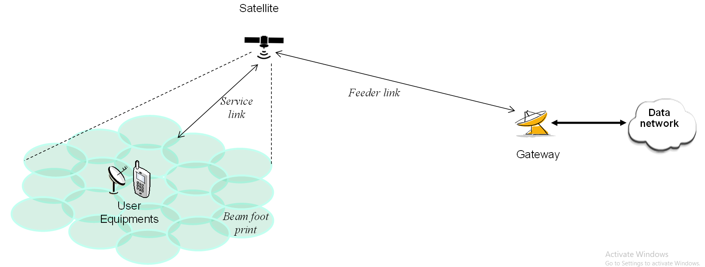
  
<strong>Figure 1.</strong> 3GPP NTN Architecture

- Label Service Link (UE ↔ Satellite)
- Label Feeder Link (Satellite ↔ Gateway)
- Show two modes:
    - Transparent mode: Satellite only forwards signals. All 5G base station (gNB) processing happens on the ground. The radio link (NR-Uu) is simply "bent" over the satellite, creating a very long-range cell.
    - Regenerative mode: Satellite performs gNB or PHY/MAC processing onboard. This allows the satellite to demodulate, decode, and process data in space, enabling lower latency, inter-satellite links, and direct on-board switching.

## NR Protocol Stack Overview
In 3GPP NTN, the radio interface follows the **New Radio (NR)** protocol stack used in terrestrial 5G but with critical adaptations in the lower layers (MAC and PHY) to handle satellite-specific challenges.

  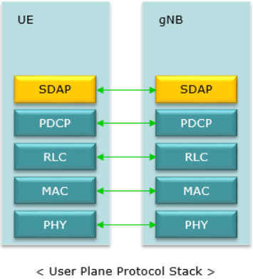
  
<strong>Figure 2.</strong> User Plane Protocol Stack

Here is a quick breakdown of what each layer does, from top to bottom, which explains why the stack is in that order:

### 1. User Plane (U-Plane) 
This plane handles the transmission of user data packets between the User Equipment (UE) and the gNB (gNodeB).
#### SDAP (Service Data Adaptation Protocol)
##### Job: 
This is the top layer, new in 5G. Its one and only job is to map Quality of Service (QoS) flows to a specific "radio bearer."

##### Analogy: 
It's like a mail sorter at a company. It sees a letter marked "Urgent/CEO" (like a voice call) and puts it in the "Express" mailbag, while a letter marked "Newsletter" (like a background update) goes in the "Bulk Mail" bag.

#### PDCP (Packet Data Convergence Protocol)

##### Job: 
This layer gets the data from SDAP and does two main things: 
1) Compresses the IP headers to save space.
2) Ciphers (encrypts) the data for security.

##### Functions: 
Header compression (ROHC), ciphering (security), integrity protection (control plane), sequential delivery, and handling data transfer during handover.

##### Analogy: 
This is the security and packing department. It "vacuum-seals" the mail to make it smaller (compression) and puts it in a "tamper-proof, locked bag" (encryption).

##### NTN Modifications:
Needs adaptation for longer delays and potentially higher error rates. The sequence numbering and reordering functions may need adjustment to be more robust against the high Round-Trip Time (RTT).

#### RLC (Radio Link Control)

##### Job: 
This layer's job is to ensure reliability and handle large packets. It splits large packets into smaller, uniform pieces (segmentation) and, if needed, uses ARQ (Automatic Repeat Request) to re-transmit any pieces that get lost.

##### Modes: 
Transparent Mode (TM), Unacknowledged Mode (UM), and Acknowledged Mode (AM). AM provides ARQ (Automatic Repeat reQuest) for reliable data transfer.

##### Analogy: 
This is the shipping department. It takes a big item (like a bicycle) and "disassembles it" (segmentation) to fit into several small boxes, labeling them "Box 1 of 3," "Box 2 of 3," etc., so they can be reassembled on the other end.

##### NTN Modifications: 
The timer settings for the ARQ mechanism (especially in AM) are significantly affected by the long propagation delay. The retransmission window and timers must be drastically increased to avoid unnecessary retransmissions before a delayed ACK/NACK is received.

#### MAC (Medium Access Control)

##### Job: 
This is the traffic cop. It's responsible for scheduling which user gets to transmit when. It takes the small pieces from the RLC layer (from multiple users) and multiplexes them together into one large transport block to be sent out.

##### Functions: 
Scheduling, logical channel prioritization, error correction via HARQ (Hybrid ARQ), and mapping logical channels to transport channels.

##### Analogy: 
This is the loading dock manager. It looks at all the small boxes for different customers and decides "These 50 boxes fit on the truck that's leaving right now. The next 20 boxes will wait for the next truck."

##### NTN Modifications:
- HARQ: Similar to RLC, the HARQ timing must be modified to account for the long propagation delay. The HARQ process typically relies on rapid feedback; in NTN, the feedback loop is much slower, requiring larger buffers and longer timing parameters.
- Scheduling: Needs to accommodate the satellite's orbital velocity (Doppler shift) and the large coverage area. Scheduling algorithms must predict channel conditions over longer time scales.

#### PHY (Physical Layer)

##### Job: 
This is the physical hardware. It takes the final block of bits from the MAC layer and converts it into a radio signal to be transmitted over the air.

##### Functions: 
Coding, modulation, multi-antenna processing, and frequency/time synchronization

##### Analogy: 
This is the truck and the driver. It's the actual physical transport that moves the goods from one place to another.

##### NTN Modifications:

- Timing Advance (TA): The large and rapidly changing distance to the satellite requires a more dynamic and accurate TA mechanism to ensure uplink transmissions arrive synchronized at the satellite/gNB.
- Doppler Compensation: The high speed of LEO satellites causes significant Doppler shifts, which the PHY layer must accurately estimate and compensate for to maintain coherent communication.

### 2. Control Plane (C-Plane)
This plane handles the signaling between the UE and the network for connection management, security, and mobility.

  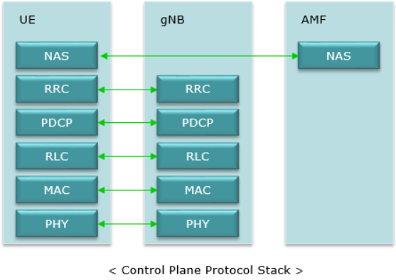
  
<strong>Figure 3.</strong> C-Plane Protocol Stack

This diagram illustrates the 5G NR (New Radio) Control Plane Protocol Stack for the Uu (Air) Interface and its connection to the Core Network.
It shows the layers responsible for signaling and control between the User Equipment (UE), the gNB (Base Station), and the Access and Mobility Management Function (AMF) in the 5G Core Network.

#### RRC (Radio Resource Control):

##### Functions: 
Connection setup/release, broadcast of system information, radio bearer configuration, measurement reporting, and mobility procedures (handover).

##### NTN Modifications: 
RRC procedures must be adapted for satellite-specific mobility scenarios, especially handovers between satellite beams or satellites (Inter-Satellite Links). System Information Blocks (SIBs) may carry satellite-specific parameters.

#### NAS (Non-Access Stratum):

##### Functions: 
Mobility Management (tracking area updates), Session Management (PDU session setup), and security control between the UE and the Core Network (AMF/SMF).

##### NTN Modifications: 
Largely unaffected by the physical layer, as NAS operates end-to-end between the UE and the Core Network. However, long delays in the signaling path may impact the perceived performance of connection setup procedures.

## NTN Topologies + Protocol Stack Placement
The placement of the gNB protocol stack determines the operational mode of the satellite link and is the basis for the two primary NTN topologies.

### 1. Transparent Mode (Bent-Pipe)
In this mode, the satellite acts merely as a relay or "bent pipe," amplifying and forwarding signals without any processing of the NR protocol stack layers. The full gNB stack resides on the ground.

| Feature            | Description                                                                                                   |
|--------------------|---------------------------------------------------------------------------------------------------------------|
| Satellite Role     | Passive repeater (RF front-end only).                                                                          |
| gNB Stack Placement| Full stack at the gNB Earth Station on the ground.                                                            |
| Layers Onboard     | None of the NR protocol layers (PDCP, RLC, MAC, PHY baseband).                                                |
| Benefits           | Simpler satellite design, lower power consumption, easier software upgrades (all done on the ground).         |
| Drawbacks          | Higher end-to-end latency (long RTT between UE and gNB), limited geographical coverage from a single gNB ES.  |

#### End-to-End Delay Path:
The delay includes the long hop from the UE to the Satellite, the hop from the Satellite to the gNB Earth Station (where the protocol processing occurs), and the subsequent hops through the core network.

This long RTT is the reason for the extensive modifications needed in the RLC/MAC timers.

### 2. Regenerative Mode (Onboard Processing)
In this mode, the satellite is equipped with onboard processing capabilities, allowing it to perform at least part of the gNB's functions, effectively terminating the radio interface link in space.
| Feature            | Description                                                                                                                   |
|--------------------|-------------------------------------------------------------------------------------------------------------------------------|
| Satellite Role     | Active node with processing capabilities (mini-gNB).                                                                          |
| gNB Stack Placement| Partial gNB stack onboard (e.g., PHY/MAC/RLC). Remaining stack (PDCP/RRC/Core Network) stays on the ground or partially onboard. |
| Layers Onboard     | Typically PHY and MAC are fully or partially terminated onboard.                                                              |
| Benefits           | Shorter RTT (UE → satellite), enabling less-modified 3GPP protocols and reducing RLC/HARQ timing constraints.                |
| Drawbacks          | More complex and heavier satellite, higher power consumption, and complex software upgrades.                                  |

#### Delay Impact
The primary advantage is the reduction of the short radio loop (UE $\leftrightarrow$ Protocol Termination Point):
- Reduced RTT for MAC/RLC: The HARQ and ARQ feedback loops only have to cover the distance between the UE and the satellite. This is a much shorter RTT, especially for LEO satellites.
- Result: Allows the use of less-modified terrestrial 5G NR protocols for the L2 layers, improving efficiency. The total end-to-end delay to the Core Network is still high, but the latency-sensitive radio protocols are less impacted.

## NTN's Main Problem 
The massive delays (e.g., 270ms one-way to GEO) and high Doppler shifts (from LEO satellite movement) force significant changes:
### PHY Layer Adaptations:

#### 1. Timing Advance (TA): 
In terrestrial 5G, the gNB measures delay and tells the User Equipment (UE) when to transmit. In NTN, the delay is too large. The UE must pre-compensate its uplink timing before its first transmission. It does this by calculating its distance to the satellite using its own GNSS position and the satellite's ephemeris data (broadcast by the satellite).

#### 2. Doppler Pre-Compensation:
Similarly, the UE must pre-shift its frequency to counteract the large Doppler shift.

#### 3. Waveform:
5G's flexible numerology (e.g., using larger subcarrier spacing) is used to make the radio signal more robust to the remaining Doppler effects.

### MAC Layer Adaptations:
#### 1. HARQ (Hybrid ARQ) Disablement:
The standard MAC-layer HARQ (a fast stop-and-wait retransmission protocol) is unusable over satellite RTTs; it would "stall" the link. 3GPP's solution is to make HARQ feedback configurable and often disabled.

#### 2. Reliability:
When HARQ is off, reliability is moved "up the stack" to the RLC layer's Acknowledged Mode (RLC-AM). RLC-AM is slower but works over long delays, ensuring data is re-transmitted if lost.

## Delay Compensation
In terrestrial 5G, the base station (gNB) tells the phone how to adjust its timing. In NTN, the delay is too big for that. The phone (UE) must autonomously calculate its own delay and frequency compensation before it even transmits.
The channel structure (Logical, Transport, Physical) is the same as terrestrial 5G, but the procedures that run on those channels (especially for error correction and scheduling) are heavily modified to handle the massive delay.

**Here’s the detailed breakdown.**
### Delay & Doppler Compensation
In terrestrial 5G, the Round Trip Time (RTT) is tiny (microseconds). In NTN, it's enormous (milliseconds for LEO, hundreds of milliseconds for GEO). This breaks two fundamental 5G assumptions.

#### **The Problem:**

1. Massive Timing Delay: If a UE just transmitted, its signal would arrive at the satellite (gNB) at the wrong time, "colliding" with other users' signals. In terrestrial 5G, the gNB measures this and sends a small "Timing Advance" (TA) command. In NTN, by the time the gNB's command got back to the UE, the satellite would have moved, and the delay would be wrong.
2. Large Doppler Shift: The high speed of the satellite (especially LEO, at ~7.8 km/s) stretches or compresses the radio waves, shifting their frequency. The 5G (OFDM) waveform is extremely sensitive to frequency errors and would fail to decode

#### **The 3GPP NTN Solution:**
The solution is uplink pre-compensation. The UE is now responsible for fixing these problems itself before transmitting.
To do this, the UE needs to know two things:
1. Its own exact location (from its internal GNSS).
2. The satellite's exact location and velocity (from the satellite ephemeris data, which is broadcast by the network).

With this data, the UE makes two calculations:
- Timing Advance Pre-Compensation: The UE calculates the one-way propagation delay to the satellite $$Delay = Distance / c$$ It then advances its own uplink transmission by this amount, so its signal arrives at the satellite's receiver perfectly in-sync with the gNB's time.
- Doppler Pre-Compensation: The UE calculates the relative velocity between itself and the satellite. It then applies an opposite frequency shift (a "pre-shift") to its uplink signal. This way, the Doppler shift that happens in transit actually "corrects" the signal, and it arrives at the satellite on the exact right frequency.

## Logical and Physical Channel
The NTN standard (Rel-17) re-uses the existing 5G NR channel structure. The names and jobs of the channels are identical. Logical and Physical channel for NTN can be seen at the RLC and the Physical layer.

  
  
<strong>Fig.4</strong> NTN Channel Structure

- Radio Bearer (PDCP): This is just a high-level name for a service.
- Logical Channel (RLC): The RLC layer creates and uses Logical Channels. Its job is to decide what kind of data is being sent (e.g., user data vs. control data).
- Transport Channel (MAC): The MAC layer creates and uses Transport Channels. Its job is to decide how the data will be handled (e.g., will it be broadcast, or shared by one user?).
- Physical Channel (PHY): The Physical Layer creates and uses Physical Channels. Its job is to actually transmit the bits as a radio signal on a specific frequency and time.

### Logical, Transport, And Physical Layer Flow
#### Logical Channels:
(The "What") Defines what kind of data is being sent. This is the "letter."
- BCCH (Broadcast Control Channel): System-wide info (like the satellite ephemeris data).
- PCCH (Paging Control Channel): To "wake up" a UE.
- CCCH (Common Control Channel): For initial access, before a connection is set.
- DCCH (Dedicated Control Channel): Control signals for one specific UE.
- DTCH (Dedicated Traffic Channel): Your actual user data (video, web, etc.).

#### Transport Channels
(The "How") Defines how data is carried by the physical layer. This is the "envelope."
- BCH (Broadcast Channel): Carries the main "master" system info.
- PCH (Paging Channel): Carries paging messages.
- DL-SCH / UL-SCH (Downlink / Uplink Shared Channel): The main "envelope" for all user data (DTCH) and most control data (DCCH).
- RACH (Random Access Channel): The "knock on the door" used for initial access.

#### Physical Channels
(The "Truck") The actual radio resource that moves the bits. This is the "delivery truck."
- PBCH (Physical Broadcast Channel): Carries the BCH.
- PDSCH (Physical Downlink Shared Channel): Carries the DL-SCH and PCH.
- PUSCH (Physical Uplink Shared Channel): Carries the UL-SCH.
- PDCCH (Physical Downlink Control Channel): Carries scheduling commands (telling where PDSCH/PUSCH are).
- PRACH (Physical Random Access Channel): Carries the RACH.

  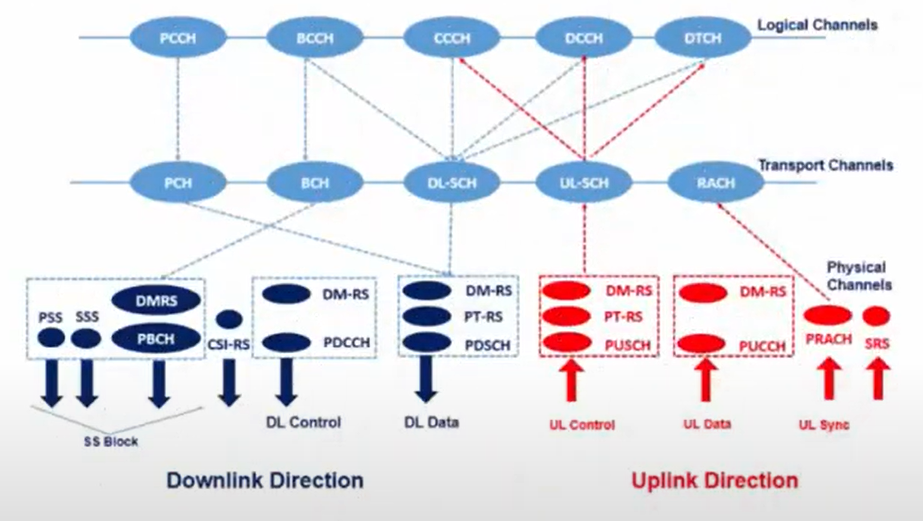
  
<strong>Figure 5.</strong> NTN Physical Channels

### Key NTN Adaptations for Channels
This is the most important part. Because of the massive delay, the procedures using these channels had to be adapted, especially at the MAC layer.

#### 1. HARQ (Hybrid ARQ) on PUSCH/PDSCH:
##### Problem: 
Standard 5G HARQ is a fast stop-and-wait protocol. The gNB sends data (PDSCH) and expects a tiny, fast ACK/NACK (on the PUCCH) within milliseconds. Over NTN, the gNB would send one packet, wait 540ms (for GEO) for the ACK, and the entire link would "stall," killing throughput.

##### NTN Solution: 
**HARQ is made configurable or disabled.**
- HARQ Disablement: The network can order the UE to turn off HARQ feedback. This keeps the data flowing. Reliability is "pushed up" to the RLC layer (RLC-AM mode), which is slower but designed to work over high-latency links.
- Extended HARQ Processes: For LEO (where delay is ~40ms RTT), the number of parallel HARQ "pipelines" is doubled from 16 to 32. This lets the gNB send 32 different blocks of data before the first ACK is even expected back, keeping the pipe full.

#### 2. Scheduling Timers (PDCCH):
##### Problem
The gNB's scheduling command (on PDCCH) that says "Your data is on PDSCH now" is useless if the "now" is 270ms in the past.
##### NTN Solution
New, massive timers are added. A new timer called Koffset is broadcast to all UEs. This tells the UE to add a huge offset (e.g., 270ms) to all of the gNB's scheduling commands. The gNB effectively schedules everything far in the future, and the UE knows to "listen for it" at the correct delayed time.
#### 3. Random Access (PRACH):
##### Problem
The whole RACH "handshake" (Msg1-4) would take seconds.
##### NTN Solution
The process is adapted for pre-compensation. When the UE sends its first message (Msg1 on the PRACH), it must already be pre-compensated for delay and Doppler. The gNB configures a much larger "guard time" on the PRACH to allow for small estimation errors from UEs spread across the beam.

# LEO Characteristics + NTN Challenges

## LEO Characteristics (orbital mechanics — with numbers & formulas)
### Relevant definitions
Low Earth Orbit (LEO): roughly 160–2,000 km altitude. Typical LEO for commercial NTN: ~500–1,200 km.

### Key constants / formulas
-  **Earth radius** $R_e = 6,371\ \text{km}$.
-  **Gravitational parameter** $\mu = 3.986004418 \times 10^{14}\ \text{m}^3/\text{s}^2$.
-  **Orbital (circular) speed** (where $h$ is altitude): $v = \sqrt{\mu / (R_e + h)}$.
-  **Orbital period** (where $h$ is altitude): $T = 2\pi \sqrt{(R_e + h)^3 / \mu}$.
-  **One-way propagation time (approx, nadir)** (where $c$ is the speed of light): $\tau_{\min} \approx h/c$.
-  **Slant (horizon) range** (where $R$ is the receiver's radius): $d_{\text{hor}} = \sqrt{(R_e + h)^2 - R^2}$ and $\tau_{\max} = d_{\text{hor}} / c$.
-  **Doppler shift (instantaneous)**: $f_D = (v_{\text{rad}} / c) f_c$ where $v_{\text{rad}}$ is the radial velocity component toward/away from receiver. (Use signed value for sign).

### Numeric examples (useful reference table)
computed for circular orbit and UE at surface:
| Altitude (km) | Orbital speed (km/s) | Orbital period (min) | one-way τ (nadir) | one-way τ (horizon) |
| ------------: | -------------------: | -------------------: | ----------------: | ------------------: |
|           160 |           7.812 km/s |             87.5 min |      **0.534 ms** |         **4.79 ms** |
|           500 |           7.617 km/s |             94.5 min |      **1.668 ms** |         **8.58 ms** |
|           600 |           7.562 km/s |         **96.5 min** |       **2.00 ms** |         **9.44 ms** |
|          1200 |           7.256 km/s |            109.3 min |       **4.00 ms** |        **13.64 ms** |
|          2000 |           6.900 km/s |            127.0 min |       **6.67 ms** |        **18.11 ms** |

(How to read it: at 600 km a straight nadir hop is ≈2.0 ms one-way; to horizon ≈9.44 ms.) These numbers match standard LEO latency ranges used in 3GPP analyses [1].

## Propagation delay (UE → Satellite → Gateway / gNB)
### Components
1. Service link: UE ↔ satellite (slant range dependent, τ as above).
2. Feeder (gateway) link: satellite ↔ gateway (can add similar order of magnitude). If gateway is under the same satellite nadir the feeder link adds another ~τ (nadir); if gateway far from UE nadir, feeder slant distance increases.
3. On-board processing / switching: regenerative satellites add processing delay (ms order variable). Transparent (bent-pipe) satellites have lower on-board processing but feeder route may go via long terrestrial/backhaul networks.

### Representative RTT / RTD
For LEO (~600 km) RTD (round-trip delay) for service + feeder is typically in the tens of ms (3GPP/ITU examples quote ~25–30 ms RTD for LEO-600 scenarios). By contrast GEO RTD can be hundreds of ms. This is why 3GPP treats LEO as feasible for NR timing with protocol adaptations [9].

### 3GPP operational note
TR 38.811 [1] cites LEO 600 km one-way propagation: ≈2 ms (min) to ≈7–9 ms (max) depending on geometry; GEO one-way ≈240–270 ms. Guard times, HARQ timers, RACH windows must be adjusted accordingly.

## Doppler shift & Doppler rate
### Magnitude
For LEO speeds ≈ 7.1–7.8 km/s the maximum normalized Doppler is about ~25 ppm (i.e., ~50 kHz at 2 GHz). Example (600 km, v≈7.56 km/s):
- At 1.6 GHz: ≈ 40.4 kHz
- At 2.0 GHz: ≈ 50.4 kHz
- At 20 GHz: ≈ 504 kHz.

(Use $f_D \approx (7.56 \times 10^3 / 3 \times 10^8) \cdot f_c$.) [10]

### Doppler rate (time derivative)
Doppler varies as satellite passes: residual Doppler can change rapidly (not instantaneous step — it’s roughly continuous and can be approximated linear over short CPI). Reported Doppler rates in literature vary with geometry and constellation; example measured/quoted values for some LEO signals reach hundreds to thousands of Hz/s in extreme geometries (depends on carrier frequency scaling). Practical UE residual Doppler rates after satellite-side pre-compensation are often handled with tracking loops and PT-RS in NR.

### Practical mitigation (3GPP / industry)
- Ephemeris broadcast & pre-compensation: satellite (or network) broadcasts ephemeris; gNB/satellite pre-compensates frequency per beam center; UE applies residual compensation.
- PT-RS and enhanced tracking loops in NR physical layer.
- Regenerative payloads (on-board gNB) can pre-correct more aggressively vs. transparent payloads. 3GPP documents these approaches as enablers for NR in LEO.

## Handover frequency & mobility challenges
### Why handover is frequent
Satellite motion causes moving cells / moving spot beams; a UE’s serving beam or satellite changes as satellites/beam footprints move over the Earth. 3GPP emphasizes that UEs can be kept in the same beam only for minutes (or less) depending on beam size and constellation geometry.

### Simple estimate (dwell time)
- Ground-track speed approx equals satellite orbital speed projected onto ground (~7–8 km/s).
- Dwell time $𝑡_{dwell}$ ≈ (beam diameter) / (ground-track speed).
    - Example: spot beam diameter 200 km → 𝑡 ≈ 200 / 7.6 ≈ 26 t ≈ 200 / 7.6 ≈ 26 s.
    - Beam diameter 1000 km → 𝑡 ≈ 132 t ≈ 132 s (≈2.2 min).

So handovers can happen every tens of seconds to a few minutes depending on beam design (narrow spot beams → faster handover).

### Operational implications
- Radio resource control (RRC), paging, and NAS procedures must handle frequent handovers (fast context transfer or centralized mobility anchoring).
- Handover decisions can be scheduled/predicted using satellite ephemeris (movement is deterministic). 3GPP suggests using ephemeris and location info for mobility management.

## Full NTN (LEO) challenge summary
### 1. Latency variability: 
LEO service-link one-way ≈ 2–10 ms (geometry dependent); combined service+feeder RTD often ~20–40 ms for practical architectures. Need to adjust MAC/HARQ timers, RACH windows, TA handling.

### 2. Large Doppler: 
Tens of kHz at GHz bands (scaled with fc); residual Doppler & Doppler rate require pre-compensation, tight frequency tracking and PT-RS / advanced synchronization.

### 3. Fast mobility / frequent handovers:
Beams move quickly; HO every tens of seconds → minutes depending on beamwidth. Predictive mobility (ephemeris) is crucial.

### 4. Resource split & payload choice: 
Transparent (bent-pipe) vs regenerative (on-board gNB) affects latency, Doppler handling and mobility complexity: regenerative simplifies many PHY/MAC issues but increases payload complexity.

### 5. Radio link / coexistence: 
NTN introduces new coexistence and adjacent-band constraints; 3GPP TR-38.863 contains RF/coexistence solutions and updates for NR-NTN. Spectrum selection (L/S/Ka bands) changes link budgets and Doppler.

### 6. Upper-layer impacts: 
TCP, real-time services, split-RAN fronthaul choices are constrained by extra propagation delay and jitter — some RAN splits not feasible over long feeder links without optimization.

# How 3GPP fixes NTN problems (LEO Focus)
## 1) Doppler compensation (main NTN fix)
**Problem:** LEO relative speed ($\sim 7-8\ \text{km/s}$) $\rightarrow$ large **Doppler shift** $f_D \approx (v_{\text{rad}} / c) f_c$ and **fast Doppler rate**. This breaks **OFDM orthogonality** and **uplink multi-user orthogonality** if uncompensated.

### 3GPP solution stack (summary):
#### Ephemeris-assisted pre-compensation (sat/gNB side): 
Satellite or on-board gNB computes expected Doppler for beam center using broadcast ephemeris & clock; it applies beam-centric pre-compensation so transmissions toward the beam are frequency-shifted to remove the bulk Doppler seen by UEs in that beam. This reduces the residual Doppler to an edge-dependent value.

#### UE Residual Estimation & Pre-compensation
UE measures the residual frequency offset (e.g., using synchronization signals / PRS / PT-RS) and applies fine frequency pre-compensation for the uplink.
Typical method: Estimate $f_{\text{res}}$ from reference signals and subtract it before the UL OFDM symbol generation.

#### PHY layer enhancements in NR
Use of **PT-RS**, enhanced frequency tracking loops, and more frequent **SSB/PRS** transmissions to support coarse + fine estimation.
3GPP defines signaling for assistance (ephemeris, timing epoch, common TA params) and procedures for pre-compensation.

#### Practical Formula & Implementation Note

* **Pre-compensation amount at beam center:**
    $$\Delta f_{\text{pre}} = - \frac{v_{\text{rad, BC}}}{c} \cdot f_c$$
* **Residual at UE edge:** The difference between true radial velocity and beam-center radial velocity $\rightarrow$ tracked by the **UE loop**. The residual must be kept small (within subcarrier spacing (SCS) $\times$ small fraction) to avoid **ICI**.

Where this is standardized: TR 38.811/TR 38.863 describe the study & solutions; implementation specifics are handled in the NR PHY & RRC (SIB assistance).

## 2) Timing Advance (TA) extensions & GNSS (Global Navigation Satellite System)-based TA
Problem: Terrestrial NR TA ranges are small; NTN LEO slant ranges produce much larger and geometry-dependent delays (variable TA + high RTT).

### 3GPP solution stack:
#### Extended TA ranges & common TA parameters in SIB-NTN: 
3GPP extends the TA range/format so TA values can cover LEO slant distances and horizon geometries; SIB (SIB-NR-NTN / RRC assistance) can carry common TA parameters and epoch times for computation.

#### GNSS-assisted TA (UE side): 
If UE has GNSS, it can compute expected propagation delay to the serving satellite from ephemeris (sat pos) and its own position, then apply an initial TA pre-adjustment during RACH/initial access to avoid large RACH timing errors. This is explicitly covered by 3GPP RRC assistance information proposals.

#### Network-assisted epoch/time stamping: 
3GPP specifies assistance information including epoch time & ephemeris so UEs/networks compute TA relative to a shared reference and compensate dynamic TA.

### Equation (UE pre-computed TA):
* **Compute slant range** ($d$):
    $$d = ||\mathbf{r}_{\text{sat}}(t) - \mathbf{r}_{\text{UE}}||$$
    * Where $\mathbf{r}_{\text{sat}}(t)$ is the satellite position vector at time $t$, and $\mathbf{r}_{\text{UE}}$ is the UE position vector.
    
* **TA estimate (in samples or $\mu \text{s}$):**
    $$\text{TA} \approx \left\lfloor \frac{d}{c} \cdot f_s \right\rfloor$$
    * Where $c$ is the speed of light and $f_s$ is the sampling frequency. This value is then mapped to the NR TA granularity.

Where standardized: RRC spec (TS 38.331) + TR 38.863/TR 38.811 procedural guidance.

## 3) HARQ adaptations
Problem: HARQ timing assumptions in terrestrial NR assume low RTT; LEO adds extra and variable RTT and jitter, impacting HARQ RTT, retransmission timers, and buffer sizing.

### 3GPP solution elements:
#### Flexible HARQ timers / extended RTT support:
TR/TS define extended HARQ RTT bounds and configuration parameters (HARQ RTT timers can be increased to accommodate NTN RTD). HARQ feedback timing and scheduling offsets are made configurable for NTN.

#### Asynchronous & adaptive HARQ processes:
Use more HARQ processes (to maintain pipeline) or adaptive HARQ process allocation depending on RTT to maintain throughput. Design tradeoff: more processes → more soft-buffer memory

#### Higher-layer fallback / TCP optimizations:
Where HARQ latency remains harmful for TCP, 3GPP points to higher-layer solutions (PDCP / RLC reordering, TCP proxies) and local on-board processing (regenerative payload) to reduce round trips.

### Implementation Note: HARQ for LEO
The number of **HARQ process count** $N_{\text{HARQ}}$ must be chosen such that:

$$N_{\text{HARQ}} \cdot T_{\text{slot}} \ge \text{RTT}$$

* **Goal:** This condition ensures the **pipeline remains full**. If this condition isn't met, the transmitter will run out of available HARQ processes while waiting for acknowledgments, and overall **throughput will degrade**.
* **3GPP Guidance:** Suggests tuning $N_{\text{HARQ}}$ for **LEO Round Trip Times (RTTs)**, which are typically **$\sim 20-40\ \text{ms}$** (depending on the specific architecture).

## 4) Beam management for moving satellites
Problem: Beams (and the cell coverage) move relative to Earth; standard beam management (SSB measurements, beam recovery) must account for moving beams, differential Doppler and predicted handovers.

### 3GPP solutions:
#### Ephemeris + predicted beam schedule: 
Satellites/gNB broadcast ephemeris & beam schedule so UEs can predict which beam/satellite will serve them next — enabling proactive handover and beam switching instead of reactive.

#### Beam-centric pre-compensation + per-UE residual tracking: 
Beam center pre-comp ensures UEs see near-stationary frequency; beam management uses SSB/CSI-RS with adjusted periodicity for NTN dynamics.

#### Enhanced measurement/HO criteria: 
Mobility measurements include ephemeris-based predicted metrics, not only instantaneous RSRP/RSRQ, to decide HO timing (minimize HO signalling & ping-pong).

Operational pattern: use deterministic satellite motion to schedule "planned handovers" with context transfer before beam edge, reducing RRC signalling spikes.

## 5) Uplink scheduling adaptations
Problem: UL transmissions need strict timing & frequency orthogonality; variable propagation delay and residual Doppler complicate grant timing and multi-user scheduling.

### 3GPP mitigations:

#### Grant timing with extended RA/UL offsets:
support larger TA and flexible grant scheduling windows; apply TA corrections based on ephemeris/UE GNSS. 

#### Pre-compensated UL so that scheduled OFDMA subcarriers remain orthogonal:
after beam pre-comp and UE residual pre-comp, scheduler can assume near-synchronized uplink.

#### Semi-persistent scheduling & predictive grants: 
for stable flows (e.g., mMTC or continuous uplink) use SPS to avoid repetitive scheduling overhead in fast HO scenarios. 3GPP studies include such adaptations.

## 6) NTN-friendly Random Access Procedure (RACH)
Problem: Standard RACH timing & RA-response windows are too tight given large/variable TA; collision resolution needs change with possibly GNSS-assisted pre-timing.

### 3GPP solutions:
#### Extended RACH windows and TA ranges: 
TR/TS define extended RA-RAR windows & response timers for NTN so UEs with larger one-way delays are supported. 

#### GNSS-assisted RACH pre-timing: 
If UE has GNSS and ephemeris from SIB-NTN, UE can transmit RACH pre-timed (TA pre-applied) so RA uses correct timing at the satellite/gNB — reduces RACH failures. 

#### Two-step RACH enhancements & contention-free options:
Use of 2-step RACH, contention-free RA, or pre-signalled RA resources for predictable UEs (e.g., VSAT/terminals) reduces collision and repeated attempts. TR 38.863 and RAN1 contributions cover RA variants.

## 7) NTN topologies with NR protocol stack
Problem: NTN deployments vary: bent-pipe (transparent payload) vs regenerative (on-board gNB) vs multi-hop/ISL. Each topology affects where NR protocol functions reside, latency, and mobility handling.

### 3GPP topologies & mapping to NR stack:

### 1. Transparent / bent-pipe (sat as RF repeater):
- NR gNB functions reside on ground (gNB at gateway). Satellite is RF front-end only.
- Pros: simpler satellite HW; Cons: higher feeder + transport RTT, more stringent terrestrial timing relaxations

### 2. Regenerative (on-board gNB):
- Some or all gNB L1/L2 functions run on satellite (on-board DU/PHY or full gNB).
- Pros: reduces service+feeder RTT, enables better Doppler compensation & local scheduling; Cons: heavier SWaP & complexity. 3GPP treats this as an enabling option.

### 3. Hybrid & ISL routing:
ISLs carry traffic between satellites; NR control/user plane can be split across satellite/GW; routing/topology changes demand dynamic session anchoring and possible PDN/NG-CN relocation. 3GPP discusses architecture options & denotes the NTN-GW and NTN platform roles.

#### Where NR protocol functions can be placed (examples):
- On-board DU/PHY: reduces PHY/HARQ RTT, allows local scheduling & immediate HARQ/ARQ actions.
- On-ground CU/UP: centralizes mobility & core integration but increases feeder latency.

Practical guidance from 3GPP: choose topology per service SLAs: interactive / low-latency services → regenerative local processing favored; massive IoT/backhaul → bent-pipe may suffice.

# References
### Primary 3GPP NTN References
1. 3GPP TR 38.811 — Study on New Radio (NR) to support Non-Terrestrial Networks (NTN), Release 15.
2. 3GPP TR 38.821 — Solutions for NR to support NTN (RAN1 & RAN2 aspects), Release 17.
3. 3GPP TR 38.863 — Solutions for NR to support NTN (RAN4 aspects, RF & coexistence), Release 18.
4. 3GPP TS 38.300 — NR Overall Description (includes NTN integration notes).
5. 3GPP TS 38.211 / 38.212 / 38.213 / 38.214 — Physical layer procedures, coding, MIMO, covering NTN-related PHY adaptations.
6. 3GPP TS 38.331 — RRC Protocol Specification (contains NTN-specific IEs: GNSS, ephemeris, SIB-NR-NTN).

### Secondary Guidance & Official Technical Sources
7. 3GPP RP-193235 — Work item proposal for NR NTN.
8. ETSI TR 103 611 — Satellite Earth Stations and Systems; NTN Integration Trends.
9. ITU-R M.2101 — Performance requirements for non-GSO systems (delay/Doppler baselines).

### Industry / Vendor Whitepapers (Useful for Real Numbers & Engineering Practices)
10. Ericsson: “NR-NTN — Extending 5G Coverage from Sky” (Doppler & timing diagrams).
11.  Huawei: “Challenges and Key Technologies for 5G NTN.”
12.  NTT DOCOMO + Rohde & Schwarz NTN demos (Doppler compensation case studies).
13.  OneWeb System Definition Documents (example LEO latency & feeder link architecture).
14.  SpaceX Starlink System Parameters (FCC Filings) (orbital altitudes, Doppler, link budgets).

### Academic Sources (GNSS/LEO Orbital Dynamics & Doppler Math)
15. Kaplan & Hegarty — Understanding GPS/GNSS, 2nd ed., Artech House.
16. Maral, Bousquet — Satellite Communications Systems, 6th ed., Wiley.
17. Mengali & D’Andrea — Synchronization Techniques for Digital Receivers, Springer.
18. 2020–2024 survey papers on NR-NTN & LEO Doppler (IEEE Communications Surveys & Tutorials).

### Simulation / Tooling References
19. 3GPP channel models implemented in ns-3 (LEO propagation profiles, Doppler).
2. MATLAB Satellite Toolbox documentation (orbital mechanics & slant-range delay formulas).

# Sharetechnote - NTN
In these notes, I want to organize everything I’ve learned from ShareTechnote + 3GPP into one flow: starting from what NTN actually is and why we need it, then going through the challenges, the technical requirements, how spectrum is allocated, and how the NTN architecture looks. After that, I’ll dive into the more detailed parts like RACH, Timing Advance for NTN, and the RRC behaviors in NR, LTE, and NB-IoT. I’ll close it with NB-IoT call flow, since a lot of NTN deployments start from IoT.

## What is NTN + Why NTN?
### What is NTN?
NTN basically stands for Non-Terrestrial Networks, which just means “cellular networks that don’t rely on ground towers.” Instead, the signal comes from things like satellites, HAPS (high-altitude balloons/planes), and even drones. The whole point is to extend coverage to places where building terrestrial sites is too expensive or flat-out impossible.
 
**In short: NTN = bringing 3GPP (LTE/NR/NB-IoT) into the sky.**
 
Instead of thinking of them as a totally different system, it’s easier to see NTN as an extension of existing cellular networks — just with different challenges (long distance, fast-moving satellites, Doppler, etc.).

  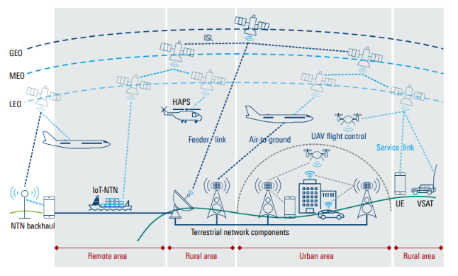
  
<strong>Figure 6.</strong> NTN Network Overview

### NTN Components (Based on the figure)

#### Satellites
- GEO: very high up (~36k km), huge coverage but big latency.
- MEO: middle ground.
- LEO: fast-moving, low altitude → much lower latency, better for UE and IoT.

#### HAPS (High-Altitude Platforms)
- Flying in the stratosphere. Think balloons or solar drones.
- Good for regional coverage, feeder links, or emergency networks.

#### UAVs (Unmanned Aerial Vehicles)
- Drones acting as relays or temporary towers.

#### Types of Links (quick breakdown)
- ISL (Inter-Satellite Link) → satellites talking to each other without going through the ground.
- Feeder Link → ground station <-> satellite/HAPS.
- Service Link → satellite/HAPS <-> end devices (phones, sensors, VSATs).
- Air-to-Ground Link → planes connecting to the network.
- UAV Control Link → for drone command + safety.

#### Use Cases
- Direct satellite-to-phone (Direct-to-UE)
- NTN IoT (maritime sensors, remote areas)
- Air-to-ground Internet for aircraft
- VSAT for rural/out-of-coverage regions
- Backhaul to support remote terrestrial sites

#### Geography Overview
- Remote: mostly NTN (backhaul/IoT).
- Rural: combo of HAPS, feeder links, and terrestrial.
- Urban: dense terrestrial, NTN mostly for UAVs, aviation, backup.

So overall → NTN fills the gaps that ground networks can never reach.

### Why NTN?
If I have to explain it simply: NTN exists because there are places where terrestrial networks just can’t go. Either it’s too expensive (islands, mountains), too remote (deserts, oceans), or too vulnerable to disasters.

Here’s the breakdown of why NTN is becoming a big deal:

#### 1. Bridging Coverage Gaps
- Remote forests, mountains, deserts → way too costly for towers.
- Ships at sea → almost zero terrestrial coverage.
- Planes → need constant connectivity.
- Islands and offshore areas → terrestrial is basically impossible.
- Satellites don’t care about geography → coverage everywhere.

#### 2. Disaster Recovery & Resilience
- Terrestrial network can be destroyed by earthquakes, floods, etc.
- Satellites stay operational → perfect for emergencies.
- Provides redundancy when the ground network fails.
- NTN = a safety net for national communication.

#### 3. Expanding the 5G Ecosystem
- 5G wants “coverage everywhere.”
- NTN allows new use cases:
- r3mote healthcare, precision agriculture, environmental sensing, maritime IoT, smart shipping, etc.
- This is basically the “wider ecosystem” argument → 5G isn’t just for cities.

#### 4. Seamless Mobility & Roaming
- With LEO satellites, latency is low enough to support real-time apps.
- 3GPP is optimizing protocols so UE can hand over between terrestrial ↔ satellite without dropping.
- Feels like “just another cell.”

##### This is important for:
- plane
- ships
- connected cars
- large moving platforms

#### 5. Cost Benefits
- Cellular standards = mass production → cheaper hardware.
- Sharing architecture with terrestrial = less custom satellite stuff.
- Lower cost to deploy than trying to build towers in impossible areas.
- NTN shifts satellite communications from “premium and expensive” → to “mass-market and integrated.

## Challenges of NTN
  

# DVB-S2X & DVB-RCS2
The **Digital Video Broadcasting – Satellite (DVB)** family defines standards for broadband satellite communication.  

The most important concept is that these are two separate, complementary standards that work together:
- DVB-S2X: The high-speed downlink (forward link) from the gateway to the user.
- DVB-RCS2: The multi-user, interactive uplink (return link) from the user back to the gateway.

These standards are defined by **ETSI EN 302 307-2 (DVB-S2X)** and **ETSI EN 301 545-2 (DVB-RCS2)**.

## System Architecture & Topologies
A DVB-RCS2 network generally includes:

| Entity | Function |
|---------|-----------|
| **Satellite** | Provides the link between terminals and hub (transparent or regenerative). |
| **Network Control Centre (NCC)** | Controls access to the return channel and distributes signaling via the forward link. |
| **Network Management Centre (NMC)** | Manages overall system configuration and enforces SLA (Service Level Agreement). |
| **Hub / Gateway (GW-RCST)** | Routes user traffic between satellite and terrestrial IP networks. |
| **Return Channel Satellite Terminal (RCST)** | Acts as the user terminal (VSAT), transmitting and receiving data and signaling. |

DVB-RCS2 supports both **transparent** and **regenerative** system architectures:

### Transparent Architecture
In a transparent system, the satellite functions purely as a **bent-pipe repeater**, relaying signals between the terminals and the hub.  
Multiple topologies are supported:
- **Transparent Star:** UT ↔ Hub via satellite (single-hop).  
- **Transparent Star with Contention Access:** Similar to star, but uplink uses contention-based slots for initial access.  
- **Transparent Mesh Overlay:** Terminals communicate indirectly through two satellite hops (UT → Hub → UT).

  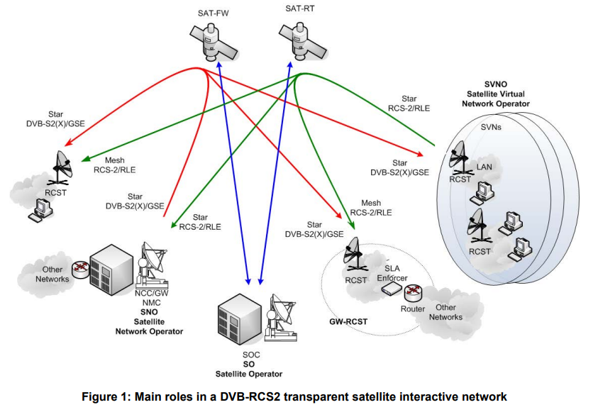
  
<strong>Figure 7.</strong> DVB Transparent Architecture

**Components:**
- Transparent satellite(s) (possibly with **Digital Transparent Processor (DTP)** payloads for multi-beam connectivity).  
- **Hub/NCC:** Performs traffic control, management, and user-plane interfacing.  
- **Star Terminals (RCSTs):** Support star connectivity.  
- **Mesh Overlay Terminals:** More complex RCSTs with additional demodulators to handle direct terminal-to-terminal links via the satellite.  
- **Gateway RCST (GW-RCST):** A terminal that provides terrestrial access and SLA enforcement for mesh users.

**Key Characteristic:**  
Simple satellite payload, heavier reliance on ground-based control and routing.

### Regenerative Architecture
In the regenerative configuration, the satellite performs **demodulation, decoding, switching, and re-encoding** functions onboard through an **On-Board Processor (OBP)**.

**Components:**
- **Regenerative Satellite:**  
  Performs PHY/MAC processing, onboard routing or switching (Layer 2/3), and may re-encapsulate data.  
  → Acts as an **on-orbit router**, connecting uplink and downlink beams with different modulation/coding.
- **Management Station (NMC/NCC):**  
  Provides network management and control functions.
- **Regenerative Satellite Gateway (GW-RCST):**  
  A hybrid terminal acting as an access gateway to terrestrial networks, possibly hosting SLA enforcers, routers, or VoIP servers.
- **Regenerative Mesh Terminals:**  
  Support single-hop connectivity via the satellite, similar to 3GPP NTN’s regenerative mode.

  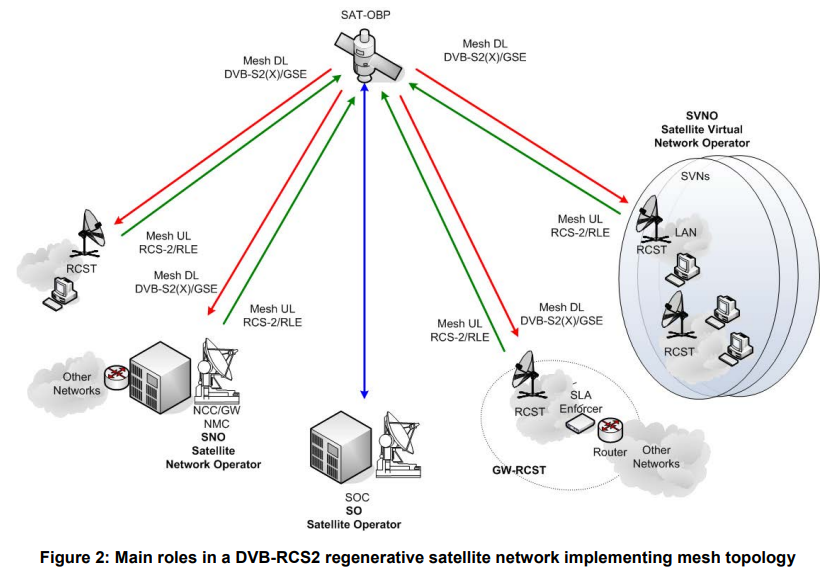
  
<strong>Figure 8.</strong> DVB Regenerative Architecture

**Key Characteristic:**  
Smart satellite with OBP enables lower latency, optimized link utilization, and independent inter-beam routing.

## Uplink & Downlink Segmentation (Encapsulation)
This is how IP packets are "packaged" for their satellite journey. DVB uses highly efficient methods, not the older MPEG-TS.
### Downlink (DVB-S2X): 
GSE (Generic Stream Encapsulation) The challenge is packing variable-length IP packets into a high-speed, continuous-like stream of large, fixed-size satellite frames. GSE acts like a "Tetris" player, packing multiple IP packets back-to-back into a single DVB frame to minimize wasted bandwidth.

### Uplink (DVB-RCS2): 
RLE (Return Link Encapsulation) The challenge is the opposite: fitting IP packets into the small, pre-assigned, variable-sized time slots (bursts) defined by the scheduler. RLE uses "just-in-time" fragmentation. It knows the exact size of the upcoming transmission slot and slices the IP packet perfectly to fill it, resulting in almost zero waste.

## Protocol Stack
Unlike 3GPP NTN, which is a native IP stack, the DVB stack is an "IP-over-DVB" encapsulation stack.

### Downlink (S2X) Stack:
- IP Packet / Application Layer → User data.
- GSE (Wraps the IP packet) Encapsulation → Packs IP/Ethernet into BBFRAME efficiently.
- DVB-S2X (Puts the GSE data into a Baseband Frame and applies FEC/Modulation)  → Adds BBHEADER (stream type, sync).
- FEC (LDPC + BCH) → Reliability for 36,000 km GEO link.
- PLFRAME → Adds PLS header, optional pilots.
- PHY (Transmits the radio signal)

  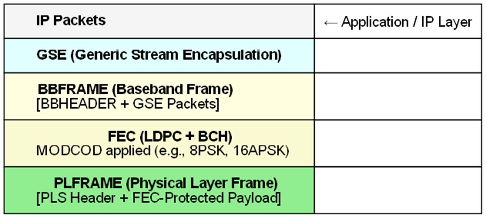
  
<strong>Figure 9.</strong> DVB-S2X Downlink Stack

### Uplink (RCS2) Stack:
- Application Layer: User data (HTTP requests, VoIP packets, etc.).
- Network Layer: IP packets destined for the internet.
- MAC Layer:
    - Resource request and allocation.
    - Burst scheduling coordination.
- Physical Layer:
    - MF-TDMA burst framing.
    - FEC for error protection.
    - Carrier frequency and modulation selection.

  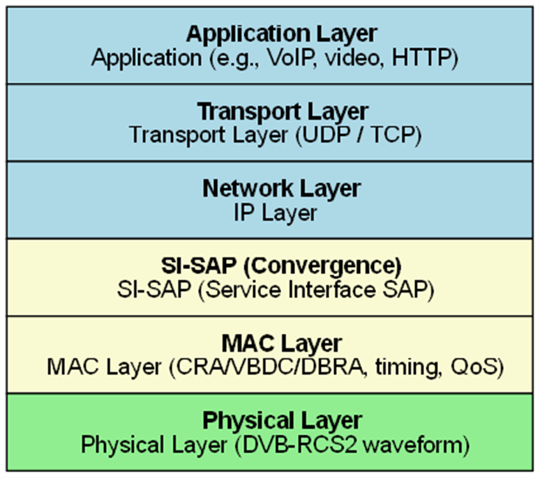
  
<strong>Figure 10.</strong> DVB-RCS2 Uplink Stack

## Frame Structures
### Downlink (DVB-S2X): 
Baseband Frame (BBFrame) This is a large, fixed-size frame (e.g., 64,800 bits) transmitted in a continuous stream. It's protected by powerful LDPC/BCH Forward Error Correction (FEC). Its key feature is ACM (Adaptive Coding and Modulation), allowing the gateway to change the modulation (e.g., from QPSK to 16APSK) for each frame based on the user's link conditions.

  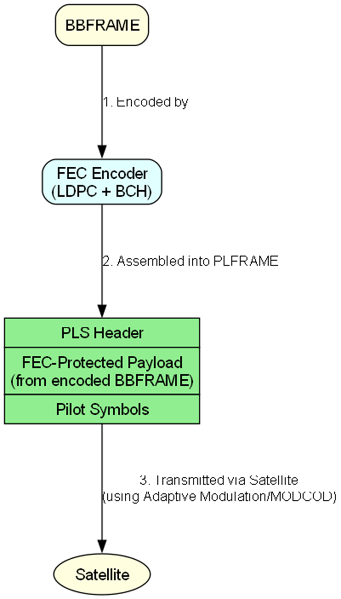
  
<strong>Figure 11.</strong> DVB-S2X Frame Structures

### Uplink (DVB-RCS2): 
MF-TDMA Burst The uplink is not a continuous frame. It's a 2D grid of Frequency and Time. This is called MF-TDMA (Multi-Frequency Time Division Multiple Access). The NCC assigns an RCST a specific "slot" (a frequency and a time block) for a single transmission. This transmission is called a burst.

  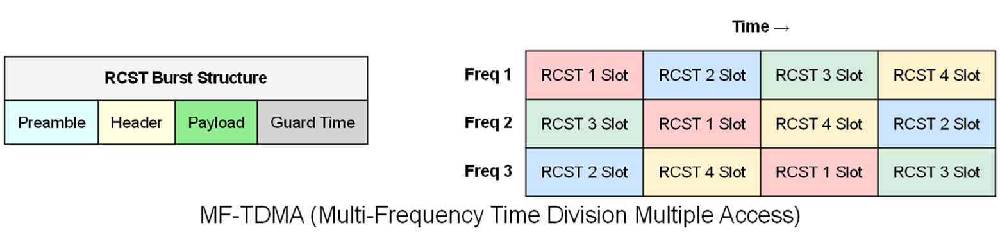
  
<strong>Figure 12.</strong> DVB-RCS2 Frame Structures

- Time-Division: Multiple RCSTs share the same frequency but transmit in non-overlapping time slots.
- Multi-Frequency: Several frequency carriers are available, and NCC assigns both time & frequency to each RCST.

Physical Layer Steps:

1. RCST prepares data burst according to NCC’s schedule.
2. Burst is modulated (e.g., QPSK, 8PSK) and FEC-coded.
3. Transmitted over assigned carrier in assigned slot.
4. Satellite repeats burst to Gateway.
5. Gateway demodulates & reassembles traffic.

This method maximizes spectrum efficiency while preventing collisions between multiple uplink users.

## MAC & Scheduling
This is the "brain" of DVB-RCS2. The MAC protocol is DAMA (Demand Assigned Multiple Access). It is a centralized system managed entirely by the NCC. An RCST never transmits data without permission.

Here is the flow:

- Request: An RCST needs to send data. It sends a tiny Capacity Request (CR) message to the NCC in a special, shared slot.
- Allocation: The NCC gathers requests from all RCSTs in the network.
- Grant (The Map): The NCC runs its scheduling algorithm (based on QoS) and creates a master schedule called the TBTP (Terminal Burst Time Plan).
- Broadcast: The NCC broadcasts this TBTP map to all RCSTs on the downlink.
- Transmission: Each RCST receives the map, waits for its assigned slot, and then transmits its data burst in that exact time/frequency window. This cycle repeats continuously.

  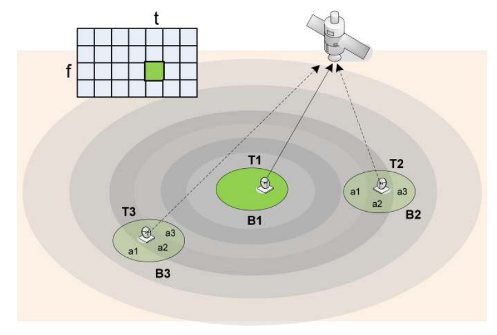
  
<strong>Figure 13.</strong> Mac & Scheduling Visualization

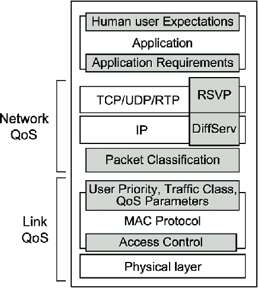
- B1, B2, B3: These are the satellite's spot beams. A satellite uses multiple beams to cover its service area, just like a cell tower has multiple sectors.
- T1, T2, T3: These are the Terminals (RCSTs).
    - T1 is a terminal in beam B1.
    - T2 is a terminal in beam B2.
    - T3 is a terminal in beam B3.
- a1, a2, a3: These are the applications or data flows running on a terminal. This is critical for QoS.
    - Think of a1 as a VoIP call (needs high-priority CRA).
    - Think of a2 as web browsing (needs best-effort VBDC).

## Role of QoS (Quality of Service)
QoS is the entire purpose of the DAMA scheduler. The NCC's main job is to allocate bandwidth according to the Service Level Agreement (SLA) of each user.
When an RCST sends a Capacity Request, it specifies the type of capacity it needs. These are the Bandwidth on Demand (BoD) mechanisms:

### CRA (Continuous Rate Assignment):
#### What it is: 
The highest priority. Used for traffic that needs a constant, guaranteed rate (e.g., a VoIP call).
#### How it works:
The NCC scheduler pre-books a slot for this RCST in every single TBTP map for the duration of the call, ensuring zero jitter.

### RBDC (Rate-Based Dynamic Capacity):
#### What it is: 
For high-priority, variable traffic (e.g., video streaming).
#### How it works: 
The RCST requests a certain rate (e.g., "I need 2 Mbps"). The NCC will try to grant this rate dynamically.

### VBDC (Volume-Based Dynamic Capacity):
#### What it is: 
The most common, "best-effort" request. Used for bursty data (e.g., web browsing).
#### How it works: 
The RCST simply reports, "I have 1500 bytes in my buffer." The NCC gives it a slot when it can, after all CRA and RBDC requests are fulfilled.

