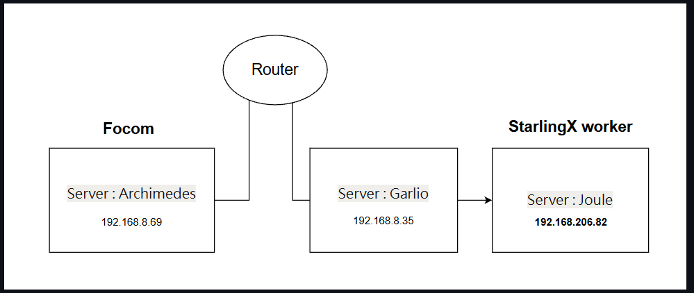
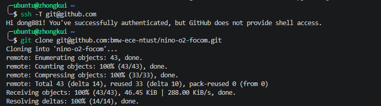
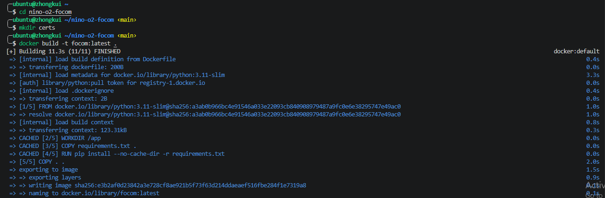
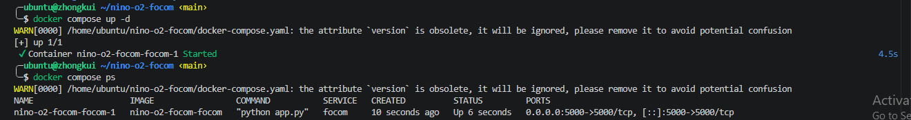
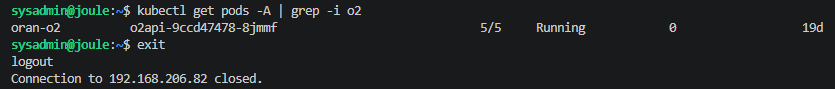
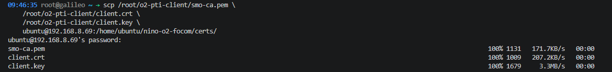
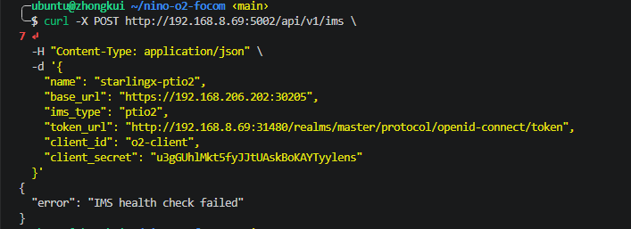

# FOCOM Deployment & StarlingX Registration 
**Verifier:** Petrajoy Davidson 
**Date:** May 2026  
**Reference:** [nino-o2-focom revised branch Example.md](https://github.com/bmw-ece-ntust/nino-o2-focom/blob/revised/Example.md)  
**Environment:** SMO on Archimedes (`ubuntu@zhongkui` / `192.168.8.69`), StarlingX on Galileo (`192.168.8.35`) → Joule (`192.168.206.82`)

---

## Topology


## Verification Summary

| Step | Description | Result |
|------|-------------|--------|
| [1](#1-clone-repository) | Clone repository | ✅ PASS |
| [2](#2-build-image) | Build FOCOM image | ✅ PASS |
| [3](#3-start-environment--check-status) | Start environment & check status | ⚠️ PASS with discrepancy |
| [4](#4-confirm-o2-exists-on-joule) | Confirm O2 exists on Joule | ✅ PASS |
| [5](#5-verify-mtls-material-on-galileo) | Verify mTLS material on Galileo | ✅ PASS |
| [6](#6-transfer-certs-to-archimedes) | Transfer certs to Archimedes | ✅ PASS |
| [7](#7-copy-certs-into-focom-container) | Copy certs into FOCOM container | ✅ PASS |
| [8](#8-ims-registration) | IMS Registration (health check) | ❌ FAIL |

---

## 1. Clone Repository

**Nino's instruction:**
```bash
git clone git@github.com:bmw-ece-ntust/nino-o2-focom.git
cd nino-o2-focom
mkdir certs
```

**Result: ✅ PASS**

```
Cloning into 'nino-o2-focom'...
remote: Enumerating objects: ...
```

---

## 2. Build Image

**Nino's instruction:**
```bash
docker build -t focom:latest .
```

**Result: ✅ PASS**

```
Successfully built <image_id>
Successfully tagged focom:latest
```

---

## 3. Start Environment & Check Status

**Nino's instruction:**
```bash
docker compose up -d
curl http://127.0.0.1:5000/api/v1/ims
# Expected: []
```

**Result: ⚠️ PASS with discrepancy**

> [!WARNING]
> **Bug found — Port mismatch:** Nino's doc references port `5000`, but the container actually binds to port `5002`.

Hitting port 5000 as documented:
```bash
╭─ubuntu@zhongkui ~/nino-o2-focom ‹main›
╰─$ curl http://127.0.0.1:5000/api/v1/ims
curl: (56) Recv failure: Connection reset by peer
```

Checking logs revealed the actual port:
```bash
focom-1  |  * Running on http://127.0.0.1:5002
focom-1  |  * Running on http://172.18.0.2:5002
```

**Workaround:** Use port `5002` instead:
```bash
╭─ubuntu@zhongkui ~/nino-o2-focom ‹main›
╰─$ curl http://127.0.0.1:5002/api/v1/ims
[]
```

**→ Nino's doc needs to be updated: replace all `5000` references with `5002`.**

---

## 4. Confirm O2 Exists on Joule

**Nino's instruction** (on Joule via Galileo):
```bash
kubectl get pods -A | grep -i o2
# Expected: oran-o2  o2api-...  5/5  Running
```

**Result: ✅ PASS**

```
oran-o2   o2api-9ccd47478-8jmmf   5/5   Running   0   19d
```

---

## 5. Verify mTLS Material on Galileo

**Nino's instruction** (on Galileo):
```bash
ls /root/o2-pti-client/
# Expected: basic_query.sh  client.crt  client.key  smo-ca.pem
```

**Result: ✅ PASS**

```
basic_query.sh  client.crt  client.key  smo-ca.pem
```

---

## 6. Transfer Certs to Archimedes

**Nino's instruction** (on Galileo):
```bash
scp /root/o2-pti-client/smo-ca.pem \
    /root/o2-pti-client/client.crt \
    /root/o2-pti-client/client.key \
    ubuntu@192.168.8.69:/home/ubuntu/nino-o2-focom/certs/
```

**Result: ✅ PASS**

```
smo-ca.pem   100% 1131   171.7KB/s   00:00
client.crt   100% 1009   207.2KB/s   00:00
client.key   100% 1679     3.3MB/s   00:00
```

---

## 7. Copy Certs into FOCOM Container

**Nino's instruction** (on Archimedes):
```bash
docker cp ~/testingSpace/nino-o2-focom/certs/. nino-o2-focom-focom-1:/app/certs/
```

**Result: ✅ PASS**

```
Successfully copied 3.82kB (transferred 7.68kB) to nino-o2-focom-focom-1:/app/certs/
```

---

## 8. IMS Registration

**Nino's instruction** (on Archimedes):
```bash
curl -X POST http://192.168.8.69:5002/api/v1/ims \
  -H "Content-Type: application/json" \
  -d '{
    "name": "starlingx-ptio2",
    "base_url": "https://192.168.206.202:30205",
    "ims_type": "ptio2",
    "token_url": "http://192.168.8.69:31480/realms/master/protocol/openid-connect/token",
    "client_id": "o2-client",
    "client_secret": "u3gGUhlMkt5fyJJtUAskBoKAYTyylens"
  }'
```

**Result: ❌ FAIL — IMS health check failed**

```json
{
  "error": "IMS health check failed"
}
```

**Root cause analysis:**

Keycloak token fetch works fine:
```bash
curl -s -X POST \
  http://192.168.8.69:31480/realms/master/protocol/openid-connect/token \
  -d "client_id=o2-client&client_secret=u3gGUhlMkt5fyJJtUAskBoKAYTyylens&grant_type=client_credentials"
# → returns valid access_token ✅
```

StarlingX o2api (`192.168.206.202:30205`) is **unreachable** from Archimedes:
```bash
ping -c 3 192.168.206.202
# 3 packets transmitted, 0 received, 100% packet loss ❌

curl -v --cacert certs/smo-ca.pem --cert certs/client.crt --key certs/client.key \
  https://192.168.206.202:30205/o2ims-infrastructureInventory/v1/
# Trying 192.168.206.202:30205... (hangs, no response) ❌
```

Routing check:
```bash
ip route get 192.168.206.202
# 192.168.206.202 via 192.168.8.9 dev enp65s0f0np0 src 192.168.8.69
```

`192.168.206.0/24` is the StarlingX internal cluster-host subnet, routed via the lab gateway (`192.168.8.9`) which has no path to it. A static route through Galileo (`192.168.8.35`) is needed, but this is a **network/infrastructure configuration issue** that requires lab admin intervention.

**→ Blocked. Cannot proceed to Step 9 (NFO) or downstream steps until Archimedes can reach `192.168.206.202:30205`.**

## SCREENSHOT VERIFICATION !!
### 1. GitHub Clone


### 2. Build Image


### 3. Starting and Check The Environment Status 


### 4. O2 Exist On Joule 


### 5. SCP Galileo mLTS -> Archimedes FOCOM


### 6. IMS Health Check `FAILED`
