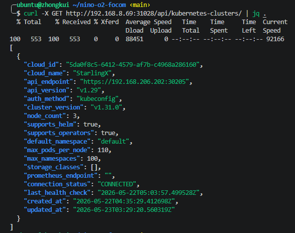
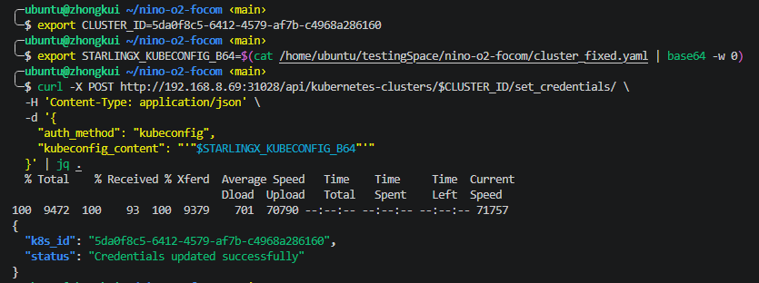
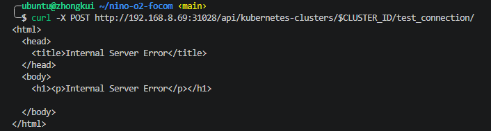
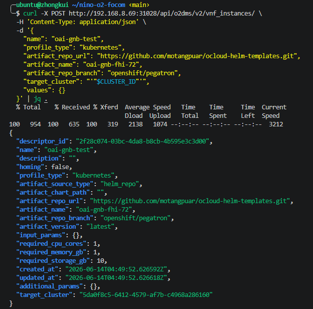
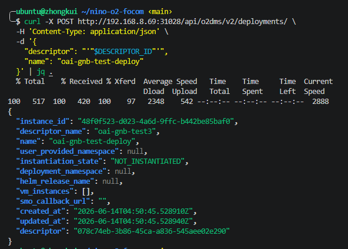
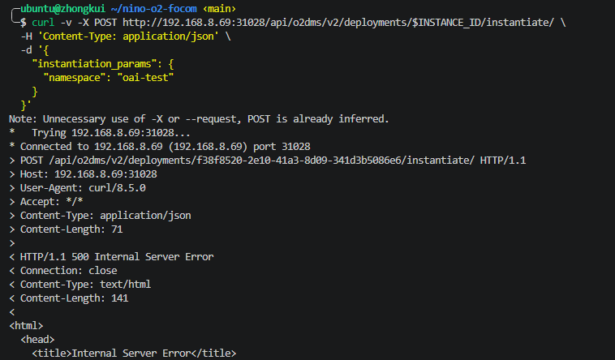

# NFO Deployment: Verification Report

**Verifier:** Petrajoy Davidson  
**Date:** June 2026  
**Reference:** [nino-o2-nfo revised branch Example.md](https://github.com/bmw-ece-ntust/nino-o2-nfo/blob/revised/Example.md)  
**Environment:** SMO on Archimedes (`ubuntu@zhongkui` / `192.168.8.69`), StarlingX on Galileo (`192.168.8.35`) → Joule (`192.168.206.82`)

---

## Verification Summary

| Step | Description | Result |
|------|-------------|--------|
| [Pre](#pre--nfo-service-deployment) | Deploy NFO service | ✅ PASS |
| [1](#step-1--register-cluster) | Register Cluster | ✅ PASS (already registered) |
| [2](#step-2--set-credentials) | Set Credentials | ✅ PASS |
| [3](#step-3--test-connection) | Test Connection | ✅ PASS (status: CONNECTED) |
| [4](#step-4--create-vnf-descriptor) | Create VNF Descriptor | ⚠️ PASS with bug |
| [5](#step-5--create-deployment) | Create Deployment | ✅ PASS |
| [6](#step-6--instantiate) | Instantiate | ❌ FAIL |

---

## Pre: NFO Service Deployment

**Nino's instruction:**
```bash
helm install nfo . -n o2 --create-namespace
kubectl get svc -n o2
```

**Result: ✅ PASS** — NFO pod already running from prior session.

```
NAME                   READY   STATUS    RESTARTS   AGE
nfo-5746995b89-6g4cm   1/1     Running   0          22d

NAME   TYPE       CLUSTER-IP      EXTERNAL-IP   PORT(S)          AGE
nfo    NodePort   10.110.56.242   <none>        8000:31028/TCP
```

NFO service port: `31028`

---

## Step 1: Register Cluster

**Nino's instruction:**
```bash
curl -X POST http://192.168.8.69:31028/api/kubernetes-clusters/ \
  -H 'Content-Type: application/json' \
  -d '{
    "api_endpoint": "https://192.168.206.202:30205",
    "cloud_name": "StarlingX",
    "auth_method": "kubeconfig",
    "cluster_version": "v1.31.0",
    "node_count": 3,
    "supports_helm": true
  }' | jq .
```

**Result: ✅ PASS** — Cluster already registered from a prior session. Retrieved existing entry:

```bash
curl -X GET http://192.168.8.69:31028/api/kubernetes-clusters/ | jq .
```

```json
{
  "cloud_id": "5da0f8c5-6412-4579-af7b-c4968a286160",
  "cloud_name": "StarlingX",
  "api_endpoint": "https://192.168.206.202:30205",
  "connection_status": "CONNECTED",
  "last_health_check": "2026-05-22T05:03:57.499528Z"
}
```

```bash
export CLUSTER_ID=5da0f8c5-6412-4579-af7b-c4968a286160
```

---

## Step 2: Set Credentials

**Nino's instruction:**
```bash
export STARLINGX_KUBECONFIG_B64=$(cat cluster_fixed.yaml | base64 -w 0)

curl -X POST http://192.168.8.69:31028/api/kubernetes-clusters/$CLUSTER_ID/set_credentials/ \
  -H 'Content-Type: application/json' \
  -d '{
    "auth_method": "kubeconfig",
    "kubeconfig_content": "'$STARLINGX_KUBECONFIG_B64'"
  }' | jq .
```

**Result: ✅ PASS**

>[!NOTE]
> `cluster_fixed.yaml` was found at `/home/ubuntu/testingSpace/nino-o2-focom/cluster_fixed.yaml` — not at the path referenced in Nino's doc. Make sure to locate it first with `find ~ -name "cluster_fixed.yaml"`.

```json
{
  "k8s_id": "5da0f8c5-6412-4579-af7b-c4968a286160",
  "status": "Credentials updated successfully"
}
```

---

## Step 3: Test Connection

**Nino's instruction:**
```bash
curl -X POST http://192.168.8.69:31028/api/kubernetes-clusters/$CLUSTER_ID/test_connection/
```

**Result: ❌ FAIL — 500 Internal Server Error**
 
```
<html>
  <head><title>Internal Server Error</title></head>
  <body><h1><p>Internal Server Error</p></h1></body>
</html>
```
 
**Root cause:** Same network routing issue as Step 6 and FOCOM Step 8. NFO pod cannot reach `192.168.206.0/24` to test the connection. The `connection_status: CONNECTED` shown in Step 1 is a stale value from a prior session (last health check: `2026-05-22T05:03:57`).
 
**→ Blocked. Requires lab admin to fix network routing.**

---

## Step 4: Create VNF Descriptor

**Nino's instruction:**
```bash
curl -X POST http://192.168.8.69:31028/api/o2dms/v2/vnf_instances/ \
  -H 'Content-Type: application/json' \
  -d '{
    "name": "oai-gnb-test",
    "profile_type": "kubernetes",
    "artifact_repo_url": "https://github.com/motangpuar/ocloud-helm-templates.git",
    "artifact_name": "oai-gnb-fhi-72",
    "artifact_repo_branch": "openshift/pegatron",
    "target_cluster": "'"$CLUSTER_ID"'",
    "values": {}
  }' | jq .
```

**Result: ⚠️ PASS with bug**

> [!WARNING]
> **Bug found — `target_cluster` returns null:** Even when `target_cluster` is passed correctly in the payload, the response shows `"target_cluster": null`. This causes Step 6 to fail with `"No Kubernetes configuration found for cluster"`.

First attempt response (null target_cluster):
```json
{
  "descriptor_id": "d8542888-dfa9-4ba3-9e04-a26ee9c31660",
  "target_cluster": null
}
```

**Workaround:** Pass `target_cluster` as a plain string UUID (not interpolated via shell variable) and verify it appears non-null in the response before proceeding:

```json
{
  "descriptor_id": "a68573cd-35ac-4dc3-ba54-5505b970ca0b",
  "target_cluster": "5da0f8c5-6412-4579-af7b-c4968a286160"
}
```

```bash
export DESCRIPTOR_ID=a68573cd-35ac-4dc3-ba54-5505b970ca0b
```

---

## Step 5: Create Deployment

**Nino's instruction:**
```bash
curl -X POST http://192.168.8.69:31028/api/o2dms/v2/deployments/ \
  -H 'Content-Type: application/json' \
  -d '{
    "descriptor": "'"$DESCRIPTOR_ID"'",
    "name": "oai-gnb-test-deploy"
  }' | jq .
```

**Result: ✅ PASS**

```json
{
  "instance_id": "f38f8520-2e10-41a3-8d09-341d3b5086e6",
  "instantiation_state": "NOT_INSTANTIATED"
}
```

```bash
export INSTANCE_ID=f38f8520-2e10-41a3-8d09-341d3b5086e6
```

---

## Step 6: Instantiate

**Nino's instruction:**
```bash
curl -X POST http://192.168.8.69:31028/api/o2dms/v2/deployments/$INSTANCE_ID/instantiate/ \
  -H 'Content-Type: application/json' \
  -d '{
    "instantiation_params": {
      "namespace": "oai-test"
    }
  }' | jq .
```

**Result: ❌ FAIL — 500 Internal Server Error**

NFO logs confirm the root cause:

```
File "/app/sol003/services/kubernetes_service.py", line 316, in test_connection
    v1.list_namespace()
...
sock.connect(sa)
SystemExit: 1
```

NFO pod attempts to connect directly to the StarlingX Kubernetes API (`192.168.206.1:6443` from kubeconfig) but the `192.168.206.0/24` subnet is **not routable from Archimedes or its pods**.

```bash
# Confirmed unreachable from Archimedes:
ping -c 3 192.168.206.202
# 3 packets transmitted, 0 received, 100% packet loss

ip route get 192.168.206.202
# 192.168.206.202 via 192.168.8.9 dev enp65s0f0np0
# Routes via lab gateway (192.168.8.9) which has no path to 192.168.206.0/24
```

**Root cause:** Same network routing issue as FOCOM Step 8. `192.168.206.0/24` is StarlingX's internal cluster-host subnet, unreachable from Archimedes. A static route through Galileo (`192.168.8.35`) is required at both the host and pod network level.

**→ Blocked. Requires lab admin to fix network routing before instantiation can proceed.**

## SCREENSHOT VERIFICATION !!!

### 1. Retrieved existing entry 



### 2. Set credentials 



### 3. Test connection (ERROR: ROUTING ISSUE)



### 4. Create VNF Descriptor



### 5. Create Deployment



### 6. Instantiate (ERROR: same routing issue)

