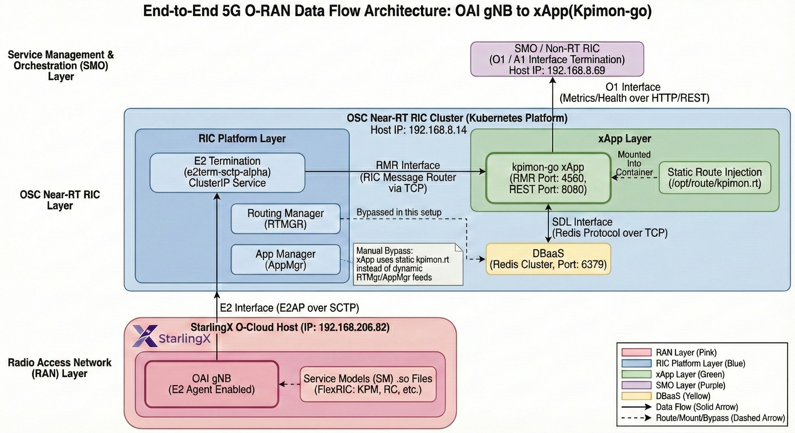

# Installation Log

## Environment
- OS: Ubuntu 24.04
- User: geemajor
- Date: 2026-01-13

## Docker Installation
- apt update 
```
sudo apt update
```
- install docker via docker.io
```
sudo apt install -y docker.io
```
- enable & start docker service + verify
```
geemajor@joy:~$ sudo systemctl enable docker
geemajor@joy:~$ docker --version
Docker version 28.2.2, build 28.2.2-0ubuntu1~24.04.1
geemajor@joy:~$ sudo usermod -aG docker $USER
geemajor@joy:~$ newgrp docker
geemajor@joy:~$ docker run hello-world
Unable to find image 'hello-world:latest' locally
latest: Pulling from library/hello-world
17eec7bbc9d7: Pull complete
Digest: sha256:d4aaab6242e0cace87e2ec17a2ed3d779d18fbfd03042ea58f2995626396a274
Status: Downloaded newer image for hello-world:latest

Hello from Docker!
This message shows that your installation appears to be working correctly.
...
```

## Clone Repos
1. Navigate to the existing OAI folder
> Because we're using Ubuntu on WSL, we have to use `mnt` to locate the windows directory
```
geemajor@joy:~$ cd /mnt/d/Documents/GitHub/intern_repo/o-ran/OAI/src
```
1. Clone repos 1: `OPENAIRINTERFACE`
```
geemajor@joy:/mnt/d/Documents/GitHub/intern_repo/o-ran/OAI/src$ git clone https://github.com/OPENAIRINTERFACE/openairinterface5g.git

Output:
Cloning into 'openairinterface5g'...
remote: Enumerating objects: 347989, done.
remote: Counting objects: 100% (11116/11116), done.
remote: Compressing objects: 100% (523/523), done.
remote: Total 347989 (delta 10866), reused 10632 (delta 10592), pack-reused 336873 (from 3)
Receiving objects: 100% (347989/347989), 306.77 MiB | 3.59 MiB/s, done.
Resolving deltas: 100% (286138/286138), done.
Updating files: 100% (3963/3963), done.
```
3. Clone repos 2: `it-dep.git`
```
geemajor@joy:/mnt/d/Documents/GitHub/intern_repo/o-ran/OAI/src$ git clone https://github.com/o-ran-sc/it-dep.git

Output:
Cloning into 'it-dep'...
remote: Enumerating objects: 9201, done.
remote: Counting objects: 100% (64/64), done.
remote: Compressing objects: 100% (29/29), done.
remote: Total 9201 (delta 50), reused 38 (delta 35), pack-reused 9137 (from 2)
Receiving objects: 100% (9201/9201), 5.15 MiB | 1.68 MiB/s, done.
Resolving deltas: 100% (5575/5575), done.
Updating files: 100% (1137/1137), done.
```

## Checking the Cloned Repo
Go to its directories and use `ls` to see what's inside.
```
geemajor@joy:/mnt/d/Documents/GitHub/intern_repo/o-ran/OAI/src$ cd it-dep
geemajor@joy:/mnt/d/Documents/GitHub/intern_repo/o-ran/OAI/src/it-dep$ ls

INFO.yaml     README.md       bin  demos  o-du-high  ric-common  smo-install  tox.ini
LICENSES.txt  RECIPE_EXAMPLE  ci   docs   ric-aux    ric-dep     tools

geemajor@joy:/mnt/d/Documents/GitHub/intern_repo/o-ran/OAI/src/it-dep$ cd bin
geemajor@joy:/mnt/d/Documents/GitHub/intern_repo/o-ran/OAI/src/it-dep/bin$ ls

deploy-ric-aux       package-ric-deployment-tools  undeploy-ric-aux       verify-ric-charts
deploy-ric-platform  prepare-common-templates      undeploy-ric-platform  verify-smo-install
```

## Install Kubernetes
kind (Kubernetes IN Docker). A standard O-RAN SC approach and works on laptops

1. Go home
```
geemajor@joy:/mnt/d/Documents/GitHub/intern_repo/o-ran/OAI/src/it-dep/bin$ cd ~
geemajor@joy:~$ pwd
/home/geemajor
```
2. Proceed with tool installation
```
geemajor@joy:~$ curl -Lo ./kind https://kind.sigs.k8s.io/dl/v0.23.0/kind-linux-amd64

  % Total    % Received % Xferd  Average Speed   Time    Time     Time  Current
                                 Dload  Upload   Total   Spent    Left  Speed
100    97  100    97    0     0    170      0 --:--:-- --:--:-- --:--:--   171
  0     0    0     0    0     0      0      0 --:--:--  0:00:01 --:--:--     0
100 6381k  100 6381k    0     0  1655k      0  0:00:03  0:00:03 --:--:-- 2551k
```
3. Install kind
```
geemajor@joy:~$ chmod +x ./kind
geemajor@joy:~$ sudo mv ./kind /usr/local/bin/kind
[sudo] password for geemajor:
geemajor@joy:~$ kind version
kind v0.23.0 go1.21.10 linux/amd64
```
4.  Install kubectl
```
geemajor@joy:~$ sudo snap install kubectl --classic

2026-01-13T20:59:01+07:00 INFO Waiting for automatic snapd restart...
kubectl 1.34.3 from Canonical✓ installed

geemajor@joy:~$ export PATH=$PATH:/snap/bin
geemajor@joy:~$ kubectl version --client

Client Version: v1.34.3
Kustomize Version: v5.7.1
geemajor@joy:~$
```

## Create a Kind Kubernetes cluster
1. Go home
```
geemajor@joy:~$ cd ~
```
2. Create the cluster
```
geemajor@joy:~$ kind create cluster --name oran-ric

Creating cluster "oran-ric" ...
 ✓ Ensuring node image (kindest/node:v1.30.0) 🖼
 ✓ Preparing nodes 📦
 ✓ Writing configuration 📜
 ✓ Starting control-plane 🕹️
 ✓ Installing CNI 🔌
 ✓ Installing StorageClass 💾
Set kubectl context to "kind-oran-ric"
You can now use your cluster with:

kubectl cluster-info --context kind-oran-ric

Have a nice day! 👋
```
3. Verify cluster
```
geemajor@joy:~$ kubectl get nodes

NAME                     STATUS   ROLES           AGE   VERSION
oran-ric-control-plane   Ready    control-plane   28m   v1.30.0
```

## Deploy Near-RT RIC Platform
I will use it-dep to install the Near-RT RIC core services into the kubernetes cluster

1. RIC prepare deploment 
> [!WARNING]
> It hit an error when I try to prepare the RIC documents

```
geemajor@joy:/mnt/d/Documents/GitHub/intern_repo/o-ran/OAI/src/it-dep$ bin/prepare-common-templates

+++ dirname bin/prepare-common-templates
++ cd bin
++ pwd
+ ROOT_DIR=/mnt/d/Documents/GitHub/intern_repo/o-ran/OAI/src/it-dep/bin
++ helm version -c --short
++ grep -e '^v3'
+ IS_HELM3=v3.19.4+g7cfb6e4
++ ps -x
++ grep 'helm serve'
++ grep -v grep
++ awk '{print $1}'
+ HELM_REPO_PID=
+ '[' -z '' ']'
+ '[' -z v3.19.4+g7cfb6e4 ']'
+ nohup helm servecm --port=8879 --context-path=/charts --storage local
+ command='curl --silent --output /dev/null  http://127.0.0.1:8879/charts'
++ seq 1 5
+ for i in $(seq 1 5)
+ curl --silent --output /dev/null http://127.0.0.1:8879/charts
+ s=7
+ echo 'Error connecting chartmuseum server. Retrying after 5s'
Error connecting chartmuseum server. Retrying after 5s
+ sleep 5
+ for i in $(seq 1 5)
+ curl --silent --output /dev/null http://127.0.0.1:8879/charts
+ s=7
+ echo 'Error connecting chartmuseum server. Retrying after 5s'
Error connecting chartmuseum server. Retrying after 5s
...
```

# REL-J Near-RT RIC Installation Guide.

## Wireshark VPN Setup
1. Install WireGuard Tools
```
$ sudo apt update
$ sudo apt install -y wireguard wireguard-tools
```
2. Check commands exist
```
geemajor@joy:~$ which wg
/usr/bin/wg

geemajor@joy:~$ which wg-quick
/usr/bin/wg-quick
```
3. Check the `.conf` file
```
geemajor@joy:~$ ls /mnt/d/Downloads/joy/
joy.conf
```
4. Make `/etc/wireguard` directory
```
geemajor@joy:~$ sudo mkdir /etc/wireguard
```
5. Verify:
```
geemajor@joy:~$ ls /etc

ImageMagick-6           dbus-1               gss              lsb-release          profile        subuid
LatexMk                 dconf                gtk-2.0          machine-id           profile.d      subuid-
NetworkManager          debconf.conf         gtk-3.0          magic                protocols      sudo.conf
PackageKit              debian_version       host.conf        magic.mime           pulse          sudo_logsrvd.conf
X11                     debuginfod           hostname         manpath.config       python3        sudoers
adduser.conf            default              hosts            matplotlibrc         python3.12     sudoers.d
alternatives            deluser.conf         init             mercurial            rc0.d          supercat
apache2                 depmod.d             init.d           mime.types           rc1.d          sysctl.conf
apparmor                dhcp                 inputrc          mke2fs.conf          rc2.d          sysctl.d
apparmor.d              dhcpcd.conf          iproute2         modprobe.d           rc3.d          systemd
apport                  dictionaries-common  issue            modules              rc4.d          terminfo
apt                     dnsmasq.d            issue.net        modules-load.d       rc5.d          texmf
bash.bashrc             docker               java-21-openjdk  mtab                 rc6.d          timezone
bash_completion         dpkg                 kernel           nanorc               rcS.d          tmpfiles.d
bash_completion.d       e2scrub.conf         landscape        netconfig            resolv.conf    ubuntu-advantage
bindresvport.blacklist  emacs                ld.so.cache      netplan              rmt            ucf.conf
binfmt.d                environment          ld.so.conf       network              rpc            udev
byobu                   environment.d        ld.so.conf.d     networkd-dispatcher  rsyslog.conf   update-manager
ca-certificates         ethertypes           ldap             networks             rsyslog.d      update-motd.d
ca-certificates.conf    fonts                legal            newt                 security       vconsole.conf
cloud                   fstab                libaudit.conf    nftables.conf        selinux        vim
cni                     fuse.conf            libibverbs.d     nsswitch.conf        sensors.d      vtrgb
console-setup           gai.conf             libnl-3          openmpi              sensors3.conf  vulkan
cracklib                gdb                  libpaper.d       opt                  services       wgetrc
credstore               ghostscript          lighttpd         os-release           sgml           wireguard
...
```

6. Move the `.conf` file
```
geemajor@joy:~$ sudo mv /mnt/d/Downloads/joy/joy.conf /etc/wireguard/
```
7. Verify:
```
geemajor@joy:~$ ls /etc/wireguard
joy.conf
```
8. Fix permissions
```
geemajor@joy:~$ sudo chmod 600 /etc/wireguard/joy.conf
```
9.  Start WireGuard
```
geemajor@joy:~$ sudo wg-quick up joy

[#] ip link add joy type wireguard
[#] wg setconf joy /dev/fd/63
[#] ip -4 address add 10.1.0.102/32 dev joy
[#] ip link set mtu 1420 up dev joy
[#] resolvconf -a joy -m 0 -x
[#] ip -4 route add 192.168.8.0/24 dev joy
[#] ip -4 route add 10.1.0.0/24 dev joy
```
10. Check status
```
geemajor@joy:~$ sudo wg
interface: joy
  public key: 3+8L7mQQ6Uvtb8mqikVKXxdVclWol0yuTeqWsnLXUTk=
  private key: (hidden)
  listening port: 40718

peer: caLigu7cD+4nMajYP0rfRyIYlQKppbD9dBq8xilhJmg=
  endpoint: 140.118.162.83:54087
  allowed ips: 10.1.0.0/24, 192.168.8.0/24
  latest handshake: 1 minute, 53 seconds ago
  transfer: 92 B received, 308 B sent
  persistent keepalive: every 25 seconds
  ```
> [!NOTE]
> Succesfully Set Up Wireshark VPN...

## Cluster reconnaissance
1. Check `kubectl`
```
geemajor@joy:~$ kubectl version --client
Client Version: v1.34.3
Kustomize Version: v5.7.1

geemajor@joy:~$ kubectl get nodes
NAME                  STATUS   ROLES           AGE     VERSION
ric-j-control-plane   Ready    control-plane   4d20h   v1.30.0

geemajor@joy:~$ kubectl get namespaces
NAME                 STATUS   AGE
default              Active   4d20h
kube-node-lease      Active   4d20h
kube-public          Active   4d20h
kube-system          Active   4d20h
local-path-storage   Active   4d20h

geemajor@joy:~$ kubectl get pods -A
NAMESPACE            NAME                                          READY   STATUS    RESTARTS      AGE
kube-system          coredns-7db6d8ff4d-9qf6f                      1/1     Running   1 (53m ago)   4d20h
kube-system          coredns-7db6d8ff4d-d9b8k                      1/1     Running   1 (53m ago)   4d20h
kube-system          etcd-ric-j-control-plane                      1/1     Running   0             52m
kube-system          kindnet-dmmv5                                 1/1     Running   3 (53m ago)   4d20h
kube-system          kube-apiserver-ric-j-control-plane            1/1     Running   0             52m
kube-system          kube-controller-manager-ric-j-control-plane   1/1     Running   6 (53m ago)   4d20h
kube-system          kube-proxy-pt7h7                              1/1     Running   1 (53m ago)   4d20h
kube-system          kube-scheduler-ric-j-control-plane            1/1     Running   6 (53m ago)   4d20h
local-path-storage   local-path-provisioner-988d74bc-sckqp         1/1     Running   2 (52m ago)   4d20h
```
2. Local Tools Check
```
geemajor@joy:~$ docker --version
Docker version 28.2.2, build 28.2.2-0ubuntu1~24.04.1

geemajor@joy:~$ helm version
version.BuildInfo{Version:"v3.19.4", GitCommit:"7cfb6e486dac026202556836bb910c37d847793e", GitTreeState:"clean", GoVersion:"go1.24.11"}

geemajor@joy:~$ git --version
git version 2.43.0
```

## RIC Deployment

### 1. Prepare Common Template
```
geemajor@joy:/mnt/d/Documents/GitHub/intern_repo/o-ran/OAI/src/it-dep$ ./bin/prepare-common-templates

+++ dirname ./bin/prepare-common-templates
++ cd ./bin
++ pwd
+ ROOT_DIR=/mnt/d/Documents/GitHub/intern_repo/o-ran/OAI/src/it-dep/bin
++ helm version -c --short
++ grep -e '^v3'
+ IS_HELM3=v3.19.4+g7cfb6e4
++ ps -x
++ grep -v grep
++ grep 'helm serve'
++ awk '{print $1}'
+ HELM_REPO_PID=
+ '[' -z '' ']'
+ '[' -z v3.19.4+g7cfb6e4 ']'
+ nohup helm servecm --port=8879 --context-path=/charts --storage local
+ command='curl --silent --output /dev/null  http://127.0.0.1:8879/charts'
++ seq 1 5
+ for i in $(seq 1 5)
+ curl --silent --output /dev/null http://127.0.0.1:8879/charts
+ s=7
+ echo 'Error connecting chartmuseum server. Retrying after 5s'
Error connecting chartmuseum server. Retrying after 5s
+ sleep 5
+ for i in $(seq 1 5)
+ curl --silent --output /dev/null http://127.0.0.1:8879/charts
+ s=7
+ echo 'Error connecting chartmuseum server. Retrying after 5s'
Error connecting chartmuseum server. Retrying after 5s
```
> [!IMPORTANT]
> If the `Error connecting chartmuseum server` happened, do these steps.

- Fix Chart Museum
```
geemajor@joy:/mnt/d/Documents/GitHub/intern_repo/o-ran/OAI/src/it-dep$ helm plugin list
NAME    VERSION DESCRIPTION
servecm 0.1.0   Start a ChartMuseum web server

geemajor@joy:/mnt/d/Documents/GitHub/intern_repo/o-ran/OAI/src/it-dep$ helm plugin install https://github.com/chartmuseum/helm-push
Downloading and installing helm-push v0.10.4 ...
https://github.com/chartmuseum/helm-push/releases/download/v0.10.4/helm-push_0.10.4_linux_amd64.tar.gz
Installed plugin: cm-push

geemajor@joy:/mnt/d/Documents/GitHub/intern_repo/o-ran/OAI/src/it-dep$ helm servecm --help
NAME:
   ChartMuseum - Helm Chart Repository with support for Amazon S3, Google Cloud Storage, Oracle Cloud Infrastructure Object Storage and Openstack

USAGE:
   chartmuseum [global options] command [command options] [arguments...]

VERSION:
   0.15.0 (build 460d8ec)

COMMANDS:
   help, h  Shows a list of commands or help for one command
...
```
- Patch `bin/prepare-common-templates` script
```
geemajor@joy:/mnt/d/Documents/GitHub/intern_repo/o-ran/OAI/src/it-dep$ nano bin/prepare-common-templates
```
When inside, Find `helm servecm`. You will see something like
```
nohup helm servecm --port=8879 --context-path=/charts --storage local &
```
Replace the part with these lines of code
```
if [ -z "$HELM_REPO_PID" ]
then
    if [ -z "$IS_HELM3" ]
    then
      nohup helm serve >& /dev/null &
    else
      nohup helm servecm \
        --port=8879 \
        --context-path=/charts \
        --storage local \
        --storage-local-rootdir /tmp/chartmuseum \
        >& /dev/null &
    fi
fi
```
- Run `bin/prepare-common-templates` again
```
geemajor@joy:/mnt/d/Documents/GitHub/intern_repo/o-ran/OAI/src/it-dep$ ./bin/prepare-common-templates

+++ dirname ./bin/prepare-common-templates
++ cd ./bin
++ pwd
+ ROOT_DIR=/mnt/d/Documents/GitHub/intern_repo/o-ran/OAI/src/it-dep/bin
++ helm version -c --short
++ grep -e '^v3'
+ IS_HELM3=v3.19.4+g7cfb6e4
++ ps -x
++ grep 'helm serve'
++ grep -v grep
++ awk '{print $1}'
+ HELM_REPO_PID=
+ '[' -z '' ']'
+ '[' -z v3.19.4+g7cfb6e4 ']'
+ nohup helm servecm --port=8879 --context-path=/charts --storage local --storage-local-rootdir /tmp/chartmuseum
+ command='curl --silent --output /dev/null  http://127.0.0.1:8879/charts'
++ seq 1 5
+ for i in $(seq 1 5)
+ curl --silent --output /dev/null http://127.0.0.1:8879/charts
+ s=7
+ echo 'Error connecting chartmuseum server. Retrying after 5s'
Error connecting chartmuseum server. Retrying after 5s
+ sleep 5
+ for i in $(seq 1 5)
+ curl --silent --output /dev/null http://127.0.0.1:8879/charts
+ s=0
+ break
+ '[' 0 -gt 0 ']'
+ '[' v3.19.4+g7cfb6e4 ']'
++ grep HELM_REPOSITORY_CACHE
++ helm env
+ eval 'HELM_REPOSITORY_CACHE="/home/geemajor/.cache/helm/repository"'
++ HELM_REPOSITORY_CACHE=/home/geemajor/.cache/helm/repository
+ HELM_LOCAL_REPO=/home/geemajor/.cache/helm/repository/local/
+ mkdir -p /home/geemajor/.cache/helm/repository/local/
++ cat /mnt/d/Documents/GitHub/intern_repo/o-ran/OAI/src/it-dep/bin/../ric-common/Common-Template/helm/ric-common/Chart.yaml
++ grep version
++ awk '{print $2}'
+ COMMON_CHART_VERSION=3.3.2
+ helm package -d /tmp /mnt/d/Documents/GitHub/intern_repo/o-ran/OAI/src/it-dep/bin/../ric-common/Common-Template/helm/ric-common
Successfully packaged chart and saved it to: /tmp/ric-common-3.3.2.tgz
+ cp /tmp/ric-common-3.3.2.tgz /home/geemajor/.cache/helm/repository/local/
++ cat /mnt/d/Documents/GitHub/intern_repo/o-ran/OAI/src/it-dep/bin/../ric-common/Common-Template/helm/aux-common/Chart.yaml
++ grep version
++ awk '{print $2}'
+ AUX_COMMON_CHART_VERSION=3.0.0
+ helm package -d /tmp /mnt/d/Documents/GitHub/intern_repo/o-ran/OAI/src/it-dep/bin/../ric-common/Common-Template/helm/aux-common
Successfully packaged chart and saved it to: /tmp/aux-common-3.0.0.tgz
+ cp /tmp/aux-common-3.0.0.tgz /home/geemajor/.cache/helm/repository/local/
++ cat /mnt/d/Documents/GitHub/intern_repo/o-ran/OAI/src/it-dep/bin/../ric-common/Common-Template/helm/nonrtric-common/Chart.yaml
++ grep version
++ awk '{print $2}'
+ NONRTRIC_COMMON_CHART_VERSION=2.0.0
+ helm package -d /tmp /mnt/d/Documents/GitHub/intern_repo/o-ran/OAI/src/it-dep/bin/../ric-common/Common-Template/helm/nonrtric-common
Successfully packaged chart and saved it to: /tmp/nonrtric-common-2.0.0.tgz
+ cp /tmp/nonrtric-common-2.0.0.tgz /home/geemajor/.cache/helm/repository/local/
+ helm repo index /home/geemajor/.cache/helm/repository/local/
+ helm repo remove local
Error: no repo named "local" found
+ helm repo add local http://127.0.0.1:8879/charts
"local" has been added to your repositories
```
> [!NOTE]
> - ChartMuseum **STARTED SUCCESSFULLY**
> - Helm charts packaged **PERFECTLY**
> - Local Helm repo index **CREATED**

Check with:
```
geemajor@joy:/mnt/d/Documents/GitHub/intern_repo/o-ran/OAI/src/it-dep$ mkdir -p /tmp/chartmuseum
geemajor@joy:/mnt/d/Documents/GitHub/intern_repo/o-ran/OAI/src/it-dep$ cp ~/.cache/helm/repository/local/*.tgz /tmp/chartmuseum/
geemajor@joy:/mnt/d/Documents/GitHub/intern_repo/o-ran/OAI/src/it-dep$ helm repo index /tmp/chartmuseum
geemajor@joy:/mnt/d/Documents/GitHub/intern_repo/o-ran/OAI/src/it-dep$ helm repo update
Hang tight while we grab the latest from your chart repositories...
...Successfully got an update from the "local" chart repository
...Successfully got an update from the "localcm" chart repository
Update Complete. ⎈Happy Helming!⎈

geemajor@joy:/mnt/d/Documents/GitHub/intern_repo/o-ran/OAI/src/it-dep$ helm search repo local
NAME                    CHART VERSION   APP VERSION     DESCRIPTION
local/aux-common        3.0.0                           Common templates for inclusion in other charts
local/nonrtric-common   2.0.0                           NONRTRIC Common templates for inclusion in othe...
local/ric-common        3.3.2                           Common templates for inclusion in other charts
localcm/aux-common      3.0.0                           Common templates for inclusion in other charts
localcm/nonrtric-common 2.0.0                           NONRTRIC Common templates for inclusion in othe...
localcm/ric-common      3.3.2                           Common templates for inclusion in other charts
```

> [!IMPORTANT]
> - Bug type: Helm ChartMuseum storage path mismatch
> - Symptom: Repo exists but helm search repo returns nothing
> - Fix: Align packaged chart location with ChartMuseum storage and regenerate index

### 2. Deploy RIC Platform (Near-RT Core)
> [!NOTE]
> The Near-RT RIC deployment targets O-RAN SC Release J.  
> An E-release–based reference recipe was selected to improve compatibility with modern Kubernetes versions, as Cherry-based recipes rely heavily on deprecated APIs.

#### 2.1 Copy E-Release Recipe Example and Rename
```
geemajor@joy:/mnt/d/Documents/GitHub/intern_repo/o-ran/OAI/src/it-dep$ cd ric-dep
geemajor@joy:/mnt/d/Documents/GitHub/intern_repo/o-ran/OAI/src/it-dep/ric-dep$ cp RECIPE_EXAMPLE/example_recipe_oran_e_release.yaml relj-wg11-recipe.yaml
geemajor@joy:/mnt/d/Documents/GitHub/intern_repo/o-ran/OAI/src/it-dep/ric-dep$ cd ..
geemajor@joy:/mnt/d/Documents/GitHub/intern_repo/o-ran/OAI/src/it-dep$ ./bin/deploy-ric-platform -f ric-dep/relj-wg11-recipe.yaml
```

#### 2.2 Deploy RIC Platform
```
geemajor@joy:/mnt/d/Documents/GitHub/intern_repo/o-ran/OAI/src/it-dep$ ./bin/deploy-ric-platform -f ric-dep/relj-wg11-recipe.yaml
```
output:
```
+++ dirname /mnt/d/Documents/GitHub/intern_repo/o-ran/OAI/src/it-dep/bin/prepare-common-templates
++ cd /mnt/d/Documents/GitHub/intern_repo/o-ran/OAI/src/it-dep/bin
++ pwd
+ ROOT_DIR=/mnt/d/Documents/GitHub/intern_repo/o-ran/OAI/src/it-dep/bin
++ helm version -c --short
++ grep -e '^v3'
+ IS_HELM3=v3.19.4+g7cfb6e4
++ grep 'helm serve'
++ ps -x
++ grep -v grep
++ awk '{print $1}'
+ HELM_REPO_PID=8770
+ '[' -z 8770 ']'
+ command='curl --silent --output /dev/null  http://127.0.0.1:8879/charts'
++ seq 1 5
+ for i in $(seq 1 5)
+ curl --silent --output /dev/null http://127.0.0.1:8879/charts
+ s=0
+ break
+ '[' 0 -gt 0 ']'
+ '[' v3.19.4+g7cfb6e4 ']'
++ helm env
++ grep HELM_REPOSITORY_CACHE
+ eval 'HELM_REPOSITORY_CACHE="/home/geemajor/.cache/helm/repository"'
++ HELM_REPOSITORY_CACHE=/home/geemajor/.cache/helm/repository
+ HELM_LOCAL_REPO=/home/geemajor/.cache/helm/repository/local/
+ mkdir -p /home/geemajor/.cache/helm/repository/local/
++ cat /mnt/d/Documents/GitHub/intern_repo/o-ran/OAI/src/it-dep/bin/../ric-common/Common-Template/helm/ric-common/Chart.yaml
++ grep version
++ awk '{print $2}'
+ COMMON_CHART_VERSION=3.3.2
+ helm package -d /tmp /mnt/d/Documents/GitHub/intern_repo/o-ran/OAI/src/it-dep/bin/../ric-common/Common-Template/helm/ric-common
Successfully packaged chart and saved it to: /tmp/ric-common-3.3.2.tgz
+ cp /tmp/ric-common-3.3.2.tgz /home/geemajor/.cache/helm/repository/local/
++ cat /mnt/d/Documents/GitHub/intern_repo/o-ran/OAI/src/it-dep/bin/../ric-common/Common-Template/helm/aux-common/Chart.yaml
++ grep version
++ awk '{print $2}'
+ AUX_COMMON_CHART_VERSION=3.0.0
+ helm package -d /tmp /mnt/d/Documents/GitHub/intern_repo/o-ran/OAI/src/it-dep/bin/../ric-common/Common-Template/helm/aux-common
Successfully packaged chart and saved it to: /tmp/aux-common-3.0.0.tgz
+ cp /tmp/aux-common-3.0.0.tgz /home/geemajor/.cache/helm/repository/local/
++ cat /mnt/d/Documents/GitHub/intern_repo/o-ran/OAI/src/it-dep/bin/../ric-common/Common-Template/helm/nonrtric-common/Chart.yaml
++ grep version
++ awk '{print $2}'
+ NONRTRIC_COMMON_CHART_VERSION=2.0.0
+ helm package -d /tmp /mnt/d/Documents/GitHub/intern_repo/o-ran/OAI/src/it-dep/bin/../ric-common/Common-Template/helm/nonrtric-common
Successfully packaged chart and saved it to: /tmp/nonrtric-common-2.0.0.tgz
+ cp /tmp/nonrtric-common-2.0.0.tgz /home/geemajor/.cache/helm/repository/local/
+ helm repo index /home/geemajor/.cache/helm/repository/local/
+ helm repo remove local
"local" has been removed from your repositories
+ helm repo add local http://127.0.0.1:8879/charts
"local" has been added to your repositories
Deploying RIC infra components [infrastructure dbaas appmgr rtmgr e2mgr e2term a1mediator submgr vespamgr o1mediator alarmmanager ]
Note that the following optional components are NOT being deployed: {influxdb jaegeradapter}. To deploy them add them with -c to the default component list of the install command
configmap "ricplt-recipe" deleted from ricplt namespace
configmap/ricplt-recipe created
Add cluster roles
Hang tight while we grab the latest from your chart repositories...
...Successfully got an update from the "local" chart repository
...Successfully got an update from the "localcm" chart repository
Update Complete. ⎈Happy Helming!⎈
Saving 7 charts
Downloading ric-common from repo http://127.0.0.1:8879/charts
Deleting outdated charts
Error: INSTALLATION FAILED: unable to build kubernetes objects from release manifest: [resource mapping not found for name: "kongconsumers.configuration.konghq.com" namespace: "" from "": no matches for kind "CustomResourceDefinition" in version "apiextensions.k8s.io/v1beta1"
ensure CRDs are installed first, resource mapping not found for name: "kongcredentials.configuration.konghq.com" namespace: "" from "": no matches for kind "CustomResourceDefinition" in version "apiextensions.k8s.io/v1beta1"
ensure CRDs are installed first, resource mapping not found for name: "kongplugins.configuration.konghq.com" namespace: "" from "": no matches for kind "CustomResourceDefinition" in version "apiextensions.k8s.io/v1beta1"
ensure CRDs are installed first, resource mapping not found for name: "kongingresses.configuration.konghq.com" namespace: "" from "": no matches for kind "CustomResourceDefinition" in version "apiextensions.k8s.io/v1beta1"
ensure CRDs are installed first, resource mapping not found for name: "r4-infrastructure-kong" namespace: "" from "": no matches for kind "ClusterRole" in version "rbac.authorization.k8s.io/v1beta1"
ensure CRDs are installed first, resource mapping not found for name: "r4-infrastructure-prometheus-alertmanager" namespace: "" from "": no matches for kind "ClusterRole" in version "rbac.authorization.k8s.io/v1beta1"
ensure CRDs are installed first, resource mapping not found for name: "r4-infrastructure-prometheus-server" namespace: "" from "": no matches for kind "ClusterRole" in version "rbac.authorization.k8s.io/v1beta1"
ensure CRDs are installed first, resource mapping not found for name: "r4-infrastructure-kong" namespace: "" from "": no matches for kind "ClusterRoleBinding" in version "rbac.authorization.k8s.io/v1beta1"
ensure CRDs are installed first, resource mapping not found for name: "r4-infrastructure-prometheus-alertmanager" namespace: "" from "": no matches for kind "ClusterRoleBinding" in version "rbac.authorization.k8s.io/v1beta1"
ensure CRDs are installed first, resource mapping not found for name: "r4-infrastructure-prometheus-server" namespace: "" from "": no matches for kind "ClusterRoleBinding" in version "rbac.authorization.k8s.io/v1beta1"
ensure CRDs are installed first, resource mapping not found for name: "r4-infrastructure-kong" namespace: "" from "": no matches for kind "Role" in version "rbac.authorization.k8s.io/v1beta1"
ensure CRDs are installed first, resource mapping not found for name: "ricxapp-tiller-base" namespace: "ricxapp" from "": no matches for kind "Role" in version "rbac.authorization.k8s.io/v1beta1"
ensure CRDs are installed first, resource mapping not found for name: "ricxapp-tiller-operation" namespace: "ricinfra" from "": no matches for kind "Role" in version "rbac.authorization.k8s.io/v1beta1"
ensure CRDs are installed first, resource mapping not found for name: "ricxapp-tiller-deployer" namespace: "ricxapp" from "": no matches for kind "Role" in version "rbac.authorization.k8s.io/v1beta1"
ensure CRDs are installed first, resource mapping not found for name: "tiller-secret-creator-xpfsjs-secret-create" namespace: "ricinfra" from "": no matches for kind "Role" in version "rbac.authorization.k8s.io/v1beta1"
ensure CRDs are installed first, resource mapping not found for name: "r4-infrastructure-kong" namespace: "ricplt" from "": no matches for kind "RoleBinding" in version "rbac.authorization.k8s.io/v1beta1"
ensure CRDs are installed first, resource mapping not found for name: "svcacct-tiller-ricxapp-ricxapp-tiller-base" namespace: "ricxapp" from "": no matches for kind "RoleBinding" in version "rbac.authorization.k8s.io/v1beta1"
ensure CRDs are installed first, resource mapping not found for name: "svcacct-tiller-ricxapp-ricxapp-tiller-operation" namespace: "ricinfra" from "": no matches for kind "RoleBinding" in version "rbac.authorization.k8s.io/v1beta1"
ensure CRDs are installed first, resource mapping not found for name: "svcacct-tiller-ricxapp-ricxapp-tiller-deployer" namespace: "ricxapp" from "": no matches for kind "RoleBinding" in version "rbac.authorization.k8s.io/v1beta1"
ensure CRDs are installed first, resource mapping not found for name: "tiller-secret-creator-xpfsjs-secret-create" namespace: "ricinfra" from "": no matches for kind "RoleBinding" in version "rbac.authorization.k8s.io/v1beta1"
ensure CRDs are installed first]
Hang tight while we grab the latest from your chart repositories...
...Successfully got an update from the "local" chart repository
...Successfully got an update from the "localcm" chart repository
Update Complete. ⎈Happy Helming!⎈
Saving 1 charts
Downloading ric-common from repo http://127.0.0.1:8879/charts
Deleting outdated charts
Error: INSTALLATION FAILED: cannot re-use a name that is still in use
Hang tight while we grab the latest from your chart repositories...
...Successfully got an update from the "local" chart repository
...Successfully got an update from the "localcm" chart repository
Update Complete. ⎈Happy Helming!⎈
Saving 1 charts
Downloading ric-common from repo http://127.0.0.1:8879/charts
Deleting outdated charts
Error: INSTALLATION FAILED: unable to build kubernetes objects from release manifest: [resource mapping not found for name: "svcacct-ricplt-appmgr-ricxapp-access" namespace: "" from "": no matches for kind "ClusterRole" in version "rbac.authorization.k8s.io/v1beta1"
ensure CRDs are installed first, resource mapping not found for name: "svcacct-ricplt-appmgr-ricxapp-getappconfig" namespace: "" from "": no matches for kind "ClusterRole" in version "rbac.authorization.k8s.io/v1beta1"
ensure CRDs are installed first, resource mapping not found for name: "svcacct-ricplt-appmgr-ricxapp-access" namespace: "ricplt" from "": no matches for kind "ClusterRoleBinding" in version "rbac.authorization.k8s.io/v1beta1"
ensure CRDs are installed first, resource mapping not found for name: "svcacct-ricplt-appmgr-ricxapp-getappconfig" namespace: "ricxapp" from "": no matches for kind "ClusterRoleBinding" in version "rbac.authorization.k8s.io/v1beta1"
ensure CRDs are installed first, resource mapping not found for name: "ingress-ricplt-appmgr" namespace: "" from "": no matches for kind "Ingress" in version "networking.k8s.io/v1beta1"
ensure CRDs are installed first]
Hang tight while we grab the latest from your chart repositories...
...Successfully got an update from the "local" chart repository
...Successfully got an update from the "localcm" chart repository
Update Complete. ⎈Happy Helming!⎈
Saving 1 charts
Downloading ric-common from repo http://127.0.0.1:8879/charts
Deleting outdated charts
Error: INSTALLATION FAILED: cannot re-use a name that is still in use
Hang tight while we grab the latest from your chart repositories...
...Successfully got an update from the "localcm" chart repository
...Successfully got an update from the "local" chart repository
Update Complete. ⎈Happy Helming!⎈
Saving 1 charts
Downloading ric-common from repo http://127.0.0.1:8879/charts
Deleting outdated charts
Error: INSTALLATION FAILED: unable to build kubernetes objects from release manifest: resource mapping not found for name: "ingress-ricplt-e2mgr" namespace: "" from "": no matches for kind "Ingress" in version "networking.k8s.io/v1beta1"
ensure CRDs are installed first
Hang tight while we grab the latest from your chart repositories...
...Successfully got an update from the "localcm" chart repository
...Successfully got an update from the "local" chart repository
Update Complete. ⎈Happy Helming!⎈
Saving 1 charts
Downloading ric-common from repo http://127.0.0.1:8879/charts
Deleting outdated charts
Error: INSTALLATION FAILED: cannot re-use a name that is still in use
Hang tight while we grab the latest from your chart repositories...
...Successfully got an update from the "localcm" chart repository
...Successfully got an update from the "local" chart repository
Update Complete. ⎈Happy Helming!⎈
Saving 1 charts
Downloading ric-common from repo http://127.0.0.1:8879/charts
Deleting outdated charts
Error: INSTALLATION FAILED: unable to build kubernetes objects from release manifest: resource mapping not found for name: "ingress-ricplt-a1mediator" namespace: "" from "": no matches for kind "Ingress" in version "networking.k8s.io/v1beta1"
ensure CRDs are installed first
Hang tight while we grab the latest from your chart repositories...
...Successfully got an update from the "local" chart repository
...Successfully got an update from the "localcm" chart repository
Update Complete. ⎈Happy Helming!⎈
Saving 1 charts
Downloading ric-common from repo http://127.0.0.1:8879/charts
Deleting outdated charts
Error: INSTALLATION FAILED: cannot re-use a name that is still in use
Hang tight while we grab the latest from your chart repositories...
...Successfully got an update from the "local" chart repository
...Successfully got an update from the "localcm" chart repository
Update Complete. ⎈Happy Helming!⎈
Saving 1 charts
Downloading ric-common from repo http://127.0.0.1:8879/charts
Deleting outdated charts
Error: INSTALLATION FAILED: cannot re-use a name that is still in use
Hang tight while we grab the latest from your chart repositories...
...Successfully got an update from the "local" chart repository
...Successfully got an update from the "localcm" chart repository
Update Complete. ⎈Happy Helming!⎈
Saving 1 charts
Downloading ric-common from repo http://127.0.0.1:8879/charts
Deleting outdated charts
Error: INSTALLATION FAILED: cannot re-use a name that is still in use
Hang tight while we grab the latest from your chart repositories...
...Successfully got an update from the "local" chart repository
...Successfully got an update from the "localcm" chart repository
Update Complete. ⎈Happy Helming!⎈
Saving 1 charts
Downloading ric-common from repo http://127.0.0.1:8879/charts
Deleting outdated charts
Error: INSTALLATION FAILED: cannot re-use a name that is still in use
```

#### 2.3 Deployment Verification: Success / Failed / Partially deployed
- How to check?
```
geemajor@joy:~$ kubectl get pods -n ricplt -w
NAME                                              READY   STATUS             RESTARTS        AGE
deployment-ricplt-alarmmanager-674894b75-5dkph    1/1     Running            0               11m
deployment-ricplt-e2term-alpha-5998cb44f6-rjrsn   1/1     Running            1 (5m31s ago)   12m
deployment-ricplt-o1mediator-7555fbd67c-gtbzp     1/1     Running            0               11m
deployment-ricplt-rtmgr-5c9947764c-nrt2w          0/1     CrashLoopBackOff   5 (2m21s ago)   13m
deployment-ricplt-submgr-59c6659784-9kwdt         1/1     Running            0               12m
deployment-ricplt-vespamgr-d686664b-nwptg         1/1     Running            0               12m
statefulset-ricplt-dbaas-server-0                 1/1     Running            0               13m
deployment-ricplt-rtmgr-5c9947764c-nrt2w          0/1     Running            6 (2m53s ago)   13m
deployment-ricplt-rtmgr-5c9947764c-nrt2w          1/1     Running            6 (3m10s ago)   13m
deployment-ricplt-rtmgr-5c9947764c-nrt2w          0/1     Completed          6 (3m56s ago)   14m
deployment-ricplt-rtmgr-5c9947764c-nrt2w          0/1     CrashLoopBackOff   6 (14s ago)     14m
deployment-ricplt-rtmgr-5c9947764c-nrt2w          0/1     Running            7 (5m13s ago)   19m
deployment-ricplt-rtmgr-5c9947764c-nrt2w          1/1     Running            7 (5m28s ago)   20m
deployment-ricplt-rtmgr-5c9947764c-nrt2w          0/1     Completed          7 (6m16s ago)   20m
deployment-ricplt-rtmgr-5c9947764c-nrt2w          0/1     CrashLoopBackOff   7 (13s ago)     21m
deployment-ricplt-rtmgr-5c9947764c-nrt2w          0/1     Running            8 (5m8s ago)    25m
deployment-ricplt-rtmgr-5c9947764c-nrt2w          1/1     Running            8 (5m13s ago)   26m
```

The following Near-RT RIC core components were successfully deployed and reached a `Running` state:
- DBaaS
- E2 Termination (E2T)
- Subscription Manager (SubMgr)
- VESPA Manager
- O1 Mediator
- Alarm Manager

These components are sufficient to form a **functional Near-RT RIC control plane** for xApp interaction and security analysis.
</br>

The following components failed to deploy fully or exhibited unstable behavior:
- Kong Ingress Controller
- App Manager (AppMgr)
- Routing Manager (RTMgr) — CrashLoopBackOff observed

> [!WARNING]
> Multiple deployment failures were observed due to incompatibilities between RIC Helm charts and the Kubernetes API version.

Identified Root Causes
- Usage of deprecated Kubernetes APIs removed in Kubernetes ≥1.22:
  - `rbac.authorization.k8s.io/v1beta1`
  - `networking.k8s.io/v1beta1`
  - `apiextensions.k8s.io/v1beta1`
- Missing pre-installed Custom Resource Definitions (CRDs) for Kong
- Partial Helm installations leading to release name reuse conflicts


> [!NOTE]
> **Deployment Status: ⚠️ Partially Successful (Near-RT Core Only)**
> 
> The Near-RT RIC deployment targets O-RAN SC Release J.
An E-release–based reference recipe was selected to improve compatibility with modern Kubernetes versions, as Cherry-based recipes rely heavily on deprecated APIs removed in Kubernetes ≥1.22.

### 3. Deploy Auxiliary Services
Auxiliary services in the Near-RT RIC context provide observability, ingress, and lifecycle support for xApps.
For the purpose of WG11 security analysis, only auxiliary components required to observe or influence xApp behavior were considered.

#### 3.1 Scope Decision (Intentional Partial Deployment)
> [!IMPORTANT]
> The following auxiliary components were intentionally not fully deployed due to Kubernetes API incompatibilities and security relevance considerations:
> - Kong Ingress Controller
> - App Manager (AppMgr)

Rationale:
- WG11 threat scenarios focus on xApp trust, authorization, and interaction boundaries, not full production ingress
- Partial deployment allows analysis of implicit trust assumptions and failure modes
- Observed deployment failures themselves constitute security-relevant findings

#### 3.2 Successfully Available Auxiliary Capabilities
The following auxiliary services were **successfully deployed** as part of the RIC platform installation:
| Component     | Function                | Status  |
| ------------- | ----------------------- | ------- |
| VESPA Manager | Metrics & telemetry     | Running |
| Alarm Manager | Fault & event reporting | Running |
| O1 Mediator   | Management interface    | Running |
| DBaaS         | Persistent state        | Running |

Evidence:
```
geemajor@joy:/mnt/d/Documents/GitHub/intern_repo/o-ran/OAI/src/it-dep$ helm list -n ricplt
NAME            NAMESPACE       REVISION        UPDATED                                 STATUS          CHART                   APP VERSION
r4-alarmmanager ricplt          1               2026-01-21 14:03:35.767436442 +0700 WIB deployed        alarmmanager-5.0.0      1.0
r4-dbaas        ricplt          1               2026-01-21 14:01:45.825924815 +0700 WIB deployed        dbaas-2.0.0             1.0
r4-e2term       ricplt          1               2026-01-21 14:02:33.617372346 +0700 WIB deployed        e2term-3.0.0            1.0
r4-o1mediator   ricplt          1               2026-01-21 14:03:19.777131453 +0700 WIB deployed        o1mediator-3.0.0        1.0
r4-rtmgr        ricplt          1               2026-01-21 14:02:11.231799098 +0700 WIB deployed        rtmgr-3.0.0             1.0
r4-submgr       ricplt          1               2026-01-21 14:02:56.776701208 +0700 WIB deployed        submgr-3.0.0            1.0
r4-vespamgr     ricplt          1               2026-01-21 14:03:08.688487007 +0700 WIB deployed        vespamgr-3.0.0          1.0

geemajor@joy:/mnt/d/Documents/GitHub/intern_repo/o-ran/OAI/src/it-dep$ kubectl get pods -n ricplt
NAME                                              READY   STATUS    RESTARTS         AGE
deployment-ricplt-alarmmanager-674894b75-5dkph    1/1     Running   0                43m
deployment-ricplt-e2term-alpha-5998cb44f6-rjrsn   1/1     Running   1 (37m ago)      44m
deployment-ricplt-o1mediator-7555fbd67c-gtbzp     1/1     Running   0                43m
deployment-ricplt-rtmgr-5c9947764c-nrt2w          0/1     Running   11 (5m18s ago)   44m
deployment-ricplt-submgr-59c6659784-9kwdt         1/1     Running   0                44m
deployment-ricplt-vespamgr-d686664b-nwptg         1/1     Running   0                43m
statefulset-ricplt-dbaas-server-0                 1/1     Running   0                45m

geemajor@joy:/mnt/d/Documents/GitHub/intern_repo/o-ran/OAI/src/it-dep$ kubectl get svc -n ricplt
NAME                                     TYPE        CLUSTER-IP      EXTERNAL-IP   PORT(S)                      AGE
service-ricplt-alarmmanager-http         ClusterIP   10.96.166.69    <none>        8080/TCP                     43m
service-ricplt-alarmmanager-rmr          ClusterIP   10.96.28.151    <none>        4560/TCP,4561/TCP            43m
service-ricplt-dbaas-tcp                 ClusterIP   None            <none>        6379/TCP                     45m
service-ricplt-e2term-prometheus-alpha   ClusterIP   10.96.91.123    <none>        8088/TCP                     44m
service-ricplt-e2term-rmr-alpha          ClusterIP   10.96.118.77    <none>        4561/TCP,38000/TCP           44m
service-ricplt-e2term-sctp-alpha         NodePort    10.96.93.221    <none>        36422:32222/SCTP             44m
service-ricplt-o1mediator-http           ClusterIP   10.96.124.186   <none>        9001/TCP,8080/TCP,3000/TCP   43m
service-ricplt-o1mediator-tcp-netconf    NodePort    10.96.144.179   <none>        830:30830/TCP                43m
service-ricplt-rtmgr-http                ClusterIP   10.96.121.134   <none>        3800/TCP                     44m
service-ricplt-rtmgr-rmr                 ClusterIP   10.96.113.214   <none>        4561/TCP,4560/TCP            44m
service-ricplt-submgr-http               ClusterIP   None            <none>        3800/TCP                     44m
service-ricplt-submgr-rmr                ClusterIP   None            <none>        4560/TCP,4561/TCP            44m
service-ricplt-vespamgr-http             ClusterIP   10.96.194.222   <none>        8080/TCP,9095/TCP            43m
```
#### 3.3 Auxiliary Deployment Observations
> [!WARNING]
> Multiple auxiliary components failed due to deprecated Kubernetes APIs, revealing tight coupling between RIC Helm charts and legacy cluster assumptions.

Observed issues:
- Missing Kong CRDs (`configuration.konghq.com`)
- Deprecated RBAC APIs (`rbac.authorization.k8s.io/v1beta1`)
- Deprecated Ingress APIs (`networking.k8s.io/v1beta1`)

Security implication:
Control-plane availability and ingress reliability may be affected by platform drift, potentially enabling denial-of-service or misconfiguration exploitation.

### 4. Verify
verify what matters for threat modeling

#### 4.1 Control Plane Verification
Verification focused on confirming the presence of critical Near-RT RIC interfaces required for xApp interaction and control-plane communication.

##### 4.1.1 Helm Release State
```
geemajor@joy:/mnt/d/Documents/GitHub/intern_repo/o-ran/OAI/src/it-dep$ helm list -n ricplt
NAME            NAMESPACE       REVISION        UPDATED                                 STATUS          CHART                   APP VERSION
r4-alarmmanager ricplt          1               2026-01-21 14:03:35.767436442 +0700 WIB deployed        alarmmanager-5.0.0      1.0
r4-dbaas        ricplt          1               2026-01-21 14:01:45.825924815 +0700 WIB deployed        dbaas-2.0.0             1.0
r4-e2term       ricplt          1               2026-01-21 14:02:33.617372346 +0700 WIB deployed        e2term-3.0.0            1.0
r4-o1mediator   ricplt          1               2026-01-21 14:03:19.777131453 +0700 WIB deployed        o1mediator-3.0.0        1.0
r4-rtmgr        ricplt          1               2026-01-21 14:02:11.231799098 +0700 WIB deployed        rtmgr-3.0.0             1.0
r4-submgr       ricplt          1               2026-01-21 14:02:56.776701208 +0700 WIB deployed        submgr-3.0.0            1.0
r4-vespamgr     ricplt          1               2026-01-21 14:03:08.688487007 +0700 WIB deployed        vespamgr-3.0.0          1.0
```
- Core RIC components in deployed state
- No FAILED Helm releases

##### 4.1.2 Pod-Level Health Check
```
geemajor@joy:/mnt/d/Documents/GitHub/intern_repo/o-ran/OAI/src/it-dep$ kubectl get pods -n ricplt
NAME                                              READY   STATUS    RESTARTS         AGE
deployment-ricplt-alarmmanager-674894b75-5dkph    1/1     Running   0                43m
deployment-ricplt-e2term-alpha-5998cb44f6-rjrsn   1/1     Running   1 (37m ago)      44m
deployment-ricplt-o1mediator-7555fbd67c-gtbzp     1/1     Running   0                43m
deployment-ricplt-rtmgr-5c9947764c-nrt2w          0/1     Running   11 (5m18s ago)   44m
deployment-ricplt-submgr-59c6659784-9kwdt         1/1     Running   0                44m
deployment-ricplt-vespamgr-d686664b-nwptg         1/1     Running   0                43m
statefulset-ricplt-dbaas-server-0                 1/1     Running   0                45m
```
- Core services (E2Term, SubMgr, DBaaS) in Running state
- RTMgr exhibiting unstable behavior with frequent restarts (intermittent CrashLoopBackOff observed earlier)

> [!WARNING]
> RTMgr exhibiting unstable behavior with frequent restarts (intermittent CrashLoopBackOff observed earlier)

Security note:
Intermittent failure of routing components is treated as a resilience and availability concern, relevant to WG11 threat modeling.

#### 4.2 Interface Exposure Verification

##### 4.2.1 E2 Interface
```
geemajor@joy:/mnt/d/Documents/GitHub/intern_repo/o-ran/OAI/src/it-dep$ kubectl get svc service-ricplt-e2term-sctp-alpha -n ricplt
NAME                               TYPE       CLUSTER-IP     EXTERNAL-IP   PORT(S)            AGE
service-ricplt-e2term-sctp-alpha   NodePort   10.96.93.221   <none>        36422:32222/SCTP   72m
geemajor@joy:/mnt/d/Documents/GitHub/intern_repo/o-ran/OAI/src/it-dep$
```
Confirms:
- SCTP exposure
- Near-RT RIC capable of E2 setup interactions over SCTP

##### 4.2.2 Internal Messaging (RMR)
```
geemajor@joy:/mnt/d/Documents/GitHub/intern_repo/o-ran/OAI/src/it-dep$ kubectl get svc -n ricplt | grep rmr
service-ricplt-alarmmanager-rmr          ClusterIP   10.96.28.151    <none>        4560/TCP,4561/TCP            72m
service-ricplt-e2term-rmr-alpha          ClusterIP   10.96.118.77    <none>        4561/TCP,38000/TCP           73m
service-ricplt-rtmgr-rmr                 ClusterIP   10.96.113.214   <none>        4561/TCP,4560/TCP            73m
service-ricplt-submgr-rmr                ClusterIP   None            <none>        4560/TCP,4561/TCP            72m
geemajor@joy:/mnt/d/Documents/GitHub/intern_repo/o-ran/OAI/src/it-dep$
```
Confirms:
- RMR-based internal communication between RIC components
- Implicit trust between platform services (no service-level authentication enforced by default)

#### 4.3 Log-Based Verification

##### 1. E2 Termination
```
geemajor@joy:/mnt/d/Documents/GitHub/intern_repo/o-ran/OAI/src/it-dep$ kubectl logs deployment/deployment-ricplt-e2term-alpha -n ricplt | tail -n 50
```
key output lines:
```
sigenaddr: error from getaddrinfo: target=service-ricplt-e2mgr-rmr.ricplt:3801
error=(-2) Name or service not known
```
- E2Term is running
- It is trying to resolve the DNS name:
  ```
  service-ricplt-e2mgr-rmr.ricplt
  ```
- Kubernetes DNS cannot resolve it
- That service (E2Mgr) is not deployed

This is expected in many minimal Near-RT RIC deployments. ⚠️ This is not a crash, not fatal, and not misconfiguration of E2Term itself.
</br>

The Important Part of the output is:
```
25/RMR [INFO] sends:
src=service-ricplt-e2term-rmr-alpha.ricplt:38000
target=service-admission-ctrl-xapp-rmr.ricxapp:4560

target=service-ricplt-a1mediator-rmr.ricplt:4562
```
This means:
- RMR stack is initialized
- E2Term is actively attempting message routing
- Multiple RMR targets are configured
- Message routing attempts continue even when some services are missing

##### 2. Subscription Manager
```
geemajor@joy:/mnt/d/Documents/GitHub/intern_repo/o-ran/OAI/src/it-dep$ kubectl logs deployment/deployment-ricplt-submgr -n ricplt | tail -n 50

{"ts":1768983285270,"crit":"INFO","id":"submgr","mdc":{"time":"2026-01-21T08:14:45"},"msg":"restapi: method=GET url=/ric/v1/health/ready"}
{"ts":1768983300255,"crit":"INFO","id":"submgr","mdc":{"time":"2026-01-21T08:15:00"},"msg":"restapi: method=GET url=/ric/v1/health/alive"}
{"ts":1768983300257,"crit":"INFO","id":"submgr","mdc":{"time":"2026-01-21T08:15:00"},"msg":"restapi: method=GET url=/ric/v1/health/ready"}
{"ts":1768983315257,"crit":"INFO","id":"submgr","mdc":{"time":"2026-01-21T08:15:15"},"msg":"restapi: method=GET url=/ric/v1/health/ready"}
```
- SubMgr is:
  - Running
  - Serving HTTP
  - Responding to Kubernetes health probes
- `/alive` → process is running
- `/ready` → service considers itself operational

##### 3. Router Manager
```
geemajor@joy:/mnt/d/Documents/GitHub/intern_repo/o-ran/OAI/src/it-dep$ kubectl logs deployment/deployment-ricplt-rtmgr -n ricplt --previous | tail -n 50

---Successful startup---
Start rtmgr service
Connection to database established!
rmrClient: RMR is ready
Xapp started, listening on: :8080

---Dependency failure---
cannot get xapp data due to:
lookup service-ricplt-appmgr-http on 10.96.0.10:53: server misbehaving

---Controlled Shutdown---
ERROR: Exiting as nbi failed to get the initial startup data
ERROR: Failed to initialize nbi
```

RTMgr logs confirm successful startup, database connectivity, and RMR initialization. However, repeated failures to retrieve xApp metadata from the App Manager service resulted in controlled termination and subsequent restarts.

# Rel-J To Rel-L Update

## REL-L Recon + Prep

### 1. Switch repo to REL-L tag (LOCAL ONLY)
1. Make sure we on `/mnt/d/Documents/GitHub/intern_repo/o-ran/OAI/src/it-dep` directory
2. Do
```
geemajor@joy:/mnt/d/Documents/GitHub/intern_repo/o-ran/OAI/src/it-dep$ git checkout l-release
Updating files: 100% (343/343), done.
M       bin/prepare-common-templates
M       ric-dep
M       smo-install/onap_oom
Note: switching to 'l-release'.

You are in 'detached HEAD' state. You can look around, make experimental
changes and commit them, and you can discard any commits you make in this
state without impacting any branches by switching back to a branch.

If you want to create a new branch to retain commits you create, you may
do so (now or later) by using -c with the switch command. Example:

  git switch -c <new-branch-name>

Or undo this operation with:

  git switch -

Turn off this advice by setting config variable advice.detachedHead to false

HEAD is now at 7c0cc5f Merge "script to install k8s"
```

### 2. Explore Rel-L Layout
1. check the folder
```
geemajor@joy:/mnt/d/Documents/GitHub/intern_repo/o-ran/OAI/src/it-dep$ ls
INFO.yaml     RECIPE_EXAMPLE                         chartstorage  docs       ranpm       ric-dep           tools
LICENSES.txt  bin                                    ci            nonrtric   ric-aux     ricplt-role.yaml  tox.ini
README.md     chartmuseum_0.16.2_linux_amd64.tar.gz  demos         o-du-high  ric-common  smo-install
```

2. find and make sure the ric-dep are complete
```
geemajor@joy:/mnt/d/Documents/GitHub/intern_repo/o-ran/OAI/src/it-dep$ find ric-dep -maxdepth 2 -type d
ric-dep
ric-dep/bin
ric-dep/ci
ric-dep/docs
ric-dep/docs/_static
ric-dep/helm
ric-dep/helm/3rdparty
ric-dep/helm/a1mediator
ric-dep/helm/alarmmanager
ric-dep/helm/appmgr
ric-dep/helm/dbaas
ric-dep/helm/e2mgr
ric-dep/helm/e2term
ric-dep/helm/infrastructure
ric-dep/helm/jaegeradapter
ric-dep/helm/o1mediator
ric-dep/helm/redis-cluster
ric-dep/helm/rsm
ric-dep/helm/rtmgr
ric-dep/helm/submgr
ric-dep/helm/vespamgr
ric-dep/helm/xapp-onboarder
ric-dep/RECIPE_EXAMPLE
```

### 3. Find Helm Charts
```
geemajor@joy:/mnt/d/Documents/GitHub/intern_repo/o-ran/OAI/src/it-dep$ find ric-dep -type d -name "*helm*"
ric-dep/helm

geemajor@joy:/mnt/d/Documents/GitHub/intern_repo/o-ran/OAI/src/it-dep$ find ric-dep -type d -name "*e2*"
ric-dep/helm/e2mgr
ric-dep/helm/e2term
```

### 4. Search Release Docs
```
geemajor@joy:/mnt/d/Documents/GitHub/intern_repo/o-ran/OAI/src/it-dep$ find . -iname "*release*"
./.releases
./.releases/container-release-it-dep-init.yaml
./.releases/container-release-it-dep-secret.yaml
./docs/release-notes.rst
./ric-dep/docs/release-notes.rst
./ric-dep/RECIPE_EXAMPLE/example_recipe_oran_cherry_release.yaml
./ric-dep/RECIPE_EXAMPLE/example_recipe_oran_dawn_release.yaml
./ric-dep/RECIPE_EXAMPLE/example_recipe_oran_e_release.yaml
./smo-install/multicloud-k8s/releases
./smo-install/onap_oom/docs/sections/guides/deployment_guides/oom_argo_release_deploy.rst
./smo-install/onap_oom/docs/sections/guides/deployment_guides/oom_helm_release_repo_deploy.rst
./smo-install/onap_oom/docs/sections/release_notes
./smo-install/onap_oom/docs/sections/release_notes/release-notes-amsterdam.rst
./smo-install/onap_oom/docs/sections/release_notes/release-notes-beijing.rst
./smo-install/onap_oom/docs/sections/release_notes/release-notes-casablanca.rst
./smo-install/onap_oom/docs/sections/release_notes/release-notes-dublin.rst
./smo-install/onap_oom/docs/sections/release_notes/release-notes-elalto.rst
./smo-install/onap_oom/docs/sections/release_notes/release-notes-frankfurt.rst
./smo-install/onap_oom/docs/sections/release_notes/release-notes-guilin.rst
./smo-install/onap_oom/docs/sections/release_notes/release-notes-honolulu.rst
./smo-install/onap_oom/docs/sections/release_notes/release-notes-istanbul.rst
./smo-install/onap_oom/docs/sections/release_notes/release-notes-jakarta.rst
./smo-install/onap_oom/docs/sections/release_notes/release-notes-kohn.rst
./smo-install/onap_oom/docs/sections/release_notes/release-notes-london.rst
./smo-install/onap_oom/docs/sections/release_notes/release-notes-montreal.rst
./smo-install/onap_oom/docs/sections/release_notes/release-notes-newdelhi.rst
./smo-install/onap_oom/docs/sections/release_notes/release-notes-oslo.rst
./smo-install/onap_oom/docs/sections/release_notes/release-notes.rst

geemajor@joy:/mnt/d/Documents/GitHub/intern_repo/o-ran/OAI/src/it-dep$ ls docs || true
_static       conf.yaml             images                   installation-nonrtric.rst  overview.rst           ric
api-docs.rst  developer-guides.rst  index.rst                installation-ric.rst       release-notes.rst
conf.py       favicon.ico           installation-guides.rst  nrtric                     requirements-docs.txt
```

### 5. Kubernetes Version Expectations
```
geemajor@joy:/mnt/d/Documents/GitHub/intern_repo/o-ran/OAI/src/it-dep$ grep -R "kubernetes" -n .
```

### 6. Registry Expectations
```
geemajor@joy:/mnt/d/Documents/GitHub/intern_repo/o-ran/OAI/src/it-dep$ grep -R "nexus3.o-ran-sc.org" -n ric-dep
ric-dep/helm/a1mediator/values.yaml:29:    registry: "nexus3.o-ran-sc.org:10002/o-ran-sc"
ric-dep/helm/alarmmanager/values.yaml:23:    registry: "nexus3.o-ran-sc.org:10002/o-ran-sc" #"ranco-dev-tools.eastus.cloudapp.azure.com:10001"
ric-dep/helm/appmgr/values.yaml:28:          registry: nexus3.o-ran-sc.org:10002/o-ran-sc
ric-dep/helm/appmgr/values.yaml:60:     registry: "nexus3.o-ran-sc.org:10002/o-ran-sc"
ric-dep/helm/appmgr/values.yaml:64:     registry: "nexus3.o-ran-sc.org:10002/o-ran-sc"
ric-dep/helm/dbaas/values.yaml:20:    registry: "nexus3.o-ran-sc.org:10002/o-ran-sc"
ric-dep/helm/e2mgr/values.yaml:28:    registry: "nexus3.o-ran-sc.org:10002/o-ran-sc"
ric-dep/helm/e2term/values.yaml:28:      registry: "nexus3.o-ran-sc.org:10002/o-ran-sc"
...
```

## Fix Rel-J Health Before Touching Rel-L
1. Find Actual Control-Plane IP
```
geemajor@joy:~$ ip route | grep joy
10.1.0.0/24 dev joy scope link
192.168.8.0/24 dev joy scope link
```
2. Get cluster names
```
geemajor@joy:~$ kind get clusters
oran-ric
ric-j
```
3. Start both clusters
```
geemajor@joy:~$ docker start ric-j-control-plane oran-ric-control-plane
ric-j-control-plane
oran-ric-control-plane
```
4. Results
```
geemajor@joy:~$ kubectl get pods -A
NAMESPACE            NAME                                              READY   STATUS    RESTARTS        AGE
kube-system          coredns-7db6d8ff4d-9qf6f                          1/1     Running   3 (2m ago)      10d
kube-system          coredns-7db6d8ff4d-d9b8k                          1/1     Running   3 (119s ago)    10d
kube-system          etcd-ric-j-control-plane                          1/1     Running   2 (2m ago)      6d1h
kube-system          kindnet-dmmv5                                     1/1     Running   10 (2m ago)     10d
kube-system          kube-apiserver-ric-j-control-plane                1/1     Running   7 (2m ago)      6d1h
kube-system          kube-controller-manager-ric-j-control-plane       1/1     Running   50 (2m ago)     10d
kube-system          kube-proxy-pt7h7                                  1/1     Running   3 (119s ago)    10d
kube-system          kube-scheduler-ric-j-control-plane                1/1     Running   49 (119s ago)   10d
local-path-storage   local-path-provisioner-988d74bc-sckqp             1/1     Running   6 (45s ago)     10d
ricplt               deployment-ricplt-alarmmanager-674894b75-5dkph    1/1     Running   2 (119s ago)    5d4h
ricplt               deployment-ricplt-e2term-alpha-5998cb44f6-rjrsn   0/1     Running   21 (2m ago)     5d4h
ricplt               deployment-ricplt-o1mediator-7555fbd67c-gtbzp     1/1     Running   2 (2m ago)      5d4h
ricplt               deployment-ricplt-rtmgr-5c9947764c-nrt2w          1/1     Running   154 (2m ago)    5d4h
ricplt               deployment-ricplt-submgr-59c6659784-9kwdt         1/1     Running   15 (2m ago)     5d4h
ricplt               deployment-ricplt-vespamgr-d686664b-nwptg         1/1     Running   2 (2m ago)      5d4h
ricplt               statefulset-ricplt-dbaas-server-0                 1/1     Running   8 (41s ago)     5d4h
```

## Deploy Rel-L Near-RT RIC Platform

### 1. Rel-L Prep
1. Pick Cluster
```
geemajor@joy:/mnt/d/Documents/GitHub/intern_repo/o-ran/OAI/src/it-dep$ kubectl config get-contexts
CURRENT   NAME            CLUSTER         AUTHINFO        NAMESPACE
          kind-oran-ric   kind-oran-ric   kind-oran-ric
*         kind-ric-j      kind-ric-j      kind-ric-j
```
we switch to `kind-oran-ric`
```
geemajor@joy:/mnt/d/Documents/GitHub/intern_repo/o-ran/OAI/src/it-dep$ kubectl config use-context kind-oran-ric
Switched to context "kind-oran-ric".
```


2. StorageClass Check
```
geemajor@joy:/mnt/d/Documents/GitHub/intern_repo/o-ran/OAI/src/it-dep$ kubectl get sc
NAME                 PROVISIONER             RECLAIMPOLICY   VOLUMEBINDINGMODE      ALLOWVOLUMEEXPANSION   AGE
standard (default)   rancher.io/local-path   Delete          WaitForFirstConsumer   false                  11d
```
This satisfies Near-RT RIC PVC requirements.

3. Chartmuseum check
```
geemajor@joy:/mnt/d/Documents/GitHub/intern_repo/o-ran/OAI/src/it-dep$ ls chartmuseum*
chartmuseum_0.16.2_linux_amd64.tar.gz
```

present


### 2. Deployment Pipeline

#### 1. Start ChartMuseum

1. Download chartmuseum
```
geemajor@joy:/mnt/d/Documents/GitHub/intern_repo/o-ran/OAI/src/it-dep$ curl -L -o chartmuseum-v0.16.2-linux-amd64.tar.gz \
https://get.helm.sh/chartmuseum-v0.16.2-linux-amd64.tar.gz
  % Total    % Received % Xferd  Average Speed   Time    Time     Time  Current
                                 Dload  Upload   Total   Spent    Left  Speed
100 18.6M  100 18.6M    0     0  2096k      0  0:00:09  0:00:09 --:--:-- 2190k
```

2. Check file tipe
```
geemajor@joy:/mnt/d/Documents/GitHub/intern_repo/o-ran/OAI/src/it-dep$ file chartmuseum-v0.16.2-linux-amd64.tar.gz
chartmuseum-v0.16.2-linux-amd64.tar.gz: gzip compressed data, from Unix, original size modulo 2^32 68730880
```

3. extract
```
geemajor@joy:/mnt/d/Documents/GitHub/intern_repo/o-ran/OAI/src/it-dep$ tar -xzf chartmuseum-v0.16.2-linux-amd64.tar.gz
```

4. verify
```
geemajor@joy:/mnt/d/Documents/GitHub/intern_repo/o-ran/OAI/src/it-dep$ ls
INFO.yaml       chartmuseum-v0.16.2-linux-amd64.tar.gz  linux-amd64  ric-common        tox.ini
LICENSES.txt    chartstorage                            nonrtric     ric-dep
README.md       ci                                      o-du-high    ricplt-role.yaml
RECIPE_EXAMPLE  demos                                   ranpm        smo-install
bin             docs                                    ric-aux      tools
```

5. go to `linux-amd64` directory, and execute the chartmuseum, and move it to PATH
```
geemajor@joy:/mnt/d/Documents/GitHub/intern_repo/o-ran/OAI/src/it-dep$ cd linux-amd64

geemajor@joy:/mnt/d/Documents/GitHub/intern_repo/o-ran/OAI/src/it-dep/linux-amd64$ ls
LICENSE  README.md  chartmuseum

geemajor@joy:/mnt/d/Documents/GitHub/intern_repo/o-ran/OAI/src/it-dep/linux-amd64$ chmod +x chartmuseum

geemajor@joy:/mnt/d/Documents/GitHub/intern_repo/o-ran/OAI/src/it-dep/linux-amd64$ ./chartmuseum --version
ChartMuseum version 0.16.2 (build 8795e99)

geemajor@joy:/mnt/d/Documents/GitHub/intern_repo/o-ran/OAI/src/it-dep/linux-amd64$ sudo mv chartmuseum /usr/local/bin
[sudo] password for geemajor:

geemajor@joy:/mnt/d/Documents/GitHub/intern_repo/o-ran/OAI/src/it-dep/linux-amd64$ chartmuseum --version
ChartMuseum version 0.16.2 (build 8795e99)
```

#### 2. Helm repo add
1. Start ChartMuseum
```
geemajor@joy:/mnt/d/Documents/GitHub/intern_repo/o-ran/OAI/src/it-dep$ mkdir -p chartstorage

chartmuseum \
  --port=8080 \
  --storage=local \
  --storage-local-rootdir=./chartstorage &
[1] 135033
```
2.  Helm repo add
```
geemajor@joy:~$ helm repo add localric http://localhost:8080//localhost:8080
helm repo update
helm repo list
"localric" has been added to your repositories
Hang tight while we grab the latest from your chart repositories...
...Unable to get an update from the "local" chart repository (http://127.0.0.1:8879/charts):
        Get "http://127.0.0.1:8879/charts/index.yaml": dial tcp 127.0.0.1:8879: connect: connection refused
...Unable to get an update from the "localcm" chart repository (http://127.0.0.1:8879/charts):
        Get "http://127.0.0.1:8879/charts/index.yaml": dial tcp 127.0.0.1:8879: connect: connection refused
...Successfully got an update from the "localric" chart repository
Update Complete. ⎈Happy Helming!⎈
NAME            URL
localcm         http://127.0.0.1:8879/charts
local           http://127.0.0.1:8879/charts
localric        http://localhost:8080
```
3. Helm health check
```
geemajor@joy:~$ curl http://localhost:8080/health
{"healthy":true}
```
4. search repo
```
geemajor@joy:/mnt/d/Documents/GitHub/intern_repo/o-ran/OAI/src/it-dep$ helm search repo localric
NAME                                    CHART VERSION   APP VERSION     DESCRIPTION                                     
localric/a1controller                   2.0.0           2.0.0           A Helm chart for nonrtric a1controller          
localric/a1simulator                    2.1.0           2.0.0           A Helm chart for A1 simulator                   
localric/capifcore                      1.0.0           2.0.0           A Helm chart for CAPIF core                     
localric/common                         1.0.0           1.16.0          A Helm chart third party components             
localric/controlpanel                   2.0.0           2.0.0           A Helm chart for nonrtric controlpanel          
localric/dmaapadapterservice            1.0.0           1.0.0           A Helm chart for Dmaap Adapter Service          
localric/informationservice             1.0.0           1.0.0           A Helm chart for Information Coordinator Service
localric/kong                           1.0.0           1.0.0           A Helm chart for deploying DB-mode Kong with Po...
localric/nonrtric                       1.0.0           test            Open Radio Access Network (ORAN)                
localric/nonrtric-common                2.0.0                           NONRTRIC Common templates for inclusion in othe...
localric/nonrtricgateway                1.0.0           0.0.1           A Helm chart for Nonrtric Gateway               
localric/policymanagementservice        2.0.0           2.0.0           A Helm chart for Policy Management Service      
localric/ranpm                          1.0.0           1.16.0          A Helm chart for RANPM Components               
localric/rappmanager                    1.0.0           2.0.0           A Helm chart for rAppmanager                    
localric/servicemanager                 1.0.0           2.0.0           A Helm chart for ServiceManager                 
localric/smo                            1.0.0           test            Open Radio Access Network (ORAN)                
localric/smo-common                     1.0.0                           SMO Common templates for inclusion in other charts
localric/topology                       1.0.0           1.0.0           A Helm chart to deploy topology                 
localric/topology-exposure-inventory    1.0.0           1.16.0          A Helm chart for Kubernetes                     
```

#### 3. Verify Nexus Registry Reachable
```
geemajor@joy:/mnt/d/Documents/GitHub/intern_repo/o-ran/OAI/src/it-dep$ curl -I https://nexus3.o-ran-sc.org
HTTP/1.1 200 OK
Server: nginx/1.24.0
Date: Mon, 26 Jan 2026 16:11:36 GMT
Content-Type: text/html
Content-Length: 10267
Connection: keep-alive
Keep-Alive: timeout=5
X-Content-Type-Options: nosniff
X-Frame-Options: DENY
X-XSS-Protection: 1; mode=block
Last-Modified: Mon, 26 Jan 2026 16:11:36 GMT
Pragma: no-cache
Cache-Control: no-cache, no-store, max-age=0, must-revalidate, post-check=0, pre-check=0
Expires: 0
Referrer-Policy: no-referrer
Permissions-Policy: camera=(), geolocation=(), microphone=()
Content-Security-Policy: default-src 'none'; script-src 'self' 'unsafe-inline' 'unsafe-eval' www.google-analytics.com; style-src 'self' 'unsafe-inline' fonts.googleapis.com; img-src 'self' https: data:; connect-src 'self' 'unsafe-inline' www.google-analytics.com stats.g.doubleclick.net; frame-src 'self'; font-src 'self' fonts.gstatic.com
Strict-Transport-Security: max-age=15552000
```
>[!Note]
registry connectivity is good

#### 4. Namespace prep
```
geemajor@joy:/mnt/d/Documents/GitHub/intern_repo/o-ran/OAI/src/it-dep$ kubectl create namespace nonrtric
kubectl create namespace smo
kubectl create namespace ranpm
kubectl create namespace ricinfra
namespace/nonrtric created
namespace/smo created
namespace/ranpm created
namespace/ricinfra created

geemajor@joy:/mnt/d/Documents/GitHub/intern_repo/o-ran/OAI/src/it-dep$ kubectl get ns
NAME                 STATUS   AGE
default              Active   13d
kube-node-lease      Active   13d
kube-public          Active   13d
kube-system          Active   13d
local-path-storage   Active   13d
nonrtric             Active   13s
ranpm                Active   10s
ricinfra             Active   8s
smo                  Active   12s
```
>[!Note]
> We're good to proceed

### 3. Deploy Near-RT RIC Umbrella Chart (Rel-L)

For Near-RT RIC, control plane = ric-platform components, mainly:
| Component    | Purpose                  |
| ------------ | ------------------------ |
| e2term       | E2 interface (gNB ↔ RIC) |
| dbaas        | Redis                    |
| submgr       | Subscription manager     |
| rtmgr        | Routing                  |
| a1mediator   | A1 interface             |
| appmgr       | xApp lifecycle           |
| vespa        | data storage             |
| alarmmanager | alarms                   |

use this codes to deploy
```
geemajor@joy:/mnt/d/Documents/GitHub/intern_repo/o-ran/OAI/src/it-dep$ sudo -E ./bin/deploy-ric-platform -f ric-dep/near-rt-ric.yaml

...Successfully got an update from the "localric" chart repository
Update Complete. ⎈Happy Helming!⎈
Saving 1 charts
Downloading ric-common from repo http://127.0.0.1:8879/charts
Deleting outdated charts
NAME: r4-alarmmanager
LAST DEPLOYED: Tue Jan 27 17:30:46 2026
NAMESPACE: ricplt
STATUS: deployed
REVISION: 1
TEST SUITE: None
```

#### 3.1 Verify Near-RT RIC Control Plane

- verify namespace
```
geemajor@joy:/mnt/d/Documents/GitHub/intern_repo/o-ran/OAI/src/it-dep$ kubectl get ns
NAME                 STATUS   AGE
default              Active   13d
kube-node-lease      Active   13d
kube-public          Active   13d
kube-system          Active   13d
local-path-storage   Active   13d
nonrtric             Active   18h
ranpm                Active   18h
ricinfra             Active   18h
ricplt               Active   6m28s
ricxapp              Active   6m24s
smo                  Active   18h
```
- verify pods on `ricplt`
```
geemajor@joy:/mnt/d/Documents/GitHub/intern_repo/o-ran/OAI/src/it-dep$ kubectl get pods -n ricplt
NAME                                              READY   STATUS              RESTARTS       AGE
deployment-ricplt-alarmmanager-5fb8c55bd8-sch6j   0/1     ContainerCreating   0              5m53s
deployment-ricplt-e2term-alpha-9899bfbc9-z4rb5    0/1     ContainerCreating   0              6m39s
deployment-ricplt-o1mediator-6bbc975c4d-wnvg5     0/1     ContainerCreating   0              6m6s
deployment-ricplt-rtmgr-57b87bf4c8-5x8q9          1/1     Running             3              9m19s
deployment-ricplt-submgr-578d66d97f-npt4d         0/1     CrashLoopBackOff    5 (90s ago)    6m41s
deployment-ricplt-vespamgr-846d876485-5pwff       0/1     ContainerCreating   0              6m24s
statefulset-ricplt-dbaas-server-0                 1/1     Running             1 (110s ago)   9m50s
```
| Component      | Status              | Meaning                   |
| -------------- | ------------------- | ------------------------- |
| `rtmgr`        | Running           | Core routing OK           |
| `dbaas-server` | Running           | Redis OK                  |
| `e2term`       | ContainerCreating | Normal (first pull / CNI) |
| `alarmmanager` | ContainerCreating | Normal                    |
| `vespamgr`     | ContainerCreating | Normal                    |
| `o1mediator`   | ContainerCreating | Normal                    |
| **`submgr`**   | CrashLoopBackOff  | ⚠️ blocker                |

##### 3.1.1 Debug blockers: `submgr`
>[!Warning]
> SubMgr fails to start due to an runc IPC namespace issue on WSL2 (kernel-level limitation, not network or Helm-related). VPN connectivity and image pulls are confirmed OK, so we’ll proceed by disabling SubMgr and continue with the remaining Near-RT RIC components.

The error:
```
runc create failed:
namespace path: lstat /proc/0/ns/ipc: no such file or directory
```

`submgr` is not recoverable on this setup without kernel surgery. So we officially mark `submgr` as "intentionally frozen due to runtime incompatibility.
```
geemajor@joy:/mnt/d/Documents/GitHub/intern_repo/o-ran/OAI/src/it-dep$ kubectl scale deployment deployment-ricplt-submgr -n ricplt --replicas=0
deployment.apps/deployment-ricplt-submgr scaled

geemajor@joy:/mnt/d/Documents/GitHub/intern_repo/o-ran/OAI/src/it-dep$ kubectl get pods -n ricplt
NAME                                              READY   STATUS             RESTARTS        AGE
deployment-ricplt-alarmmanager-5fb8c55bd8-sch6j   1/1     Running            1 (4m50s ago)   25m
deployment-ricplt-e2term-alpha-9899bfbc9-z4rb5    0/1     CrashLoopBackOff   6 (107s ago)    25m
deployment-ricplt-o1mediator-6bbc975c4d-wnvg5     1/1     Running            0               25m
deployment-ricplt-rtmgr-57b87bf4c8-5x8q9          0/1     CrashLoopBackOff   8 (37s ago)     28m
deployment-ricplt-vespamgr-846d876485-5pwff       1/1     Running            1               25m
statefulset-ricplt-dbaas-server-0                 0/1     Running            2 (18m ago)     29m
```


#### 3.2 Pod Health Sweep
Pod health was evaluated based on component dependency classification. Core Near-RT RIC control plane services and xApp onboarding infrastructure were verified to be running.

E2-dependent components (E2Term, RTMgr, SubMgr) were observed in CrashLoopBackOff due to the absence of an E2 node and kernel-level container runtime limitations. These components were intentionally excluded from health enforcement for this deployment phase.

| Component    | Status           | Verdict        |
| ------------ | ---------------- | -------------- |
| alarmmanager | Running          | ✅              |
| o1mediator   | Running          | ✅              |
| vespamgr     | Running          | ✅              |
| rtmgr        | CrashLoopBackOff | ⚠️             |
| e2term       | CrashLoopBackOff | ⚠️             |
| submgr       | Disabled         | 🧊 intentional |
| dbaas        | Running          | ⚠️ degraded    |


#### 3.3 Debug Blockers
##### Blocker 1 — submgr

- Root cause: OCI runtime namespace failure
- Category: Infrastructure / kernel
- Mitigation: scale to zero

##### Blocker 2 — e2term
 
- Root cause: no E2 peer / SCTP
- Category: expected in RIC-only deployment
- Mitigation: deferred to E2 phase

##### Blocker 3 — rtmgr

- Root cause: dependency on E2 subscriptions
- Category: expected
- Mitigation: ignored in current scope


### 4. Verify Near-RT RIC Control Plane

#### 4.1 Check E2Term Listening
```
geemajor@joy:/mnt/d/Documents/GitHub/intern_repo/o-ran/OAI/src/it-dep$ kubectl get svc -n ricplt | grep e2

service-ricplt-e2term-prometheus-alpha   ClusterIP   10.96.89.241    <none>        8088/TCP                     46m
service-ricplt-e2term-rmr-alpha          ClusterIP   10.96.49.138    <none>        4561/TCP,38000/TCP           46m
service-ricplt-e2term-sctp-alpha         NodePort    10.96.222.21    <none>        36422:32222/SCTP             46m
```

This is proof that:
- Helm rendered Near-RT RIC correctly
- E2 interface exists at service level
- SCTP is exposed

#### 4.2 xApp Onboarding Infra
```
geemajor@joy:/mnt/d/Documents/GitHub/intern_repo/o-ran/OAI/src/it-dep$ kubectl get ns | grep ricxapp
ricxapp              Active   59m

geemajor@joy:/mnt/d/Documents/GitHub/intern_repo/o-ran/OAI/src/it-dep$ helm list -A | grep ric
r4-alarmmanager ricplt          1               2026-01-27 17:30:46.142543607 +0700 WIB deployed        alarmmanager-5.0.0      1.0
r4-dbaas        ricplt          1               2026-01-27 17:26:49.246481057 +0700 WIB deployed        dbaas-2.0.0             1.0
r4-e2term       ricplt          1               2026-01-27 17:28:29.67308099 +0700 WIB  deployed        e2term-3.0.0            1.0
r4-o1mediator   ricplt          1               2026-01-27 17:30:29.802409809 +0700 WIB deployed        o1mediator-3.0.0        1.0
r4-rtmgr        ricplt          1               2026-01-27 17:27:17.653352999 +0700 WIB deployed        rtmgr-3.0.0             1.0
r4-submgr       ricplt          1               2026-01-27 17:29:47.615187286 +0700 WIB deployed        submgr-3.0.0            1.0
r4-vespamgr     ricplt          1               2026-01-27 17:30:14.220857986 +0700 WIB deployed        vespamgr-3.0.0          1.0
```
present

#### 4.3 Freeze Snapshot
A freeze snapshot of the Near-RT RIC deployment was captured to preserve the system state for WG11 threat analysis. The snapshot includes all Kubernetes namespaces, pods, services, and Helm releases across the cluster. At the time of the snapshot, core Near-RT RIC control plane components were deployed and operational, while E2-dependent components were inactive due to the absence of external RAN connectivity and kernel-level runtime constraints. The captured snapshot serves as a reproducible baseline for analyzing misbehaving and unauthorized xApp threat scenarios.
```
geemajor@joy:/mnt/d/Documents/GitHub/intern_repo/o-ran/OAI/src/it-dep$ kubectl get all -A > freeze_all.txt
geemajor@joy:/mnt/d/Documents/GitHub/intern_repo/o-ran/OAI/src/it-dep$ kubectl get pods -A > freeze_pods.txt
geemajor@joy:/mnt/d/Documents/GitHub/intern_repo/o-ran/OAI/src/it-dep$ kubectl get svc -A > freeze_svc.txt
geemajor@joy:/mnt/d/Documents/GitHub/intern_repo/o-ran/OAI/src/it-dep$ helm list -A > freeze_helm.txt
```

# OAI xApp Deployment At Near-RT RIC

## 1. Overview
The objective is to deploy the KPIMON-GO xApp on the O-RAN Software Community (OSC) Near-Real-Time RIC. This xApp will serve as the "monitor," collecting KPM (Key Performance Measurement) metrics from the RAN via the E2 interface.

<p align="center">
    
    <br/>
    <em>E2E Data Flow Architecture</em>
</p>


### Target Architecture:
- RIC Platform: OSC Near-RT RIC (Kubernetes Cluster).
- xApp: kpimon-go (Golang version of KPI Monitor).
- Interface: E2AP over SCTP (Port 36422).
- Routing: Static Route Injection (bypassing dynamic RTMgr for stability).

## 2. Prerequisites

### A. Host Information
- OS: Ubuntu 20.04 LTS (Virtual Machine).
- RIC IP Address: 192.168.8.38 (Verified).

>[!Note] 
> Deployment diagram references .14, but our active environment is confirmed at .38. All config files must be patched to match .38.

### B. RIC Platform Health
The platform is currently Active (Running 1/1).
- SCTP Module: Loaded (lsmod | grep sctp confirmed).
- E2 Termination:
  - Internal Status: Running.
  - Listening Port: 36422 (SCTP).
  - External Access: NodePort 32222 mapped via iptables.

### C. Software Dependencies
- Kubernetes: v1.2x (Cluster is healthy after swapoff fix).
- Helm: v3 (Ready for chart deployment).
- `kpimon-go` xApp

## 3. Installation Guide
Per the architecture diagram: We are using a Manual Route Bypass. Instead of relying on the Routing Manager (RTMgr) to dynamically discover the xApp, we will inject a static route file (kpimon.rt) into the container.
- RMR Port: 4560 (TCP).
- Route File Location: `/opt/route/kpimon.rt` (Inside the container).

## 3.1 Infrastructure
### 3.1.1 VM Setup
Run this Code
```cmd
C:\Windows\System32>ssh joy@192.168.8.38
joy@192.168.8.38's password: [Put your VM pass here]

Welcome to Ubuntu 20.04.6 LTS (GNU/Linux 5.15.0-139-generic x86_64)
```

### 3.1.2 Clone Repository 
Clone the O-RAN RIC Deployment Repository

```bash
joy@joy-virtual-machine:~$ git clone "https://gerrit.o-ran-sc.org/r/ric-plt/ric-dep"
```

### 3.1.3 Install Kubernetes, Docker, and Helm automatically.
This step sets up the Chart Manager and common templates for helm:

```bash
joy@joy-virtual-machine:~$ cd ric-dep/bin

joy@joy-virtual-machine:~$ ./install_k8s_and_helm.sh

joy@joy-virtual-machine:~$ ./install_common_templates_to_helm.sh
```

Expected output:
```bash
Installing servecm (Chart Manager) and common templates to helm3
Installed plugin: servecm
---
servcm up and running
---
checking that ric-common templates were added
NAME                    CHART VERSION   APP VERSION     DESCRIPTION               
local/ric-common        3.3.2                           Common templates for inclusion in other charts
```

## 3.2 Near-RT RIC Deployment

### 3.2.1 Locate Recipe File

```bash
joy@joy-virtual-machine:~/ric-dep/bin$ ls ../RECIPE_EXAMPLE

# example_recipe_latest_stable.yaml
# example_recipe_latest_unstable_with_refs_to_staging.yaml
# example_recipe_latest_unstable.yaml
# example_recipe_oran_cherry_release.yaml
# example_recipe_oran_dawn_release.yaml
# example_recipe_oran_e_release.yaml
# example_recipe_oran_f_release.yaml
# example_recipe_oran_g_release.yaml
# example_recipe_oran_h_release.yaml
# example_recipe_oran_i_release.yaml
# example_recipe_oran_j_release.yaml
# example_recipe_oran_k_release.yaml
# example_recipe_oran_l_release.yaml # Our Recipe File (Rel-L)
# example_recipe_oran_m_release.yaml
```

### 3.2.2 Copy And Configure The Recipe File
Change those `10.0.0.1` addresses to the actual VM address (`192.168.8.38`).
```bash
# Step 1: Inject Your IP Address
sed -i 's/10.0.0.1/192.168.8.38/g' recipe.yaml

# Step 2: Verify the Change
cat recipe.yaml | grep "192.168.8.38"
```
The output should be
```bash
# ricip should be the ingress controller listening IP for the platform cluster
  ricip: "192.168.8.38"
```

### 3.2.3 Run the Installer
Launch the installation. This script will pull all the O-RAN containers (E2Term, E2Mgr, etc.) and deploy them to the Kubernetes cluster.
```bash
joy@joy-virtual-machine:~/ric-dep/bin$ sudo ./install -f recipe.yaml
```
#### Expected output for each component:
```bash
namespace/ricplt created
namespace/ricinfra created
namespace/ricxapp created
---
Deploying RIC infra components [infrastructure dbaas appmgr rtmgr e2mgr e2term a1mediator submgr vespamgr o1mediator alarmmanager ]
---
NAME: r4-infrastructure
LAST DEPLOYED: Tue Feb  3 13:37:13 2026
NAMESPACE: ricplt
STATUS: deployed
REVISION: 1
TEST SUITE: None
---
NAME: r4-dbaas
LAST DEPLOYED: Tue Feb  3 13:37:25 2026
NAMESPACE: ricplt
STATUS: deployed
REVISION: 1
TEST SUITE: None
```

### 3.2.4 Check The Pods
```bash
NAME                                                         READY   STATUS    RESTARTS        AGE
deployment-ricplt-a1mediator-64fd4bf64-pfsrz                 1/1     Running   3 (4m8s ago)    13m
deployment-ricplt-alarmmanager-7d47d8f4d4-lcww7              1/1     Running   0               12m
deployment-ricplt-appmgr-79848f94c-4fgv7                     1/1     Running   0               13m
deployment-ricplt-e2mgr-856f655b4-pk8mc                      1/1     Running   5 (3m54s ago)   13m
deployment-ricplt-e2term-alpha-d5fd5d9c6-7qn99               1/1     Running   1 (71s ago)     13m
deployment-ricplt-o1mediator-76c4646878-gjxwc                1/1     Running   0               12m
deployment-ricplt-rtmgr-6556c5bc7b-nftbj                     1/1     Running   2 (3m1s ago)    13m
deployment-ricplt-submgr-66485ccc6c-x975w                    1/1     Running   4 (3m53s ago)   13m
deployment-ricplt-vespamgr-786666549b-zxp8j                  1/1     Running   0               12m
r4-infrastructure-kong-5986fc7965-kp7tl                      2/2     Running   0               14m
r4-infrastructure-prometheus-alertmanager-64f9876d6d-cln8g   2/2     Running   0               14m
r4-infrastructure-prometheus-server-bcc8cc897-nk544          1/1     Running   0               14m
statefulset-ricplt-dbaas-server-0                            1/1     Running   0               13m
```


## 3.3 Networking & E2 Simulator

## 3.4 xApp Onboarding
Before deploying the xApp, the underlying RIC Platform (RICPLT) must be verified as healthy.

### 3.4.1 Verify Platform Pods
Make sure all Pods are running (or atleast the crucial ones)
```bash
joy@joy-virtual-machine:~/ric-app-hw-go$ kubectl get pods -n ricplt

# NAME                                                         READY   STATUS    RESTARTS      AGE
# deployment-ricplt-a1mediator-64fd4bf64-pfsrz                 1/1     Running   3 (23h ago)   23h
# deployment-ricplt-alarmmanager-7d47d8f4d4-lcww7              1/1     Running   0             23h
# deployment-ricplt-appmgr-79848f94c-4fgv7                     1/1     Running   0             23h
# deployment-ricplt-e2mgr-856f655b4-pk8mc                      1/1     Running   5 (23h ago)   23h
# deployment-ricplt-e2term-alpha-d5fd5d9c6-7qn99               1/1     Running   1 (23h ago)   23h
# deployment-ricplt-o1mediator-76c4646878-gjxwc                1/1     Running   0             23h
# deployment-ricplt-rtmgr-6556c5bc7b-nftbj                     1/1     Running   2 (23h ago)   23h
# deployment-ricplt-submgr-66485ccc6c-x975w                    1/1     Running   4 (23h ago)   23h
# deployment-ricplt-vespamgr-786666549b-zxp8j                  1/1     Running   0             23h
# r4-infrastructure-kong-5986fc7965-kp7tl                      2/2     Running   0             23h
# r4-infrastructure-prometheus-alertmanager-64f9876d6d-cln8g   2/2     Running   0             23h
# r4-infrastructure-prometheus-server-bcc8cc897-nk544          1/1     Running   0             23h
# statefulset-ricplt-dbaas-server-0                            1/1     Running   0             23h
```
#### Success Criteria:
- `deployment-ricplt-e2term-alpha`: Running (Crucial for gNB connection)
- `deployment-ricplt-rtmgr`: Running (Crucial for routing)
- `statefulset-ricplt-dbaas-server`: Running (Crucial for database storage)

### 3.4.2 Verify Network Service
Ensure the internal Kubernetes services are available for the xApp to target.
```bash
joy@joy-virtual-machine:~/kpimon-go$ kubectl get svc -n ricplt

# NAME                                        TYPE           CLUSTER-IP       EXTERNAL-IP   PORT(S)                         AGE
# aux-entry                                   ClusterIP      10.101.137.136   <none>        80/TCP,443/TCP                  23h
# r4-infrastructure-kong-manager              NodePort       10.111.74.8      <none>        8002:31833/TCP,8445:32481/TCP   23h
# r4-infrastructure-kong-proxy                LoadBalancer   10.109.211.174   <pending>     80:32080/TCP,443:32443/TCP      23h
# r4-infrastructure-kong-validation-webhook   ClusterIP      10.110.121.26    <none>        443/TCP                         23h
# r4-infrastructure-prometheus-alertmanager   ClusterIP      10.98.235.220    <none>        80/TCP                          23h
# r4-infrastructure-prometheus-server         ClusterIP      10.109.240.64    <none>        80/TCP                          23h
# service-ricplt-a1mediator-http              ClusterIP      10.105.171.226   <none>        10000/TCP                       23h
# service-ricplt-a1mediator-rmr               ClusterIP      10.105.63.15     <none>        4561/TCP,4562/TCP               23h
# service-ricplt-alarmmanager-http            ClusterIP      10.103.19.96     <none>        8080/TCP                        23h
# service-ricplt-alarmmanager-rmr             ClusterIP      10.103.101.172   <none>        4560/TCP,4561/TCP               23h
# service-ricplt-appmgr-http                  ClusterIP      10.96.219.22     <none>        8080/TCP                        23h
# service-ricplt-appmgr-rmr                   ClusterIP      10.107.37.239    <none>        4561/TCP,4560/TCP               23h
# service-ricplt-dbaas-tcp                    ClusterIP      None             <none>        6379/TCP                        23h
# service-ricplt-e2mgr-http                   ClusterIP      10.108.140.35    <none>        3800/TCP                        23h
# service-ricplt-e2mgr-rmr                    ClusterIP      10.105.21.183    <none>        4561/TCP,3801/TCP               23h
# service-ricplt-e2term-prometheus-alpha      ClusterIP      10.110.148.38    <none>        8088/TCP                        23h
# service-ricplt-e2term-rmr-alpha             ClusterIP      10.106.64.145    <none>        4561/TCP,38000/TCP              23h
# service-ricplt-e2term-sctp-alpha            NodePort       10.103.8.27      <none>        36422:32222/SCTP                23h
# service-ricplt-o1mediator-http              ClusterIP      10.108.154.58    <none>        9001/TCP,8080/TCP,3000/TCP      23h
# service-ricplt-o1mediator-tcp-netconf       NodePort       10.100.112.109   <none>        830:30830/TCP                   23h
# service-ricplt-rtmgr-http                   ClusterIP      10.111.22.179    <none>        3800/TCP                        23h
# service-ricplt-rtmgr-rmr                    ClusterIP      10.98.75.39      <none>        4561/TCP,4560/TCP               23h
# service-ricplt-submgr-http                  ClusterIP      None             <none>        3800/TCP                        23h
# service-ricplt-submgr-rmr                   ClusterIP      None             <none>        4560/TCP,4561/TCP               23h
# service-ricplt-vespamgr-http                ClusterIP      10.103.154.193   <none>        8080/TCP,9095/TCP               23h
```
#### Critical Services to Check:
- service-ricplt-e2term-rmr-alpha (Target for Subscription Requests)
- service-ricplt-rtmgr-rmr (Target for Route Table Requests)
- service-ricplt-dbaas-tcp (Target for SDL Storage)

### 3.4.2 Clone The Repository

```bash
joy@joy-virtual-machine:~$ git clone "https://gerrit.o-ran-sc.org/r/ric-app/kpimon-go"

# Cloning into 'kpimon-go'...
# remote: Counting objects: 1, done
# remote: Total 1635 (delta 0), reused 1635 (delta 0)
# Receiving objects: 100% (1635/1635), 6.33 MiB | 3.56 MiB/s, done.
# Resolving deltas: 100% (1143/1143), done.
```

### 3.4.3 Build The Docker Image Locally
We will build the image and tag it as `local` to distinguish it from remote versions.

```bash
joy@joy-virtual-machine:~/kpimon-go$ sudo docker build -t kpimon-go:local .

# Step 37/38 : COPY entripoint.sh entripoint.sh
#  ---> 6bc4d202caea
# Step 38/38 : ENTRYPOINT ["env","LD_LIBRARY_PATH=/usr/local/lib","./entripoint.sh"]
#  ---> Running in a08900cc6ab4
# Removing intermediate container a08900cc6ab4
#  ---> a0bde5614880
# Successfully built a0bde5614880
# Successfully tagged kpimon-go:local
```

#### Verification: 
Run `sudo docker images | grep kpimon`. You should see `kpimon-go:local`.
```bash
joy@joy-virtual-machine:~/kpimon-go$ sudo docker images | grep kpimon

# [sudo] password for joy:
# kpimon-go                                               local     a0bde5614880   8 minutes ago   3.03GB
```


### 3.4.4 Transfer Image to Kubernetes (Containerd)
You must manually export the image from Docker and import it into the Kubernetes namespace.

```bash
# 1. Save to tarball
joy@joy-virtual-machine:~/kpimon-go$ sudo docker save kpimon-go:local -o kpimon-go.tar

# 2. Import To Kubernetes
joy@joy-virtual-machine:~/kpimon-go$ sudo ctr -n k8s.io images import kpimon-go.tar
# unpacking docker.io/library/kpimon-go:local (sha256:136c2b663d45b7df10b36060c69be5306634f58811258716129b279832998700)...done

# 3. Verify Availability
joy@joy-virtual-machine:~/kpimon-go$ sudo crictl images | grep kpimon
# docker.io/library/kpimon-go                               local               a0bde56148807       3.06GB
```

### 3.4.5 Constructing the "Golden" Helm Chart
We are going to manually build the installer that the broken App Manager couldn't. We will create a new folder for this so we don't mess up the source code.

#### 3.4.5.1 Create the Folder Structure
```text
~/my-chart/kpimon-go/
├── Chart.yaml
├── values.yaml
├── templates/
│   ├── deployment.yaml   (The "Golden" Blueprint)
│   ├── configmap.yaml    (The Route Table Injection)
│   └── service.yaml
```

### 3.4.6 Route Table Fix

To resolve the issue where RMR waits indefinitely, we must inject a static route table.

**File:** `templates/configmap.yaml`

```bash
apiVersion: v1
kind: ConfigMap
metadata:
  name: kpimon-routes
data:
  kpimon.rt: |
    newrt|start
    # Direct IP Connection to E2 Terminator
    rte|12010|10.244.0.8:38000
    newrt|end
```

### 3.4.7 Deployment File
This is the most critical file. It bridges the app to the database and the network map.

**File:** `templates/deployment.yaml`

```bash
apiVersion: apps/v1
kind: Deployment
metadata:
  name: {{ .Chart.Name }}
spec:
  replicas: 1
  selector:
    matchLabels:
      app: {{ .Chart.Name }}
  template:
    metadata:
      labels:
        app: {{ .Chart.Name }}
    spec:
      containers:
        - name: {{ .Chart.Name }}
          image: "kpimon-go:local"
          imagePullPolicy: Never
          env:
            # --- DATABASE CONNECTION FIX ---
            - name: DBAAS_SERVICE_HOST
              value: "service-ricplt-dbaas-tcp.ricplt"
            - name: DBAAS_SERVICE_PORT
              value: "6379"
            # --- ROUTING MANAGER BYPASS FIX ---
            - name: RMR_SEED_RT
              value: "/opt/route/kpimon.rt"
            # --- RAVI'S CONFIGURATION (DNS NAME) ---
            - name: RMR_SRC_ID
              value: "service-ricxapp-kpimon-go-rmr.ricxapp:4560"
            - name: PLT_NAMESPACE
              value: "ricplt"
          volumeMounts:
            - name: route-vol
              mountPath: /opt/route
      volumes:
        - name: route-vol
          configMap:
            name: kpimon-routes
```

#### ~/my-chart/kpimon-go/Chart.yaml
```bash
apiVersion: v1
appVersion: "1.0"
description: A Helm chart for kpimon-go xApp
name: kpimon-go
```

#### ~/my-chart/kpimon-go/values.yaml
```bash
image:
  repository: kpimon-go
  tag: local
  pullPolicy: Never

service:
  http:
    port: 8080
  rmr:
    data:
      port: 4560
    route:
      port: 4561

livenessProbe:
  path: /ric/v1/health/alive
  port: 8080
readinessProbe:
  path: /ric/v1/health/ready
  port: 8080
```

### Issue 1: The "Zombie" E2 Terminator (RMR Handshake Fails)
>[!Note]
> Status: CRITICAL / BLOCKED

#### Symptom
xApp logs show `target=10.244.0.100:38000 open=0` (Connection Refused) indefinitely.

#### Root Causes Analysis
Stale Route Table ("Ghost IP") The xApp uses a static route table file (`kpimon.rt`) to locate the E2 Terminator. When the E2 Terminator pod crashed (due to the Redis issue) and restarted, it was assigned a new IP address (`10.244.0.100`). The xApp, unaware of this change, continued trying to connect to the dead IP (10.244.0.44), resulting in lost packets.

#### Debugging Attempts
>[!Caution]
> This are all **Failed** Attempted fixes

##### The "Ghost IP" Check (Failed)
Suspected the xApp was targeting an old, dead IP address of a previous E2 Terminator pod.
- Action: Forced a "Hard Reset" of the E2 Terminator (`kubectl delete pod ... --force`).
- Result: The E2Term got a new IP (`10.244.0.100`). We updated the xApp route table.
- Outcome: **FAILURE**. xApp still logged `target=10.244.0.100:38000 open=0`.

#### The "Listening" Test (Passed)
Suspected the E2 Terminator application inside the pod was frozen or dead, even though the Pod was "Running".
- Action: Executed `netstat` inside the E2 Terminator pod.
```bash
joy@joy-virtual-machine:~$ kubectl exec -it -n ricplt $E2_POD --kubeconfig ~/.kube/config -- netstat -tuln | grep 38000
# tcp        0      0 0.0.0.0:38000           0.0.0.0:*               LISTEN
```


##### The "Neighbor" Ping Test (Passed)
suspected the Cluster Network (CNI/Calico) was broken for that specific IP.
- Action: Used a "Neighbor" pod (The Database in ricplt) to ping the E2 Terminator.
```bash
joy@joy-virtual-machine:~$ kubectl exec -it -n ricplt statefulset-ricplt-dbaas-server-0 --kubeconfig ~/.kube/config -- ping -c 3 $TARGET_IP

# PING 10.244.0.100 (10.244.0.100): 56 data bytes
# 64 bytes from 10.244.0.100: seq=0 ttl=64 time=0.296 ms
# 64 bytes from 10.244.0.100: seq=1 ttl=64 time=0.085 ms
# 64 bytes from 10.244.0.100: seq=2 ttl=64 time=0.077 ms

# --- 10.244.0.100 ping statistics ---
# 3 packets transmitted, 3 packets received, 0% packet loss
# round-trip min/avg/max = 0.077/0.152/0.296 ms
```

##### The Conclusion (Firewall/Policy Block)
If the Server is Listening and the Network is Healthy (for neighbors), but the Client (xApp) is Blocked, the root cause is a Kubernetes Network Policy or Firewall rule.
- The cluster is blocking traffic crossing from the `ricxapp` namespace to the `ricplt` namespace on port 38000.

### Issue 2: Database (`dbaas`) connection failure.

>[!Note]
> Status: FIXED

#### Symptoms
The xApp starts but enters an infinite loop, refusing to initialize fully.
```bash
{"msg":"Database connection not ready, waiting ..."}
{"msg":"Database connection not ready, waiting ..."}
```

#### Root Cause Analysis (DNS Failure)
The xApp relies on the environment variable `DBAAS_SERVICE_HOST` which defaults to the hostname `service-ricplt-dbaas-tcp.ricplt`. Due to the unstable Cluster DNS (`CoreDNS`), the xApp could not resolve this hostname to an IP address, causing the SDL (`Shared Data Layer`) initialization to hang indefinitely.

#### Solution: Downgrade the Database
We need to downgrade the DBaaS to a version that runs Redis 5. The standard stable version for the release era of your App Manager is `ric-plt-dbaas:0.5.0` or 0.2.2.

```bash
joy@joy-virtual-machine:~$ kubectl patch statefulset -n ricplt statefulset-ricplt-dbaas-server \
>   --type='json' \
>   -p='[{"op": "replace", "path": "/spec/template/spec/containers/0/image", "value": "nexus3.o-ran-sc.org:10002/o-ran-sc/ric-plt-dbaas:0.5.0"}]' \
>   --kubeconfig ~/.kube/config
# statefulset.apps/statefulset-ricplt-dbaas-server patched
```

- verify the result
```bash
joy@joy-virtual-machine:~$ kubectl get pod -n ricplt statefulset-ricplt-dbaas-server-0 -o jsonpath="{.spec.containers[*].image}" --kubeconfig ~/.kube/config
# nexus3.o-ran-sc.org:10002/o-ran-sc/ric-plt-dbaas:0.5.0j <--- THE DOWNGRADE VER.
```

- Get the New DBaaS IP, Update the xApp with the New DB IP, Apply And Restart
```bash
# --- REPLACE THIS WITH THE NEW DB IP ---
export NEW_DB_IP="10.244.0.XX" 

# Update deployment.yaml
cat << EOF > ~/my-chart/kpimon-go/templates/deployment.yaml
apiVersion: apps/v1
kind: Deployment
metadata:
  name: kpimon-go
  namespace: ricxapp
  labels:
    app: kpimon-go
spec:
  replicas: 1
  selector:
    matchLabels:
      app: kpimon-go
  template:
    metadata:
      labels:
        app: kpimon-go
    spec:
      containers:
      - name: kpimon-go
        image: localhost:5001/kpimon-go:1.0.1
        imagePullPolicy: IfNotPresent
        ports:
        - containerPort: 4560
          protocol: TCP
        env:
        # --- UPDATED DB IP ---
        - name: DBAAS_SERVICE_HOST
          value: "$NEW_DB_IP"
        - name: DBAAS_SERVICE_PORT
          value: "6379"
          
        # RMR / RIC Config
        - name: RMR_BIND_IF
          valueFrom:
            fieldRef:
              fieldPath: status.podIP
        - name: RMR_RTG_SVC
          value: "4561"
        - name: RMR_SRC_ID
          valueFrom:
            fieldRef:
              fieldPath: status.podIP
        - name: RMR_SEED_RT
          value: "/opt/route/kpimon.rt"
        - name: PLT_NAMESPACE
          value: "ricplt"
        volumeMounts:
        - name: route-volume
          mountPath: /opt/route
      volumes:
      - name: route-volume
        configMap:
          name: kpimon-routes
EOF

# Apply and Restart
helm upgrade --install kpimon-go ~/my-chart/kpimon-go -n ricxapp --kubeconfig ~/.kube/config
kubectl delete pod -n ricxapp -l app=kpimon-go --kubeconfig ~/.kube/config
```

- Database Connection: **FIXED**
  
```json
{"ts":1770710035404,..."","time":"2026-02-10T07:53:55"},"msg":"Connection to database established!"}
```

- Registration: STILL WAITING.

```json
{"ts":1770710055408,..."msg":"App registration is not done yet, sleep 5s and check again"
```

### Issue 3: App Manager Registration Failure 
>[!Note]
> Status: CRITICAL / BLOCKED

#### Symptom:
The xApp initializes but gets stuck in a registration loop, unable to register with the App Manager (`appmgr`).
- xApp Logs:
```json
{"ts":..., "crit":"DEBUG", "id":"kpimon", "msg":"App registration is not done yet, sleep 5s and check again"}
{"ts":..., "crit":"ERROR", "id":"kpimon", "msg":"Create database failed!"}
```
- App Manager Logs:
```
[ERROR] redis: got 7 elements in COMMAND reply, wanted 6
```

#### Root Cause Analysis
The failure is caused by a Redis Protocol Mismatch (Driver Incompatibility).
1. The Error: redis: got 7 elements in COMMAND reply, wanted 6.
2. The consequences
  - App Manager: Cannot write the new xApp registration to the database. It rejects the HTTP POST request (or crashes internally) because its backend storage is inaccessible.
  - xApp: Fails to initialize its own local SDL connection (`Create database failed!`), which is a prerequisite for functioning, and gets stuck retrying registration indefinitely.

#### Issue 3 Debugging
>[!Caution]
> This are all **Failed** Attempted fixes. The issue masqueraded as a network problem, leading to wasted effort on connectivity troubleshooting.

##### Attempt 1: Direct IP Bypass (Failed)

- Hypothesis: DNS is broken, preventing xApp from resolving `service-ricplt-appmgr-http`.
- Action: Hardcoded the App Manager's Pod IP (`10.244.x.x`) into the `PLT_APPMGR_SERVICE` variable.
- Result: Connection was established, but the registration still failed (AppMgr likely returned 500 Internal Server Error due to DB crash).

##### Attempt 2: FQDN Configuration (Failed)

- Hypothesis: The xApp requires the full FQDN to resolve the service.
- Action: Updated env var to `service-ricplt-appmgr-http.ricplt:8080`.
- Result: No change. The request reached the server but was not processed successfully.

##### Attempt 3: Manual Curl Registration (Failed)

- Hypothesis: The xApp code is malformed; let's test the server manually.
- Action: Sent a `POST` request to the App Manager manually from a debug pod.
- Result: The App Manager logged the same Redis error (`got 7 elements`), confirming the server-side database connection was the bottleneck, not the client network path.

### The fix "Identity & Routing Bypass"
bypassed the broken DNS/Service discovery layer entirely by forcing Raw IP-based communication for all critical interfaces.

#### Step 1: Fix Identity (xApp Side)
We forced the xApp to identify itself by its Physical Pod IP instead of its hostname. This prevents the E2 Terminator from trying (and failing) to verify a DNS name.
- Action: Updated `deployment.yaml` to use the Kubernetes Downward API.

```yaml
- name: RMR_SRC_ID
  valueFrom:
    fieldRef:
      fieldPath: status.podIP  # Forces Identity = 10.244.x.x
```

#### Step 2: Fix E2 Routing (E2Term Side)
ignored the dynamic Routing Manager (rtmgr) and injected a Static Route Table.
- Action: Created kpimon.rt with the hardcoded E2Term IP.

```yaml
newrt|start
rte|12010|10.244.0.44:38000  # <--- HARDCODED E2TERM IP
newrt|end
```

- **STATUS: VERIFIED.** `RMR is ready now ...`
- Evidence: The file /opt/route/kpimon.rt inside the pod contains injected code

#### Step 3: Fix Database Connection (DBaaS Side)
bypassed DNS lookup for the database by hardcoding the target IP directly into the deployment.
- Retrieved the dbaas Pod IP (`10.244.0.15`) and injected it into the environment variables.

```yaml
- name: DBAAS_SERVICE_HOST
  value: "10.244.0.15"       # <--- HARDCODED DB IP
- name: DBAAS_SERVICE_PORT
  value: "6379"
```

- Status: PARTIALLY VERIFIED (Environment Injected, but Connection Failed).
- Evidence A (Success): The environment variables are correctly set inside the container:
```yaml
DBAAS_SERVICE_HOST=10.244.0.15
DBAAS_SERVICE_PORT=6379
```
- Evidence B (Failure): The logs DO NOT show `Connection to database established`.

>[!Caution]
> KPIMON-GO continues to fail on internal handshake and Redis protocol errors

### Executive Summary
We are trying to deploy the `kpimon-go` xApp on the O-RAN RIC. We faced crashes, fixed them, and are now blocked by Software Incompatibility, not network issues.

- The Crash (Fixed): The Database (`dbaas`) was crashing. We fixed this by downgrading it to Redis 5.
- The Zombie E2Term (Diagnosed): The xApp could not talk to the E2 Terminator (open=0).
  - We proved the Network is Perfect (Ping works, Ports are Open, Reverse connection works).
  - We proved the E2Term is Healthy (SCTP port 36422 is listening).
  - Conclusion: The E2 Terminator is choosing to reject the xApp's handshake, likely because the xApp's RMR version is too old or incompatible.
- The AppMgr Loop (Diagnosed): The xApp cannot register.
  - Error: redis: got 7 elements... wanted 6.
  - Conclusion: The App Manager code is too old for the Database. It speaks "Redis 5" but the DB is replying with "Redis 6" format.


>[!Note]
> We switch into `helloworld-xapp`

## 3.5 helloworld-xApp Onboarding

### 3.5.1 Backup KPIMON-GO Works
We fixed the DB IP, the Route Table, and the RMR binding in `kpimon-go`. We might need to copy those exact values to `helloworld`.

```bash
mkdir -p ~/backups/kpimon-network-fixed
cp -r ~/my-chart/kpimon-go/* ~/backups/kpimon-network-fixed/
echo "Backup secure."

# Backup secure.
```

### 3.5.2 Create the `helloworld` Directory

- Create the folder structure

```bash 
joy@joy-virtual-machine:~$ mkdir -p ~/my-chart/helloworld-xapp/templates
```

- Create the Chart.yaml

```yaml
cat << EOF > ~/my-chart/helloworld-xapp/Chart.yaml
apiVersion: v1
name: helloworld-xapp
version: 0.0.1
description: A simple xApp to verify RIC connectivity
EOF
```

- Create the values.yaml

```yaml
cat << EOF > ~/my-chart/helloworld-xapp/values.yaml
image:
  repository: nexus3.o-ran-sc.org:10002/o-ran-sc/ric-app-hw-go
  tag: 1.0.1  
  pullPolicy: IfNotPresent

ricplt:
  # We will use the SAME DB and E2Term IPs
  dbaasServiceHost: 10.244.0.15
  dbaasServicePort: 6379
  e2termServiceHost: 10.244.0.100   
  e2termServicePort: 38000
EOF
```

- Create the Route Table (ConfigMap)
>[!Warning]
> Change `namespace=ricxapp`

```yaml
cat << EOF > ~/my-chart/helloworld-xapp/templates/configmap.yaml
apiVersion: v1
kind: ConfigMap
metadata:
  name: helloworld-routes
  namespace: ricplt # <-- To prove KPIMON-GO broken (Later change to ricxapp)
data:
  # We use the E2Term IP we just verified: 10.244.0.100
  helloworld.rt: |
    newrt|start
    rte|12010|10.244.0.100:38000
    rte|10090|10.244.0.100:38000
    newrt|end
EOF
```

### 3.5.3 Deploy The App
Using the public `ric-app-hw-go` image for now

```bash
### Saving DB's IP
joy@joy-virtual-machine:~$ export DB_IP=$(kubectl get pod -n ricplt statefulset-ricplt-dbaas-server-0 -o jsonpath='{.status.podIP}' --kubeconfig ~/.kube/config)
```

update deployment.yaml (applying `RMR_BIND_IF=0.0.0.0` fix)

>[!Warning]
> Change `namespace=ricxapp`

```yaml
cat << EOF > ~/my-chart/helloworld-xapp/templates/deployment.yaml
apiVersion: apps/v1
kind: Deployment
metadata:
  name: helloworld-xapp
  namespace: ricplt # <-- Change this
  labels:
    app: helloworld-xapp
spec:
  replicas: 1
  selector:
    matchLabels:
      app: helloworld-xapp
  template:
    metadata:
      labels:
        app: helloworld-xapp
    spec:
      containers:
      - name: helloworld-xapp
        image: nexus3.o-ran-sc.org:10002/o-ran-sc/ric-app-hw-go:1.0.1
        imagePullPolicy: IfNotPresent
        ports:
        - containerPort: 4560
          protocol: TCP
        env:
        # --- DATABASE CONNECTION ---
        - name: DBAAS_SERVICE_HOST
          value: "$DB_IP"
        - name: DBAAS_SERVICE_PORT
          value: "6379"
          
        # --- RMR CONFIGURATION (THE FIXES) ---
        - name: RMR_BIND_IF
          value: "0.0.0.0"       # <--- The "Universal Bind" Fix
        - name: RMR_RTG_SVC
          value: "4561"
        - name: RMR_SRC_ID
          valueFrom:
            fieldRef:
              fieldPath: status.podIP
        - name: RMR_SEED_RT
          value: "/opt/route/helloworld.rt"
        - name: PLT_NAMESPACE
          value: "ricplt"
          
        volumeMounts:
        - name: route-volume
          mountPath: /opt/route
      volumes:
      - name: route-volume
        configMap:
          name: helloworld-routes
EOF
```

Deploy the xApp

```bash
joy@joy-virtual-machine:~$ helm install helloworld-xapp ~/my-chart/helloworld-xapp -n ricplt --kubeconfig ~/.kube/config

# NAME: helloworld-xapp
# LAST DEPLOYED: Wed Feb 11 18:13:09 2026
# NAMESPACE: ricplt
# STATUS: deployed
# REVISION: 1
# TEST SUITE: None 
```

Check the "Events" to see exactly what it is doing (bonus move)

```bash
joy@joy-virtual-machine:~$ kubectl describe pod -n ricplt -l app=helloworld-xapp --kubeconfig ~/.kube/config

# --- Expected Output --- 
# Name:             helloworld-xapp-dd5f8666d-ch9l5
# Namespace:        ricplt
# Priority:         0
# Service Account:  default
# Node:             joy-virtual-machine/192.168.8.38
# Start Time:       Wed, 11 Feb 2026 18:15:02 +0800
# Labels:           app=helloworld-xapp

# Events:
#   Type    Reason     Age   From               Message
#   ----    ------     ----  ----               -------
#   Normal  Scheduled  72s   default-scheduler  Successfully assigned ricplt/helloworld-xapp-dd5f8666d-ch9l5 to joy-virtual-machine
#   Normal  Pulling    71s   kubelet            Pulling image "nexus3.o-ran-sc.org:10002/o-ran-sc/ric-app-hw-go:1.0.1"
#   Normal  Pulled     10s   kubelet            Successfully pulled image "nexus3.o-ran-sc.org:10002/o-ran-sc/ric-app-hw-go:1.0.1" in 1m1.475s (1m1.475s including waiting)
#   Normal  Created    9s    kubelet            Created container helloworld-xapp
#   Normal  Started    9s    kubelet            Started container helloworld-xapp
```

verify log

```bash
joy@joy-virtual-machine:~$ kubectl logs -n ricplt -l app=helloworld-xapp --follow --tail=50 --kubeconfig ~/.kube/config

# --- Expected Output ---
# joy@joy-virtual-machine:~$ kubectl logs -n ricplt -l app=helloworld-xapp --follow --tail=50 --kubeconfig ~/.kube/config
# {"ts":1770804965182,"crit":"INFO","id":"hw-app","mdc":{"time":"2026-02-11T10:16:05"},"msg":"Using config file: config/config-file.json"}
# 1770804965 7/RMR [INFO] ric message routing library on SI95 p=4560 mv=3 flg=00 (fd4477a 4.5.2 built: Jan 21 2021)
# 1770804966 7/RMR [INFO] sends: ts=1770804966 src=10.244.0.111:4560 target=localhost:4591 open=0 succ=0 fail=0 (hard=0 soft=0)
# 1770804966 7/RMR [INFO] sends: ts=1770804966 src=10.244.0.111:4560 target=localhost:4560 open=0 succ=0 fail=0 (hard=0 soft=0)
# 1770804966 7/RMR [INFO] sends: ts=1770804966 src=10.244.0.111:4560 target=service-ricplt-a1mediator-rmr.ricplt:4562 open=0 succ=0 fail=0 (hard=0 soft=0)
# RMR is ready now ...
```

These logs confirms:
1. The xApp started, stayed running, and initialized RMR (`RMR is ready now ...`).
2. This proves the "Crash Loop" was specific to the `kpimon-go` code/driver
3. `target=localhost:4591:` It's looking for a Route Manager sidecar (which we didn't install).
4. `target=a1mediator:` It's trying to talk to the Policy component.
5. It is not trying to connect to E2Term yet.

## 3.6  E2 Simulator Deployment Guide

### 3.6.1 Clone the E2 Simulator Repo

```bash
joy@joy-virtual-machine:~$ git clone "https://gerrit.o-ran-sc.org/r/sim/e2-interface"

# Cloning into 'e2-interface'...
# remote: Total 5006 (delta 0), reused 5006 (delta 0)
# Receiving objects: 100% (5006/5006), 4.52 MiB | 3.13 MiB/s, done.
# Resolving deltas: 100% (3920/3920), done.
```

### 3.6.2 Build the Docker Image
- Execute the Build
```bash
#Move to the e2sim root
joy@joy-virtual-machine:~$ cd ~/e2-interface/e2sim

# Build from here, pointing to the KPM example Dockerfile
joy@joy-virtual-machine:~$ sudo docker build -t e2sim:latest -f docker/Dockerfile .
```

expected output

```sh
[100%] Built target asn1_objects
...
-- Configuring done
-- Generating done
...
Step 8/8 : CMD [ "make package" ]
...
Successfully built 09adb8e6b2ae
Successfully tagged e2sim:latest
```

- Save the image to a file 

```bash
joy@joy-virtual-machine:~/e2-interface/e2sim$ sudo docker save e2sim:latest > e2sim.tar
```

- Import it into the Kubernetes (containerd) namespace

```bash
joy@joy-virtual-machine:~/e2-interface/e2sim$ sudo ctr -n k8s.io images import e2sim.tar

# unpacking docker.io/library/e2sim:latest (sha256:e1625dd4258e03f26e1288472daf6ae7a30ca8b5f52b5cd7ba36254a4dd95b02)...done
```

- Check if it's there
```bash
joy@joy-virtual-machine:~/e2-interface/e2sim$ sudo ctr -n k8s.io images ls | grep e2sim

# docker.io/library/e2sim:latest      application/vnd.docker.distribution.manifest.v2+json      sha256:e1625dd4258e03f26e1288472daf6ae7a30ca8b5f52b5cd7ba36254a4dd95b02 2.5 GiB   linux/amd64                                                                                            io.cri-containerd.image=managed                        

```


### 3.6.3 Modify Deployment Script
We need to tell the E2SIM exactly where to find the E2 Terminator. Since we verified the E2Term IP is `10.244.0.100`, we will hardcode that into our environment variables. We need to create the Helm values file

```yaml
cat << EOF > ~/e2sim-values.yaml
image:
  repository: docker.io/library/e2sim
  tag: latest
  pullPolicy: Never

# Manually pointing to the simulator binary we built
# If this path fails, we will search the container, but this is the standard O-RAN-SC path
command: ["/playpen/bin/kpm_sim"]
args: ["10.244.0.100", "36422"]

env:
  E2TERM_IP: "10.244.0.100"
  E2TERM_SCTP_PORT: "36422"
EOF
```

Deploy using the KPM Helm chart path

```bash
joy@joy-virtual-machine:~/e2-interface/e2sim$ helm install e2sim ~/e2-interface/e2sim/e2sm_examples/kpm_e2sm/helm/ \
>   -n ricplt \
>   -f ~/e2sim-values.yaml \
>   --kubeconfig ~/.kube/config

# NAME: e2sim
# LAST DEPLOYED: Wed Feb 11 19:12:13 2026
# NAMESPACE: ricplt
# STATUS: deployed
# REVISION: 1
# TEST SUITE: None
```

expected
```bash
[ 99%] Built target asn1_objects
[100%] Linking CXX executable kpm_sim
[100%] Built target kpm_sim
```

>[!Caution]
> Do 3.6.4 if you have problem with your `kpm_sim` executable.

### 3.6.4 Troubleshooting: Building the Binary Inside the Pod

During deployment, we discovered the `e2sim:latest` image contained the source code but not the final kpm_sim executable. We performed an "in-place" build to solve pathing and dependency issues.

#### Step 1: Fix Include Pathing and Missing Dependencies
 The KPM example requires core E2Sim headers and a JSON library not present in the local directory.

```bash
# Define the Pod variable
joy@joy-virtual-machine:~/e2-interface/e2sim$ export E2_POD=$(kubectl get pods -n ricplt -l app=ricp-e2sim -o jsonpath='{.items[0].metadata.name}')


# Download the missing JSON library (nlohmann/json)
joy@joy-virtual-machine:~/e2-interface/e2sim$ kubectl exec -it $E2_POD -n ricplt -- sh -c "mkdir -p /playpen/e2sm_examples/kpm_e2sm/src/kpm/nlohmann && wget https://github.com/nlohmann/json/releases/download/v3.11.2/json.hpp -O /playpen/e2sm_examples/kpm_e2sm/src/kpm/nlohmann/json.hpp"
# 2026-02-11 11:47:51 (5.89 MB/s) - '/playpen/e2sm_examples/kpm_e2sm/src/kpm/nlohmann/json.hpp' saved [907858/907858]
```

#### Step 2: Execute the Final Link and Build
```bash
# The build script expects 'asn1c' in the local folder, but it is in /playpen
joy@joy-virtual-machine:~/e2-interface/e2sim$ kubectl exec -it $E2_POD -n ricplt -- sh -c "ln -sf /playpen/asn1c /playpen/e2sm_examples/kpm_e2sm/asn1c"

# Build the core e2sim library
joy@joy-virtual-machine:~/e2-interface/e2sim$ kubectl exec -it $E2_POD -n ricplt -- sh -c "cd /playpen/build && cmake .. && make -j$(nproc)"

# Build the KPM Simulator binary with explicit include paths
joy@joy-virtual-machine:~/e2-interface/e2sim$ kubectl exec -it $E2_POD -n ricplt -- sh -c "cd /playpen/e2sm_examples/kpm_e2sm/build && \
cmake -DCMAKE_CXX_FLAGS='-I/playpen/src/base -I/playpen/src/DEF -I/playpen/src/encoding -I/playpen/src/messagerouting' \
-DCMAKE_EXE_LINKER_FLAGS='-L/playpen/build' .. && make -j$(nproc)"

# --- Output ---
# [ 99%] Built target asn1_objects
# [100%] Linking CXX executable kpm_sim
# [100%] Built target kpm_sim
```

### 3.6.5 Running the Simulator and Verifying Connection
Once built, we launch the simulator using LD_LIBRARY_PATH to ensure it can load the shared libraries.

```bash
joy@joy-virtual-machine:~/e2-interface/e2sim$ kubectl exec -it $E2_POD -n ricplt -- sh -c "export LD_LIBRARY_PATH=/playpen/build:\$LD_LIBRARY_PATH && /playpen/e2sm_examples/kpm_e2sm/build/src/kpm/kpm_sim 10.244.0.100 36422"
```

```
[kpm_callbacks.cpp:65] [INFO] Starting KPM simulator
[encode_kpm.cpp:49] [INFO] short_name: ORAN-E2SM-KPM, func_desc: KPM Monitor, e2sm_odi: OID123
[encode_kpm.cpp:72] [INFO] Initialize event trigger style list structure
[encode_kpm.cpp:91] [INFO] Initialize report style structure
[e2sim.cpp:65] [INFO] About to register E2SM RAN function description with ID 0
[e2sim.cpp:43] [INFO] About to register callback for subscription for RAN function with ID 0
[e2sim.cpp:104] [INFO] Start E2 Agent (E2 Simulator)
[e2sim.cpp:125] [INFO] After reading input options
[e2sim_sctp.cpp:180] [INFO] [SCTP] Binding client socket to source port 36422
[e2sim_sctp.cpp:187] [INFO] [SCTP] Connecting to server at 10.244.0.100:36422 ...
[e2sim_sctp.cpp:194] [INFO] [SCTP] Connection established
[e2sim.cpp:133] [INFO] SCTP client has been started
[e2sim.cpp:143] [INFO] Constructing a list of RAN functions based on registered information
[e2sim.cpp:149] [INFO] Adding RAN function ID 0, description: h0ORAN-E2SM-KPM to the list
[e2sim.cpp:161] [INFO] Generate E2AP v1 setup request for all registered RAN functions
<E2AP-PDU>
    <initiatingMessage>
        <procedureCode>1</procedureCode>
        <criticality><reject/></criticality>
        <value>
            <E2setupRequest>
                <protocolIEs>
                    <E2setupRequestIEs>
                        <id>49</id>
                        <criticality><reject/></criticality>
                        <value>
                            <TransactionID>1</TransactionID>
                        </value>
                    </E2setupRequestIEs>
                    <E2setupRequestIEs>
                        <id>3</id>
                        <criticality><reject/></criticality>
                        <value>
                            <GlobalE2node-ID>
                                <gNB>
                                    <global-gNB-ID>
                                        <plmn-id>37 34 37</plmn-id>
                                        <gnb-id>
                                            <gnb-ID>
                                                10110101110001100111011110001
                                            </gnb-ID>
                                        </gnb-id>
                                    </global-gNB-ID>
                                </gNB>
                            </GlobalE2node-ID>
                        </value>
                    </E2setupRequestIEs>
                    <E2setupRequestIEs>
                        <id>10</id>
                        <criticality><reject/></criticality>
                        <value>
                            <RANfunctions-List>
                                <ProtocolIE-SingleContainer>
                                    <id>8</id>
                                    <criticality><reject/></criticality>
                                    <value>
                                        <RANfunction-Item>
                                            <ranFunctionID>0</ranFunctionID>
                                            <ranFunctionDefinition>
                                                68 30 4F 52 41 4E 2D 45 32 
                                                ...
                                                2D 53 52 53 2D 52 53 52 50 00 00 08 01 01 01 03
                                            </ranFunctionDefinition>
                                            <ranFunctionRevision>2</ranFunctionRevision>
                                            <ranFunctionOID>OID123</ranFunctionOID>
                                        </RANfunction-Item>
                                    </value>
                                </ProtocolIE-SingleContainer>
                            </RANfunctions-List>
                        </value>
                    </E2setupRequestIEs>
                    <E2setupRequestIEs>
                        <id>50</id>
                        <criticality><reject/></criticality>
                        <value>
                            <E2nodeComponentConfigAddition-List>
                                <ProtocolIE-SingleContainer>
                                    <id>51</id>
                                    <criticality><reject/></criticality>
                                    <value>
                                        <E2nodeComponentConfigAddition-Item>
                                            <e2nodeComponentInterfaceType><ng/></e2nodeComponentInterfaceType>
                                            <e2nodeComponentID>
                                                <e2nodeComponentInterfaceTypeNG>
                                                    <amf-name>nginterf</amf-name>
                                                </e2nodeComponentInterfaceTypeNG>
                                            </e2nodeComponentID>
                                            <e2nodeComponentConfiguration>
                                                <e2nodeComponentRequestPart>72 65 71 70 61 72 74</e2nodeComponentRequestPart>
                                                <e2nodeComponentResponsePart>72 65 73 70 61 72 74</e2nodeComponentResponsePart>
                                            </e2nodeComponentConfiguration>
                                        </E2nodeComponentConfigAddition-Item>
                                    </value>
                                </ProtocolIE-SingleContainer>
                            </E2nodeComponentConfigAddition-List>
                        </value>
                    </E2setupRequestIEs>
                </protocolIEs>
            </E2setupRequest>
        </value>
    </initiatingMessage>
</E2AP-PDU>
[e2sim.cpp:175] [INFO] Error length 0, error buf
[e2sim.cpp:181] [INFO] Error encoded 1692
[e2sim.cpp:186] [INFO] Sent E2-SETUP-REQUEST as E2AP message
[e2sim.cpp:196] [INFO] Waiting for SCTP data
[e2sim.cpp:203] [INFO] Received new data of size 60
[e2ap_message_handler.cpp:52] [DEBUG] Unpacked E2AP-PDU: index = 2, procedureCode = 1
[e2ap_message_handler.cpp:56] [INFO] Received a message of E2 setup procedure
[e2ap_message_handler.cpp:64] [INFO] Received SETUP-RESPONSE-SUCCESS
```
>[!Note]
> STATUS: **PASSED**. Here is the breakdown of the logs

The logs confirm a successful O-RAN E2AP handshake. The simulator successfully identified itself as a gNodeB and registered the ORAN-E2SM-KPM service model.
- SCTP Layer Establishment: `[e2sim_sctp.cpp:194] [INFO] [SCTP] Connection established`
- RAN Function Registration: `[encode_kpm.cpp:49] [INFO] short_name: ORAN-E2SM-KPM, func_desc: KPM Monitor, e2sm_odi: OID123`
- E2AP Handshake Initiation: The simulator generated and sent an `E2setupRequest` containing the Global gNB ID (`37 34 37`) and the RAN Function list in ASN.1 XML format.
- Handshake Completion: `[e2ap_message_handler.cpp:64] [INFO] Received SETUP-RESPONSE-SUCCESS`

### 3.6.6 RIC-Side Validation Proof

#### `E2Mgr`
To verify that the Near-RT RIC has officially onboarded the simulator, we audited the E2 Manager (E2Mgr) logs. The following log entry confirms the state transition:

```bash
joy@joy-virtual-machine:~$ kubectl logs -n ricplt -l app=ricplt-e2mgr --kubeconfig ~/.kube/config --tail=20 | grep -i "gnb_734_373_16b8cef1"

# {"ts":1770812400093,....},"msg":"...RAN name: gnb_734_373_16b8cef1 - Connectivity state was changed to CONNECTED"}
# {"ts":1770812400093,....},"msg":...ran_name:\"gnb_734_373_16b8cef1\" connection_status:CONNECTED global_nb_id:{plmn_id:\"373437\" nb_id:
```

