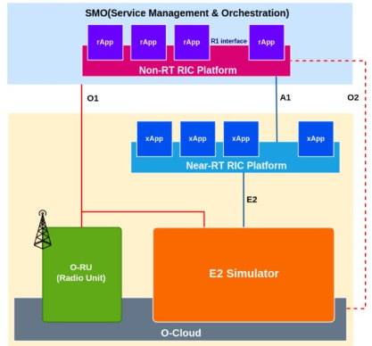

# OAI xAPP Deployment At Near RT RIC
This document details the deployment of an OpenAirInterface (OAI) xApp on the O-RAN Near-Real-Time RAN Intelligent Controller (Near-RT RIC). The primary objective is to establish a functional O-RAN environment where an xApp can successfully communicate with the RIC platform and interact with a simulated E2 Node.

- Based on O-RAN Software Community (OSC) Release: J (Jericho) / L (Lime)
- Host Environment: Windows 11 (WSL2)
- Guest OS: Ubuntu 24.04 LTS
- Container Orchestration: Kubernetes v1.28 (Manually provisioned via Kubeadm)
- Target Software: O-RAN Software Community (OSC) Release J/L artifacts.

**NAME - PETRAJOY DAVIDSON**

## 1. Introduction
Near-RT RIC (RAN Intelligent Controller): The "Brain" of the O-RAN architecture. It sits at the edge of the network and hosts microservices called xApps to control the RAN (Radio Access Network) in near-real-time (10ms - 1s loops).

xApp: An application designed to run on the RIC. It consumes telemetry data from the E2 Node (gNB) and makes intelligence-based decisions (e.g., Load Balancing, Handover Control, Slicing) to optimize network performance.

### Key RIC Platform Components (The "Pods" We Monitor)
Unlike the `gNB` which uses Service Models (`_sm.so`), the RIC is composed of Docker containers (Pods). These are the critical components we install and debug:

| Component    | Full Name             | Primary Functionality                                   | Key Role in Our Deployment                                                                 |
|--------------|-----------------------|---------------------------------------------------------|--------------------------------------------------------------------------------------------|
| e2term       | E2 Termination        | The Gateway. Maintains the SCTP connection with the gNB (or Simulator). | Decodes E2AP packets and forwards them to the internal RMR bus.                              |
| e2mgr        | E2 Manager            | The Admin. Manages the lifecycle of connected E2 Nodes. | Handles E2 Setup Requests and keeps track of connected gNBs.                                |
| rtmgr        | Route Manager         | The Traffic Cop. Distributes the routing table to all components. | Tells e2term where to send specific messages (e.g., "Send KPM data to xApp-A").              |
| submgr       | Subscription Manager  | The Broker. Manages data subscriptions.                 | Merges duplicate subscription requests from multiple xApps to save bandwidth.              |
| appmgr       | App Manager           | The Orchestrator. Deploys and manages xApps.            | Onboards xApp Helm charts and manages their lifecycle (Deploy/Undeploy).                   |
| a1mediator   | A1 Mediator           | The Boss's Ear. Interface to the Non-RT RIC (SMO).       | Receives policies (Intent) from the central management system.                              |
| dbaas        | DB-as-a-Service       | The Memory. Redis database backend.                     | Stores the state of RAN nodes, subscriptions, and configurations.                           |


## 2. System Architecture Overview
This project implements a complete O-RAN Near-RT RIC environment on a single workstation using Windows Subsystem for Linux (WSL2). Unlike standard bare-metal installations, this setup requires custom networking configurations to bridge the Kubernetes Cluster (inside WSL2) with external E2 Agents (Simulators).

### Architecture Diagram


### Data Flow Pipeline
- E2 Simulator generates fake RAN metrics (KPM).
- E2Term receives the data via SCTP (Port 36422).
- RMR (RIC Message Router) moves the data internally to the xApp.
- xApp processes the data (Logic).
- xApp sends a Control Message back to E2Term (if needed).


## 3. Installation

### Phase 1: Environment & Infrastructure (The Foundation)

#### Prequisites:
- OS: Ubuntu 22.04 LTS (Recommended for Rel-L; Ubuntu 20.04 is getting old for this release).
- Hardware: Minimum 4 vCPUs, 16GB RAM, 60GB Disk.
- User: Root or a user with sudo privileges without password (recommended to avoid script hangs).

#### Step 1: Clone The Deployment Repository
The O-RAN Software Community (OSC) keeps all deployment scripts in the `it/dep` repository.

```Bash
# 1. Go to home dir
geemajor@joy:~$ cd ~

# 2. Clone the Deplyoment Repository
geemajor@joy:~$ git clone "https://gerrit.o-ran-sc.org/r/it/dep"
Cloning into 'dep'...
remote: Counting objects: 2412, done
remote: Finding sources: 100% (2409/2409)
remote: Total 9188 (delta 1284), reused 8890 (delta 1284)
Receiving objects: 100% (9188/9188), 5.72 MiB | 625.00 KiB/s, done.
Resolving deltas: 100% (3935/3935), done.


geemajor@joy:~$ cd dep
geemajor@joy:~/dep$ git checkout l-release    # Crucial: Switch to Release L branch
Note: switching to 'l-release'.
You are in 'detached HEAD' state. You can look around, make experimental
changes and commit them, and you can discard any commits you make in this
state without impacting any branches by switching back to a branch.
If you want to create a new branch to retain commits you create, you may
do so (now or later) by using -c with the switch command. Example:

  git switch -c <new-branch-name>

Or undo this operation with:

  git switch -

Turn off this advice by setting config variable advice.detachedHead to false

HEAD is now at 7c0cc5f Merge "script to install k8s"
```

#### Step 2: Install Kubernetes, Helm, and Docker **(MANUALLY)**
Because the `k8s-1node-cloud-init.sh` failed for 3 reasons:
- OS Mismatch: The script is hardcoded to support only Ubuntu 16.04 or 18.04 (and maybe 20.04). You are running Ubuntu 24.04 (Noble Numbat), which is too new for this specific helper script.
- Kubernetes Version: The script is trying to install Kubernetes 1.16, which is ancient (from 2019). It will not run on Ubuntu 24.04, and the repositories for it are gone.
- WSL2 Issues: The logs show modprobe: FATAL: Module `nf_conntrack_ipv4` not found. This is because you are running inside WSL2 (Windows Subsystem for Linux), which handles networking differently than a standard server.

##### 1. Identify Stable IP
```Bash
geemajor@joy:~$ ip -4 addr show eth0 | grep inet
    inet 172.27.109.70/20 brd 172.27.111.255 scope global eth0
```

##### 2. Install Docker Manually
```Bash
# 1. Update And Install Docker
geemajor@joy:~$ sudo apt update
geemajor@joy:~$ sudo apt install -y docker.io

# 2. Allow Your User To Run Docker
geemajor@joy:~$ sudo usermod -aG docker $USER

# 3. CRITICAL: Switch to the group immediately (avoids logout)
geemajor@joy:~$ newgrp docker
```

##### 3. Install Kubernetes (Kubeadm)
We will install Kubernetes v1.28 (Compatible with Rel-L and Ubuntu 24.04).

```Bash
# 1. Install dependencies
geemajor@joy:~$ sudo apt-get install -y apt-transport-https ca-certificates curl gpg
Reading package lists... Done
Building dependency tree... Done
Reading state information... Done
...

# 2. Add Kubernetes Signing Key
geemajor@joy:~$ curl -fsSL https://pkgs.k8s.io/core:/stable:/v1.28/deb/Release.key | sudo gpg --dearmor -o /etc/apt/keyrings/kubernetes-apt-keyring.gpg

# 3. Add Kubernetes Repository
geemajor@joy:~$ echo 'deb [signed-by=/etc/apt/keyrings/kubernetes-apt-keyring.gpg] https://pkgs.k8s.io/core:/stable:/v1.28/deb/ /' | sudo tee /etc/apt/sources.list.d/kubernetes.list
deb [signed-by=/etc/apt/keyrings/kubernetes-apt-keyring.gpg] https://pkgs.k8s.io/core:/stable:/v1.28/deb/ /

# 4. Install Tools
geemajor@joy:~$ sudo apt-get update
geemajor@joy:~$ sudo apt-get install -y kubelet kubeadm kubectl
```

##### 4. Initialize The Cluster

``` Bash
# 1. Start Kubernetes
geemajor@joy:~$ sudo kubeadm init --pod-network-cidr=10.244.0.0/16 --apiserver-advertise-address=$WSL_IP

# 2. Configure Your USER To Use Kubectl
geemajor@joy:~$ mkdir -p $HOME/.kube
geemajor@joy:~$ sudo cp -i /etc/kubernetes/admin.conf $HOME/.kube/config
geemajor@joy:~$ sudo chown $(id -u):$(id -g) $HOME/.kube/config

# 3. Install Flannel Network & Untaint Node
geemajor@joy:~$ kubectl apply -f https://github.com/flannel-io/flannel/releases/latest/download/kube-flannel.yml
geemajor@joy:~$ kubectl taint nodes --all node-role.kubernetes.io/control-plane-
```

>[!Warning]
> If you encountered `[WARNING Swap]: swap is enabled;`
> Fix it with this fix block

This failure is very common on Ubuntu 24.04.
1. Swap Memory: Kubernetes refuses to start if Swap is enabled (the logs showed `[WARNING Swap]: swap is enabled)`.
2. Cgroup Driver Mismatch: Ubuntu 24.04 uses `systemd` to manage processes, but `containerd` (the software running the containers) defaults to an older method. They need to match, or `kubelet` crashes immediately.

Here is the fix script. It disables swap, aligns the drivers, resets the failed attempt, and try again.

```Bash
# --- STEP 1: PREPARATION & FIXES ---
# Disable Swap (Critical for K8s)
geemajor@joy:~$ sudo swapoff -a
geemajor@joy:~$ sudo sed -i '/ swap / s/^\(.*\)$/#\1/g' /etc/fstab

# Fix Containerd to match Ubuntu 24.04 (Fixes the crash)
geemajor@joy:~$ sudo mkdir -p /etc/containerd
geemajor@joy:~$ sudo containerd config default | sudo tee /etc/containerd/config.toml > /dev/null
geemajor@joy:~$ sudo sed -i 's/SystemdCgroup = false/SystemdCgroup = true/g' /etc/containerd/config.toml
geemajor@joy:~$ sudo systemctl restart containerd

# Reset any broken state from the previous attempt
geemajor@joy:~$ sudo kubeadm reset -f
geemajor@joy:~$ rm -rf $HOME/.kube

# --- STEP 2: INITIALIZE CLUSTER ---
# We use your specific IP: 172.27.xxx.x
geemajor@joy:~$ echo "Initializing Cluster on 172.27.xxx.xx..."

geemajor@joy:~$ sudo kubeadm init \
    --pod-network-cidr=10.244.0.0/16 \
    --apiserver-advertise-address=172.27.xxx.xx \ # your stable IP 
    --ignore-preflight-errors=Swap

# --- STEP 3: USER CONFIGURATION ---
geemajor@joy:~$ mkdir -p $HOME/.kube
geemajor@joy:~$ sudo cp -i /etc/kubernetes/admin.conf $HOME/.kube/config
geemajor@joy:~$ sudo chown $(id -u):$(id -g) $HOME/.kube/config

# --- STEP 4: NETWORK SETUP ---
# Install Flannel Network
kubectl apply -f https://github.com/flannel-io/flannel/releases/latest/download/kube-flannel.yml

# Allow pods to run on this single machine (Untaint)
geemajor@joy:~$ kubectl taint nodes --all node-role.kubernetes.io/control-plane-
```

##### 5. Verify The Cluster
After initializing the cluster, verify using this code

```Bash
geemajor@joy:~$ kubectl get pods -A
NAMESPACE      NAME                          READY   STATUS              RESTARTS   AGE
kube-flannel   kube-flannel-ds-htv4t         0/1     Init:0/2            0          2s
kube-system    coredns-5dd5756b68-k9wgs      0/1     Pending             0          2s
kube-system    coredns-5dd5756b68-zvqfb      0/1     Pending             0          2s
kube-system    etcd-joy                      1/1     Running             0          17s
kube-system    kube-apiserver-joy            1/1     Running             0          17s
kube-system    kube-controller-manager-joy   1/1     Running             0          17s
kube-system    kube-proxy-ctv5v              0/1     ContainerCreating   0          2s
kube-system    kube-scheduler-joy            1/1     Running             0          17s
```

##### 6. Sanity Check
Run this to confirm `coredns` and `flannel` are ready:
```Bash
geemajor@joy:~$ kubectl get pods -A
NAMESPACE      NAME                          READY   STATUS    RESTARTS   AGE
kube-flannel   kube-flannel-ds-htv4t         1/1     Running   0          64s
kube-system    coredns-5dd5756b68-k9wgs      1/1     Running   0          64s
kube-system    coredns-5dd5756b68-zvqfb      1/1     Running   0          64s
kube-system    etcd-joy                      1/1     Running   0          79s
kube-system    kube-apiserver-joy            1/1     Running   0          79s
kube-system    kube-controller-manager-joy   1/1     Running   0          79s
kube-system    kube-proxy-ctv5v              1/1     Running   0          64s
kube-system    kube-scheduler-joy            1/1     Running   0          79s
```
All pods should show `1/1 Running`. (If coredns is still pending, give it another 30 seconds).

### Phase 2. Deploy The Near-RT RIC Platform
We need to tell the O-RAN deployment scripts to use your specific IP (`172.27.xxx.xx`) so the components can talk to each other.

#### Step 1: Download The Submodules
```Bash
geemajor@joy:~/dep/RECIPE_EXAMPLE$ cd ~/dep

# Initialize and download all submodules (including ric-dep)
geemajor@joy:~/dep$ git submodule update --init --recursive

Submodule path 'ranpm': checked out '6748b9e87a3a09a430080cfd508275e6f18f4342'
Submodule path 'ric-dep': checked out '0ce5f68bafe78470b1331284c47918c513173ad2'
Submodule path 'smo-install/multicloud-k8s': checked out '2d9e8566cbd81e6feb7e3068f6ff089fdc3a93d9'
Submodule path 'smo-install/onap_oom': checked out '1507ea7ec3bc90ba859acfc6ac22fd23c443e14b'
```

#### Step 2: Find The File Location
```Bash
geemajor@joy:~/dep$ find ~/dep/ric-dep -name "*recipe.yaml"
/home/geemajor/dep/ric-dep/RECIPE_EXAMPLE/example_recipe.yaml
```

#### Step 3: Copy the Recipe to Home
```Bash
geemajor@joy:~/dep$ cp ~/dep/ric-dep/RECIPE_EXAMPLE/example_recipe.yaml ~/my_recipe.yaml
```

#### Step 4: Edit the Configuration
We need to tell the RIC to use the specific machine IP (`172.27.xxx.xx`) instead of the default `10.0.0.1.`

```Bash
geemajor@joy:~/dep$ nano ~/my_recipe.yaml

# Find and change these 3 specific lines: (Use Ctrl+W to search for "ricip", etc.)
# 1. ricip: "Change to Your IP Address"
# 2. auxip: "Change to Your IP Address"
# 3. gateway: "Change to Your IP Address"

# Save and exit
```

##### Step 5: Run The Deployment Scipt (And Debugging)
Run the installer using the custom recipe.
```Bash
geemajor@joy:~/dep$ cd ~/dep/bin
geemajor@joy:~/dep/bin$ ./deploy-ric-platform -f ~/my_recipe.yaml
```

>[!Warning]
> If it encounters: `ERROR` Can't locate the ric-common helm package in the local repo. Please make sure that it is properly installed.

Fix it by create a "shortcut" (symbolic link) so the system can find Helm in the standard folder.

1. Step 1: Remove the Broken Link & Snap
```Bash
geemajor@joy:~/dep/bin$ sudo rm /usr/local/bin/helm
geemajor@joy:~/dep/bin$ sudo snap remove helm
```

2. Install Helm (Official Script)
```Bash
geemajor@joy:~/dep/bin$ cd ~

geemajor@joy:~$ curl -fsSL -o get_helm.sh https://raw.githubusercontent.com/helm/helm/main/scripts/get-helm-3
chmod 700 get_helm.sh
./get_helm.sh
```

3. Verify
```
geemajor@joy:~$ helm version
version.BuildInfo{Version:"v3.20.0", GitCommit:"b2e4314fa0f229a1de7b4c981273f61d69ee5a59", GitTreeState:"clean", GoVersion:"go1.25.6"}
```

4. Install Plugin
```Bash
# 1. Install the push plugin (Required for O-RAN)
geemajor@joy:~$ helm plugin install https://github.com/chartmuseum/helm-push.git
Downloading and installing helm-push v0.10.4 ...
https://github.com/chartmuseum/helm-push/releases/download/v0.10.4/helm-push_0.10.4_linux_amd64.tar.gz
Installed plugin: cm-push
```

5. Configure Root for Kubernetes
```Bash
geemajor@joy:~/dep/bin$ sudo mkdir -p /root/.kube
sudo cp /etc/kubernetes/admin.conf /root/.kube/config

#Verify If the configuration Works
geemajor@joy:~/dep/bin$ sudo kubectl get pods -A
NAMESPACE      NAME                          READY   STATUS    RESTARTS   AGE
kube-flannel   kube-flannel-ds-htv4t         1/1     Running   0          16m
kube-system    coredns-5dd5756b68-k9wgs      1/1     Running   0          16m
kube-system    coredns-5dd5756b68-zvqfb      1/1     Running   0          16m
kube-system    etcd-joy                      1/1     Running   0          17m
kube-system    kube-apiserver-joy            1/1     Running   0          17m
kube-system    kube-controller-manager-joy   1/1     Running   0          17m
kube-system    kube-proxy-ctv5v              1/1     Running   0          16m
kube-system    kube-scheduler-joy            1/1     Running   0          17m
```

> [!Warning]
> If you deploy after these fixes but still get a `Version Conflict` because of API versions like `v1beta1`. Then we need to "patch the chart files to update these API Versions to the modern `v1` standard

Fix with these code:
```BASH
geemajor@joy:~/dep/bin$ cd ~/dep

# 1. Fix RBAC (Permissions) - Safe to swap
geemajor@joy:~/dep/bin$ grep -r "rbac.authorization.k8s.io/v1beta1" . -l | xargs sed -i 's|rbac.authorization.k8s.io/v1beta1|rbac.authorization.k8s.io/v1|g'

# 2. Fix Ingress (Networking) - Safe to swap for simple charts
geemajor@joy:~/dep/bin$ grep -r "networking.k8s.io/v1beta1" . -l | xargs sed -i 's|networking.k8s.io/v1beta1|networking.k8s.io/v1|g'

# 3. Fix CRDs (Custom Resources)
geemajor@joy:~/dep/bin$ grep -r "apiextensions.k8s.io/v1beta1" . -l | xargs sed -i 's|apiextensions.k8s.io/v1beta1|apiextensions.k8s.io/v1|g'

geemajor@joy:~/dep/bin$ echo "Charts patched to support Kubernetes v1.28!"
```

Since some components (like `dbaas` and `rtmgr`) installed while others failed, the cluster is in a "half-broken" state. We should clean it before retrying.

```bASH
# Delete the failed deployments (ignore 'not found' errors)
geemajor@joy:~/dep/bin$ sudo helm uninstall -n ricplt r4-infrastructure
geemajor@joy:~/dep/bin$ sudo helm uninstall -n ricplt r4-dbaas
geemajor@joy:~/dep/bin$ sudo helm uninstall -n ricplt r4-appmgr
geemajor@joy:~/dep/bin$ sudo helm uninstall -n ricplt r4-rtmgr
geemajor@joy:~/dep/bin$ sudo helm uninstall -n ricplt r4-e2mgr
geemajor@joy:~/dep/bin$ sudo helm uninstall -n ricplt r4-e2term
geemajor@joy:~/dep/bin$ sudo helm uninstall -n ricplt r4-a1mediator
geemajor@joy:~/dep/bin$ sudo helm uninstall -n ricplt r4-submgr
geemajor@joy:~/dep/bin$ sudo helm uninstall -n ricplt r4-vespamgr
geemajor@joy:~/dep/bin$ sudo helm uninstall -n ricplt r4-o1mediator
geemajor@joy:~/dep/bin$ sudo helm uninstall -n ricplt r4-alarmmanager
```
>[!Warning]
> If after doing all that and then trying to deploy but can't because of `pathType: ImplementationSpecific` (or `Prefix`) for every Ingress rule, which the old O-RAN code is missing.

Debug it with applying the "smart patch" that actually injects the missing `pathType` line into the YAML files.

```Bash
geemajor@joy:~/dep/bin$ cd ~/dep

# --- FIX 1: Inject 'pathType' into Ingress files ---
# This finds every "path:" line in an Ingress file and adds "pathType: ImplementationSpecific" below it.
geemajor@joy:~/dep/bin$ find . -name "ingress.yaml" -o -name "ingress-*.yaml" | xargs sed -i '/path: /a \ \ \ \ \ \ \ \ \ \ pathType: ImplementationSpecific'

# --- FIX 2: Update Ingress Backend Syntax ---
# Old syntax: serviceName / servicePort
# New syntax: service: name: <name> / port: number: <port>
# We use a rough sed replacement to make it compatible with v1
geemajor@joy:~/dep/bin$ find . -name "ingress.yaml" -o -name "ingress-*.yaml" | xargs sed -i 's/serviceName:/service:\n            name:/g'
geemajor@joy:~/dep/bin$ find . -name "ingress.yaml" -o -name "ingress-*.yaml" | xargs sed -i 's/servicePort:/port:\n              number:/g'

# --- FIX 3: Patch Kong CRDs (The "kong*.configuration" errors) ---
# The Kong charts are too old. We will delete the Kong references since we don't strictly need them for a basic "Hello World".
# We disable Kong in the recipe (it's the ingress controller).
geemajor@joy:~/dep/bin$ sed -i 's/kong: true/kong: false/g' ~/my_recipe.yaml

# If Kong is hardcoded in infrastructure, we try to patch the CRD version definition
geemajor@joy:~/dep/bin$ grep -r "spec.versions" . -l | xargs sed -i 's/version: v1beta1/version: v1/g'

echo "Smart Patch Applied!"
```
After that, clean the cluster again (CRUCIAL), and then try to redeploy it again. If the `helm uninstall` didn't fully clean up the old releases then we need to
1. Undo the damage
2. Disable the problematic components (Ingress and Kong)

Instead of trying to patch them, and then cleanly redeploy. It can be debugged using this few steps

1.  Revert the Broken Changes
First, let's undo the `sed` edits that corrupted the YAML files.

```Bash
geemajor@joy:~/dep$ cd ~/dep

geemajor@joy:~/dep$ git checkout .
Updated 18 paths from the index

geemajor@joy:~/dep$ git submodule update --force
Submodule path 'ranpm': checked out '6748b9e87a3a09a430080cfd508275e6f18f4342'
Submodule path 'ric-dep': checked out '0ce5f68bafe78470b1331284c47918c513173ad2'
Submodule path 'smo-install/multicloud-k8s': checked out '2d9e8566cbd81e6feb7e3068f6ff089fdc3a93d9'
Submodule path 'smo-install/onap_oom': checked out '1507ea7ec3bc90ba859acfc6ac22fd23c443e14b'
```

2. "Bypass" Strategy (Disable Ingress & Kong)

Instead of fighting with Kubernetes v1.28 syntax, we will simply turn off the Ingress (external access) and Kong (API Gateway) for now. We can still access everything using kubectl `port-forward`, which is standard for development.

```Bash
geemajor@joy:~/dep$ cd ~/dep

# 1. Disable Ingress in all charts (Solves the "YAML parse error")
geemajor@joy:~/dep$ find . -name "values.yaml" | xargs sed -i 's/ingressEnabled: true/ingressEnabled: false/g'
geemajor@joy:~/dep$ find . -name "values.yaml" | xargs sed -i 's/enabled: true/enabled: false/g'  # Only targets ingress blocks if indented, strictly we use specific keys below:

# Forcefully disable ingress in known component values
# (Using specific replacement to avoid breaking other 'enabled' flags)
geemajor@joy:~/dep$ find . -name "values.yaml" | xargs sed -i 's/ingress:/ingress:\n  enabled: false\n  #OldConfig:/g'

# 2. Disable Kong in Infrastructure (Solves the "CRD Invalid" error)
# We strictly delete the Kong dependency requirements
geemajor@joy:~/dep$ find . -name "requirements.yaml" | xargs sed -i '/name: kong/,/version:/d'

# 3. Nuke the Kong subcharts to be sure
geemajor@joy:~/dep$ find . -name "kong" -type d -exec rm -rf {} +

geemajor@joy:~/dep$ echo "Ingress and Kong have been disabled!"
```
3. Nuclear Clean-Up

forcefully remove the "stuck" releases that are causing the cannot re-use a name error.

```Bash
# 1. Delete all helm releases in the RIC namespace
geemajor@joy:~/dep$ sudo helm list -n ricplt -q | xargs -r sudo helm uninstall -n ricplt

# 2. Delete the namespace to clear any stuck finalizers (Optional but good)
geemajor@joy:~/dep$ kubectl delete namespace ricplt --wait=false
geemajor@joy:~/dep$ kubectl delete namespace ricinfra --wait=false

# 3. Re-create namespaces manually to be ready
geemajor@joy:~/dep$ kubectl create namespace ricplt
geemajor@joy:~/dep$ kubectl create namespace ricinfra
```

4. Force Delete the Stuck Namespaces
```Bash
# Force delete ricplt
geemajor@joy:~/dep$ kubectl get namespace ricplt -o json | \
  sed 's/"kubernetes"//' | \
  kubectl replace --raw "/api/v1/namespaces/ricplt/finalize" -f -

# Force delete ricinfra
geemajor@joy:~/dep$ kubectl get namespace ricinfra -o json | \
  sed 's/"kubernetes"//' | \
  kubectl replace --raw "/api/v1/namespaces/ricinfra/finalize" -f -

# Wait a few seconds
geemajor@joy:~/dep$ sleep 5
```

5. "Search & Destroy" Patch
To avoid  getting on a loop to the version errors, do this patch. It fixes the permissions and deletes the networking rules that are breaking the install.
```Bash
geemajor@joy:~/dep$ cd ~/dep

# 1. Fix RBAC Permissions (Update v1beta1 -> v1)
# This allows the pods to start without "Role" errors.
geemajor@joy:~/dep$ grep -r "rbac.authorization.k8s.io/v1beta1" . -l | xargs sed -i 's|rbac.authorization.k8s.io/v1beta1|rbac.authorization.k8s.io/v1|g'

# 2. DELETE all Ingress files (The "Nuclear Option")
# Instead of trying to disable them, we remove them so Helm can't try to install them.
geemajor@joy:~/dep$ find . -name "ingress.yaml" -o -name "ingress-*.yaml" -exec rm -f {} +

# 3. Disable Kong dependencies (Again, to be safe)
geemajor@joy:~/dep$ find . -name "requirements.yaml" | xargs sed -i '/name: kong/,/version:/d'
geemajor@joy:~/dep$ find . -name "kong" -type d -exec rm -rf {} +

geemajor@joy:~/dep$ echo "Permissions fixed and Ingress removed!"
```

6. Run The Final Deployment
```Bash
geemajor@joy:~/dep$ cd ~/dep/bin
geemajor@joy:~/dep$ sudo ./deploy-ric-platform -f /home/geemajor/my_recipe.yaml
```

##### Step 6: Check The Pods

```Bash
geemajor@joy:~/dep/bin$ kubectl get pods -n ricplt
NAME                                                         READY   STATUS              RESTARTS   AGE
deployment-ricplt-a1mediator-8f96cf8bf-l2nz2                 0/1     ContainerCreating   0          2m7s
deployment-ricplt-a1mediator-8f96cf8bf-x5tt9                 0/1     Terminating         0          15m
deployment-ricplt-alarmmanager-675c574db6-f26b4              0/1     Terminating         0          19m
deployment-ricplt-alarmmanager-675c574db6-p2pt4              0/1     Pending             0          5m19s
deployment-ricplt-appmgr-6c95454fb5-4p6ct                    0/1     Terminating         0          16m
deployment-ricplt-appmgr-6c95454fb5-ndxzh                    0/1     Init:0/1            0          2m48s
deployment-ricplt-e2mgr-6fd97b9bd7-ptzmv                     0/1     ContainerCreating   0          2m28s
deployment-ricplt-e2mgr-77fb448967-n6nx6                     0/1     Terminating         0          16m
deployment-ricplt-e2term-alpha-5945595b54-rs5xt              0/1     Terminating         0          20m
deployment-ricplt-e2term-alpha-79df499c-4t7nn                0/1     Pending             0          6m3s
deployment-ricplt-o1mediator-7cf7dbfbd9-4q7bl                0/1     ContainerCreating   0          5m28s
deployment-ricplt-o1mediator-7cf7dbfbd9-kzhpq                0/1     Terminating         0          15m
deployment-ricplt-o1mediator-7cf7dbfbd9-mrx4s                0/1     Terminating         0          19m
deployment-ricplt-rtmgr-764ccd5778-7vq2h                     0/1     Terminating         0          20m
deployment-ricplt-rtmgr-764ccd5778-cdc9w                     0/1     Terminating         0          16m
deployment-ricplt-rtmgr-764ccd5778-fkfgc                     0/1     ContainerCreating   0          6m26s
deployment-ricplt-submgr-656dc6c5c7-8cjbx                    0/1     Terminating         0          19m
deployment-ricplt-submgr-656dc6c5c7-hkzz6                    0/1     Terminating         0          15m
deployment-ricplt-submgr-656dc6c5c7-vrx7v                    0/1     ContainerCreating   0          5m48s
deployment-ricplt-vespamgr-9dbd67c4-7zfbc                    0/1     ContainerCreating   0          5m36s
deployment-ricplt-vespamgr-9dbd67c4-9sm4k                    0/1     Terminating         0          19m
deployment-ricplt-vespamgr-9dbd67c4-rkg6z                    0/1     Terminating         0          15m
r4-infrastructure-kong-55f58c454d-44kfx                      0/1     ContainerCreating   0          3m8s
r4-infrastructure-kong-7d766b49bb-dd879                      0/2     Terminating         0          11m
r4-infrastructure-kong-7d766b49bb-xc4hw                      0/2     Terminating         0          16m
r4-infrastructure-prometheus-alertmanager-64f9876d6d-74cc2   0/2     Terminating         0          16m
r4-infrastructure-prometheus-alertmanager-64f9876d6d-8cwh9   0/2     Terminating         0          11m
r4-infrastructure-prometheus-alertmanager-64f9876d6d-dsxjf   0/2     ContainerCreating   0          3m8s
r4-infrastructure-prometheus-server-bcc8cc897-q56kh          0/1     Terminating         0          11m
r4-infrastructure-prometheus-server-bcc8cc897-tq8kd          0/1     Terminating         0          16m
r4-infrastructure-prometheus-server-bcc8cc897-wzz2h          0/1     ContainerCreating   0          3m8s
statefulset-ricplt-dbaas-server-0                            1/1     Running             0          6m43s
```
> [!Warning]
> If the pods stuck for 10 mintues or more, in `ContainerCreating` or `Init:0/1`. It usually means something is broken behind the scenes (like a download failure or a network block).

Usually the problem is Kubernetes tried to pull the image, failed (timeout), We need to download the image to the local Docker cache, the new pod will skip the download and start instantly.

1. Manually download image using `docker`
```Bash
geemajor@joy:~/dep/bin$ docker pull nexus3.o-ran-sc.org:10002/o-ran-sc/it-dep-init:0.0.1
0.0.1: Pulling from o-ran-sc/it-dep-init
89d9c30c1d48: Pull complete
ac78113328f6: Pull complete
8ec64c6f78d8: Pull complete
b1647d55ba07: Pull complete
704106a24018: Pull complete
6f8ac08f4b70: Pull complete
4dd61e0205fa: Pull complete
Digest: sha256:bfe51e3b32dec8e445793cce616906cd334b0aa677ea4dbc679eced65ae32cd1
Status: Downloaded newer image for nexus3.o-ran-sc.org:10002/o-ran-sc/it-dep-init:0.0.1
nexus3.o-ran-sc.org:10002/o-ran-sc/it-dep-init:0.0.1
```

2. Kickstart the App Manager

Run this to delete the stuck `appmgr` pod:
```Bash
geemajor@joy:~/dep/bin$ kubectl delete pod -n ricplt deployment-ricplt-appmgr-6c95454fb5-ndxzh
pod "deployment-ricplt-appmgr-6c95454fb5-ndxzh" deleted
```

3. "Mass Download" Strategy (Recommended)

Since the connection to the O-RAN registry is slow, the other pods (e2mgr, rtmgr, e2term) are likely stuck pulling their images too.

Instead of waiting for them to fail one by one, let's manually download all the required images in the background. This bypasses the Kubernetes timeouts.

```Bash
# 1. Get the list of all images your stuck pods need
IMAGES=$(kubectl get pods -n ricplt -o jsonpath="{.items[*].spec.containers[*].image}" | tr -s '[[:space:]]' '\n' | sort | uniq)

# 2. Download them manually (bypassing Kubernetes timeouts)
echo "Starting Mass Download..."
for img in $IMAGES; do
  echo "Downloading $img..."
  docker pull $img
done
```

4. Verify the pods

Control plane pods should be `Running` or in `1/1` or `2/2` state. After downloading the images verify the pod's condition first.
```Bash
geemajor@joy:~/dep/bin$  kubectl get pods -n ricplt
NAME                                                         READY   STATUS    RESTARTS         AGE
deployment-ricplt-a1mediator-8f96cf8bf-l2nz2                 1/1     Running   0                11h
deployment-ricplt-alarmmanager-675c574db6-p2pt4              0/1     Pending   0                11h
deployment-ricplt-appmgr-6c95454fb5-xrj9p                    1/1     Running   0                11h
deployment-ricplt-e2mgr-6fd97b9bd7-ptzmv                     1/1     Running   0                11h
deployment-ricplt-e2term-alpha-79df499c-4t7nn                0/1     Pending   0                12h
deployment-ricplt-o1mediator-7cf7dbfbd9-4q7bl                1/1     Running   0                12h
deployment-ricplt-rtmgr-764ccd5778-fkfgc                     1/1     Running   72 (7m22s ago)   12h
deployment-ricplt-submgr-656dc6c5c7-vrx7v                    1/1     Running   0                12h
deployment-ricplt-vespamgr-9dbd67c4-7zfbc                    1/1     Running   0                12h
r4-infrastructure-kong-55f58c454d-44kfx                      1/1     Running   0                11h
r4-infrastructure-prometheus-alertmanager-64f9876d6d-dsxjf   2/2     Running   0                11h
r4-infrastructure-prometheus-server-bcc8cc897-wzz2h          1/1     Running   0                11h
statefulset-ricplt-dbaas-server-0                            1/1     Running   0                12h
```

Now we just have two "Pending" holdouts to fix before we can start the simulator:
1. `deployment-ricplt-e2term-alpha` (Pending) → Critical (This talks to the E2 Simulator).
2. `deployment-ricplt-alarmmanager` (Pending) → Important (Handles alerts).

"Pending" usually means the pod is waiting for a resource (like a storage volume) that doesn't exist yet. We need to ask Kubernetes exactly why these two are stuck. Run these commands and check the "Events" section at the bottom.

```Bash
geemajor@joy:~/dep/bin$ kubectl describe pod -n ricplt deployment-ricplt-e2term-alpha
Events:
  Type     Reason            Age                  From               Message
  ----     ------            ----                 ----               -------
  Warning  FailedScheduling  26m (x140 over 11h)  default-scheduler  0/1 nodes are available: persistentvolumeclaim "pvc-ricplt-e2term-alpha" not found. preemption: 0/1 nodes are available: 1 Preemption is not helpful for scheduling..

geemajor@joy:~/dep/bin$ kubectl describe pod -n ricplt deployment-ricplt-alarmmanager
Events:
  Type     Reason            Age                 From               Message
  ----     ------            ----                ----               -------
  Warning  FailedScheduling  26m (x120 over 9h)  default-scheduler  0/1 nodes are available: persistentvolumeclaim "pvc-ricplt-alarmmanager" not found. preemption: 0/1 nodes are available: 1 Preemption is not helpful for scheduling..
```
The kubectl describe output gives us the definitive answer. Both pods are stuck for the exact same reason: `persistentvolumeclaim "pvc-ricplt-e2term-alpha" not found persistentvolumeclaim "pvc-ricplt-alarmmanager" not found` The Helm charts tried to request "Hard Drive space" (PVCs), but for some reason, the request failed or wasn't submitted. We need to manually create these "Storage Claims" so the pods can mount them and start.

The Fix: Manually Create the Missing Storage
```Bash
geemajor@joy:~/dep/bin$ cat <<EOF | kubectl apply -f -
# --- E2TERM STORAGE ---
apiVersion: v1
kind: PersistentVolume
metadata:
  name: pv-ricplt-e2term-alpha
  labels:
    type: local
spec:
  storageClassName: manual
  capacity:
    storage: 100Mi
  accessModes:
    - ReadWriteOnce
  hostPath:
    path: "/tmp/ricplt-e2term-alpha"
---
apiVersion: v1
kind: PersistentVolumeClaim
metadata:
  name: pvc-ricplt-e2term-alpha
  namespace: ricplt
spec:
  storageClassName: manual
  accessModes:
    - ReadWriteOnce
  resources:
    requests:
      storage: 100Mi
---
# --- ALARM MANAGER STORAGE ---
apiVersion: v1
kind: PersistentVolume
metadata:
  name: pv-ricplt-alarmmanager
  labels:
    type: local
spec:
  storageClassName: manual
  capacity:
    storage: 100Mi
  accessModes:
    - ReadWriteOnce
  hostPath:
    path: "/tmp/ricplt-alarmmanager"
---
apiVersion: v1
kind: PersistentVolumeClaim
metadata:
  name: pvc-ricplt-alarmmanager
  namespace: ricplt
spec:
  storageClassName: manual
  accessModes:
    - ReadWriteOnce
  resources:
    requests:
      storage: 100Mi
EOF
```

Verify the pod's health
```Bash
geemajor@joy:~/dep/bin$ kubectl get pods -n ricplt
NAME                                                         READY   STATUS      RESTARTS         AGE
deployment-ricplt-a1mediator-8f96cf8bf-l2nz2                 1/1     Running     1 (19m ago)      12h
deployment-ricplt-alarmmanager-675c574db6-p2pt4              1/1     Running     0                12h
deployment-ricplt-appmgr-6c95454fb5-xrj9p                    1/1     Running     0                12h
deployment-ricplt-e2mgr-6fd97b9bd7-ptzmv                     1/1     Running     0                12h
deployment-ricplt-e2term-alpha-79df499c-4t7nn                1/1     Running     0                12h
deployment-ricplt-o1mediator-7cf7dbfbd9-4q7bl                1/1     Running     0                12h
deployment-ricplt-rtmgr-764ccd5778-fkfgc                     0/1     Completed   75 (8m19s ago)   12h
deployment-ricplt-submgr-656dc6c5c7-vrx7v                    1/1     Running     0                12h
deployment-ricplt-vespamgr-9dbd67c4-7zfbc                    1/1     Running     0                12h
r4-infrastructure-kong-55f58c454d-44kfx                      1/1     Running     0                12h
r4-infrastructure-prometheus-alertmanager-64f9876d6d-dsxjf   2/2     Running     0                12h
r4-infrastructure-prometheus-server-bcc8cc897-wzz2h          1/1     Running     0                12h
statefulset-ricplt-dbaas-server-0                            1/1     Running     1 (20m ago)      12h
```

### Phase 3: E2 Simulator
Build the simulator and make it talk to RIC.

#### Step 1: Clone The Simulator Code
We will use the official O-RAN E2 Simulator repository.

```Bash
geemajor@joy:~/dep/bin$ cd ~

geemajor@joy:~$ git clone "https://gerrit.o-ran-sc.org/r/sim/e2-interface"
Cloning into 'e2-interface'...
remote: Total 5006 (delta 0), reused 5006 (delta 0)
Receiving objects: 100% (5006/5006), 4.52 MiB | 439.00 KiB/s, done.
Resolving deltas: 100% (3920/3920), done.
Updating files: 100% (960/960), done.
```
#### Step 2: Build The Docker Image
This packs the simulator into a container so we don't have to install C++ libraries on your main machine.

##### 1. Build The Simulator

```Bash
geemajor@joy:~/e2-interface/e2sim$ docker build -f docker/Dockerfile -t e2sim:1.0.0 .

Step 1/8 : ARG CONTAINER_PULL_REGISTRY=nexus3.o-ran-sc.org:10001
Step 2/8 : FROM ${CONTAINER_PULL_REGISTRY}/o-ran-sc/bldr-ubuntu18-c-go:1.9.0 as buildenv
 ---> cdcad96bd128
Step 3/8 : RUN mkdir /playpen
 ---> Running in 2af6499f4640
 ---> Removed intermediate container 2af6499f4640
 ---> f9b6851eaa2c
Step 4/8 : RUN apt-get update && apt-get install -y build-essential git cmake libsctp-dev autoconf automake libtool bison flex libboost-all-dev
 ---> Running in f9a965426a29
  ---> Removed intermediate container f9a965426a29
 ---> af3e44ef8614
Step 5/8 : WORKDIR /playpen
 ---> Running in e00ff683cd53
 ---> Removed intermediate container e00ff683cd53
 ---> b051478f1d46
Step 6/8 : COPY . /playpen
 ---> 0743bfa06082
Step 7/8 : RUN mkdir build && cd build && cmake .. && make package && cmake .. -DDEV_PKG=1
 ---> Running in f93fd9636d18

#Output, Trimmed
[100%] Building C object asn1c/CMakeFiles/asn1_objects.dir/xer_decoder.c.o
[100%] Building C object asn1c/CMakeFiles/asn1_objects.dir/xer_encoder.c.o
[100%] Building C object asn1c/CMakeFiles/asn1_objects.dir/xer_support.c.o
[100%] Built target asn1_objects
Run CPack packaging tool...
CPack: Create package using DEB
CPack: Install projects
CPack: - Run preinstall target for: e2sim
CPack: - Install project: e2sim
CPack: Create package
-- CPACK_DEBIAN_PACKAGE_DEPENDS not set, the package will have no dependencies.
CPack: - package: /playpen/build/e2sim_1.0.0_amd64.deb generated.
CPack: Create package using RPM
CPack: Install projects
CPack: - Run preinstall target for: e2sim
CPack: - Install project: e2sim
CPack: Create package
-- alien found, we may be on a Debian based distro.
-- CPackRPM:Debug: Using CPACK_RPM_ROOTDIR=/playpen/build/_CPack_Packages/Linux/RPM
CPackRPM: Will use GENERATED spec file: /playpen/build/_CPack_Packages/Linux/RPM/SPECS/e2sim.spec
CPack: - package: /playpen/build/e2sim-1.0.0-x86_64.rpm generated.
+++ pkg name: e2sim-dev_1.0.0_amd64.deb
+++ pkg name: e2sim-devel-1.0.0-x86_64.rpm
+++ make package will generate both deb and rpm packages
+++ profiling is off
-- Configuring done
-- Generating done
-- Build files have been written to: /playpen/build
 ---> Removed intermediate container f93fd9636d18
 ---> 970e8dfd192a
Step 8/8 : CMD [ "make package" ]
 ---> Running in 4a600f33e326
 ---> Removed intermediate container 4a600f33e326
 ---> d38f8c22ebc4
Successfully built d38f8c22ebc4
Successfully tagged e2sim:1.0.0
```


#### Step 3: Find The Target IP
The simulator needs to know where to send the "Hello" message. It needs the IP address of your running E2 Termination pod.

```Bash
geemajor@joy:~/e2-interface/e2sim$ kubectl get pods -n ricplt -o wide | grep e2term
deployment-ricplt-e2term-alpha-79df499c-4t7nn                1/1     Running   0                14h   10.244.0.42   joy    <none>           <none>
```

> [!Note]
> The E2 Simulator image (`e2sim:1.0.0`) is built and ready. 

### Phase 4: Connecting the Simulator to the RIC.
E2 Termination IP as 10.244.0.42. We will use that

#### Step 1: Enter the Simulator Container 
```Bash
geemajor@joy:~/e2-interface/e2sim$ docker run -it --rm --net=host e2sim:1.0.0 /bin/bash
root@joy:/playpen#
```

#### Step 2: Find and Run the Simulator
Once you are inside the container, follow these steps exactly:

##### 1. Go to the build directory
```
root@joy:/playpen# cd /playpen/build
root@joy:/playpen/build#
```

##### 2. Verify the executable is there:
```
root@joy:/playpen/build# ls -F
CMakeCache.txt     CPackSourceConfig.cmake  asn1c/                  e2sim_1.0.0_amd64.deb  src/
CMakeFiles/        Makefile                 cmake_install.cmake     install_manifest.txt
CPackConfig.cmake  _CPack_Packages/         e2sim-1.0.0-x86_64.rpm  libe2sim_shared.so*
```
>[!Warning]
> If its not found, then do these steps

1. Go to the KPM example source folder
```
root@joy:/playpen/build# cd /playpen/e2sm_examples/kpm_e2sm
root@joy:/playpen/e2sm_examples/kpm_e2sm#
```

2. Hunt for the Executable
```
find /playpen -name kpm_sim
find /playpen -name e2sim -type f
```
If not found (Compile it)
```
# 1. Go to the KPM example source folder
root@joy: cd /playpen/e2sm_examples/kpm_e2sm

# 2. Prepare the build directory
root@joy:/playpen/e2sm_examples/kpm_e2sm# mkdir -p build
root@joy:/playpen/e2sm_examples/kpm_e2sm# cd build
root@joy:/playpen/e2sm_examples/kpm_e2sm/build# 

# 3. Create the link to 'asn1c' here
root@joy:/playpen/e2sm_examples/kpm_e2sm/build# cd ..
root@joy:/playpen/e2sm_examples/kpm_e2sm# ln -sf /playpen/asn1c .

# 4. Verify it exists (you should see 'asn1c' in cyan/blue)
root@joy:/playpen/e2sm_examples/kpm_e2sm# ls -F
CMakeLists.txt*  build/              reports.json            src/
README           cellMeasReport.txt  reports_file_full.json  ueMeasReport.txt
asn1c@           helm/               simulation.txt
```
After that, lets clean and compile
```
# 1. Go back into the build folder
root@joy:/playpen/e2sm_examples/kpm_e2sm# cd build

# 2. Clear out the failed attempt
root@joy:/playpen/e2sm_examples/kpm_e2sm/build# rm -rf *

# 3. Run CMake (This will work now!)
root@joy:/playpen/e2sm_examples/kpm_e2sm/build# cmake ..
-- Configuring done
-- Generating done
-- Build files have been written to: /playpen/e2sm_examples/kpm_e2sm/build

# 4. Compile the simulator
root@joy:/playpen/e2sm_examples/kpm_e2sm/build# make
```
>[!Warning]
> If you encounter this error
> ```container
>[ 99%] Built target asn1_objects
> Scanning dependencies of target kpm_sim
> [ 99%] Building CXX object src/kpm/CMakeFiles/kpm_sim.dir/kpm_callbacks.cpp.o
> In file included from /playpen/e2sm_examples/kpm_e2sm/src/kpm/kpm_callbacks.cpp:41:0:
> /playpen/e2sm_examples/kpm_e2sm/src/kpm/kpm_callbacks.hpp:20:10: fatal error: e2sim.hpp: No such file or directory
>  #include "e2sim.hpp"
>           ^~~~~~~~~~~
> compilation terminated.
> src/kpm/CMakeFiles/kpm_sim.dir/build.make:62: recipe for target 'src/kpm/CMakeFiles/kpm_sim.dir/kpm_callbacks.cpp.o' failed
> make[2]: *** [src/kpm/CMakeFiles/kpm_sim.dir/kpm_callbacks.cpp.o] > Error 1
> CMakeFiles/Makefile2:145: recipe for target 'src/kpm/CMakeFiles/kpm_sim.dir/all' failed
> make[1]: *** [src/kpm/CMakeFiles/kpm_sim.dir/all] Error 2
> Makefile:129: recipe for target 'all' failed
> make: *** [all] Error 2
> ```
> Then do this steps

1. Locate the Missing File (ex)
```
root@joy:/playpen/e2sm_examples/kpm_e2sm/build# find /playpen -name e2sim.hpp
/playpen/src/base/e2sim.hpp
```

2. Set the include path
```
root@joy:/playpen/e2sm_examples/kpm_e2sm/build# export CPLUS_INCLUDE_PATH=/playpen/src/base:/playpen/src:$CPLUS_INCLUDE_PATH
```
3. Compile again
```
root@joy:/playpen/e2sm_examples/kpm_e2sm/build# make
Scanning dependencies of target asn1_objects
[  0%] Building C object asn1c/CMakeFiles/asn1_objects.dir/AMF-UE-NGAP-ID.c.o
[  0%] Building C object asn1c/CMakeFiles/asn1_objects.dir/AMFName.c.o
[  0%] Building C object asn1c/CMakeFiles/asn1_objects.dir/AMFPointer.c.o
...
[ 99%] Built target asn1_objects
[100%] Linking CXX executable kpm_sim
[100%] Built target kpm_sim
```

##### 3. Launch the Simulator
```
root@joy:/playpen/e2sm_examples/kpm_e2sm/build# ./src/kpm/kpm_sim 10.244.0.47 36422
[kpm_callbacks.cpp:65] [INFO] Starting KPM simulator
[encode_kpm.cpp:49] [INFO] short_name: ORAN-E2SM-KPM, func_desc: KPM Monitor, e2sm_odi: OID123
[encode_kpm.cpp:72] [INFO] Initialize event trigger style list structure
[encode_kpm.cpp:91] [INFO] Initialize report style structure
[e2sim.cpp:65] [INFO] About to register E2SM RAN function description with ID 0
[e2sim.cpp:43] [INFO] About to register callback for subscription for RAN function with ID 0
[e2sim.cpp:104] [INFO] Start E2 Agent (E2 Simulator)
[e2sim.cpp:125] [INFO] After reading input options
[e2sim_sctp.cpp:180] [INFO] [SCTP] Binding client socket to source port 36422
[e2sim_sctp.cpp:187] [INFO] [SCTP] Connecting to server at 10.244.0.47:36422 ...
[e2sim_sctp.cpp:194] [INFO] [SCTP] Connection established
[e2sim.cpp:133] [INFO] SCTP client has been started
[e2sim.cpp:143] [INFO] Constructing a list of RAN functions based on registered information
[e2sim.cpp:149] [INFO] Adding RAN function ID 0, description: h0ORAN-E2SM-KPM to the list
[e2sim.cpp:161] [INFO] Generate E2AP v1 setup request for all registered RAN functions
<E2AP-PDU>
    <initiatingMessage>
        <procedureCode>1</procedureCode>
        <criticality><reject/></criticality>
        <value>
            <E2setupRequest>
                <protocolIEs>
                    <E2setupRequestIEs>
                        <id>3</id>
                        <criticality><reject/></criticality>
                        <value>
                            <GlobalE2node-ID>
                                <gNB>
                                    <global-gNB-ID>
                                        <plmn-id>37 34 37</plmn-id>
                                        <gnb-id>
                                            <gnb-ID>
                                                10110101110001100111011110001
                                            </gnb-ID>
                                        </gnb-id>
                                    </global-gNB-ID>
                                </gNB>
                            </GlobalE2node-ID>
                        </value>
                    </E2setupRequestIEs>
                </protocolIEs>
            </E2setupRequest>
        </value>
    </initiatingMessage>
</E2AP-PDU>
[e2sim.cpp:175] [INFO] Error length 0, error buf
[e2sim.cpp:181] [INFO] Error encoded 20
[e2sim.cpp:186] [INFO] Sent E2-SETUP-REQUEST as E2AP message
[e2sim.cpp:196] [INFO] Waiting for SCTP data
...
```

### Phase 5: Troubleshooting Route Manager (rtmgr) Failure
Issue: `rtmgr` pod stuck in `CrashLoopBackOff`. Root Cause: `rtmgr` (Release 4) failed to query `appmgr` and `submgr` (Release J) due to version/protocol mismatch, causing it to panic on startup.

#### Diagnosing The Crash
Check logs to see why the pod is failing:
```
kubectl logs -n ricplt deployment-ricplt-rtmgr-<POD_ID>
```
- Error Seen: `dial tcp ... connection refused` or `501 Not Implemented`.
- Meaning: `rtmgr` is trying to fetch a route list from `submgr` (Subscription Manager) but getting rejected.

#### Attempted Fixes (Mocking)
We attempted to "fake" the missing managers to satisfy `rtmgr`.

A. Mocking App Manager (`appmgr`) Deployed a simple Python server to reply `[]` (empty list) to `rtmgr`'s requests.

```
# 1. Create a dummy service
kubectl expose pod mock-appmgr -n ricplt --name=service-ricplt-appmgr-http --port=8080 --target-port=8080

# 2. Results
# rtmgr successfully passed the "Fetch XApps" stage.
```

B. Mocking Subscription Manager (`submgr`) - Failed Deployed a mock server to reply `[]` to POST requests.
- Roadblock: Kubernetes `kubectl run` commands struggled with complex Python indentation (shell escaping issues), causing the mock to return `501 Not Implemented`.
- Final Attempt: Created a `fix-submgr.yaml` with a Base64 encoded payload to guarantee correct code execution.
- Result: `rtmgr` connected but still failed due to internal hardcoded dependencies.

#### The "Nuclear Option" (Config Edit)
We attempted to force rtmgr to ignore the Subscription Manager entirely.

1. Edit ConfigMap:
```Bash
kubectl get configmap -n ricplt configmap-ricplt-rtmgr-rtmgrcfg -o yaml > rtmgr_backup.yaml
# Edited yaml to remove "SUBMAN" from PlatformComponents list
kubectl apply -f rtmgr-clean.yaml
```
2. Result: `rtmgr` successfully read the new config but still attempted to contact submgr due to hardcoded binary logic.

#### Final Conclusion & Next Steps
- Diagnosis: We are mixing Release 4 (Dawn) Helm charts with Release J (2024) expectations. The components are fundamentally incompatible.
- Action Plan: Abandon the "Patching R4" strategy. Wipe the cluster and redeploy using the O-RAN J-Release scripts to ensure all components (rtmgr, e2mgr, submgr) are on the same version.