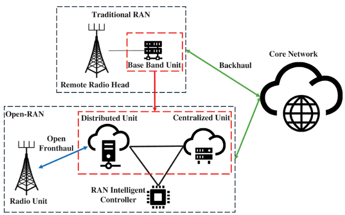
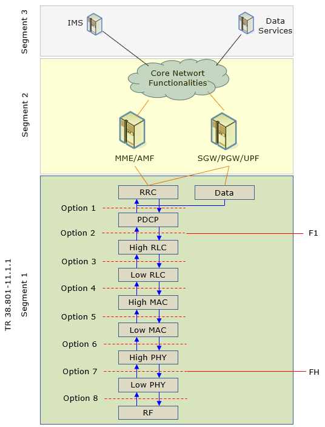
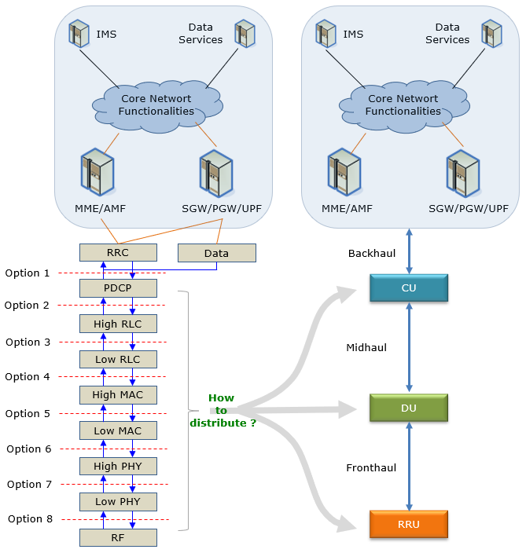
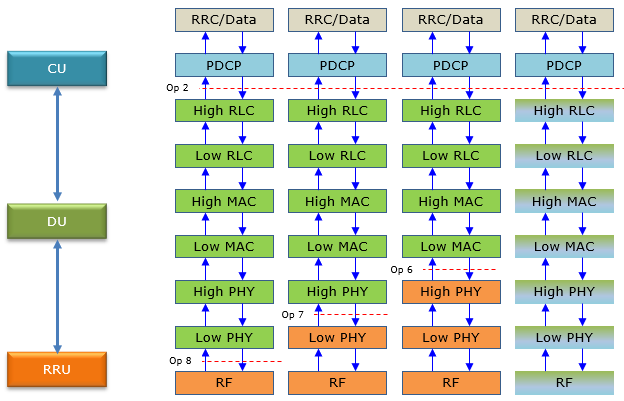

# O-RAN Fundamentals

For a long time, the Radio Access Network (RAN) has been a black box. If an operator used equipment from one vendor, then everything, hardware and software had to come from that same vendor.

O-RAN (Open Radio Access Network) aims to open that black box. By using open and standardized interfaces, components from different vendors can work together, making the RAN more flexible and interoperable.

## What is O-RAN
O-RAN refers to the standards and architecture defined by the O-RAN ALLIANCE. It transforms the traditional, monolithic base station into a modular system where hardware and software are separated, and different parts can come from different vendors.
- Traditional RAN: A proprietary "all-in-one" solution (Locked).
- O-RAN: A "Lego-like" system where you can use a Radio Unit from Vendor A, a server from Vendor B, and management software from Vendor C (Open).

## Why O-RAN
Traditional RAN architecture (the image below) is a monolithic black box. If an operator uses a specific vendor's antenna, they are forced to use that same vendor's Base Band Unit (BBU) and software. 

    
     
    <em>Traditional RAN VS O-RAN</em>

This leads to several major issues that O-RAN solves:

### 1. Avoid Vendor Lock-in
Operators were tired of getting stuck with one supplier for a long time. If a vendor's price goes up, tech lagged, etc, so did the final product.

### 2. Cost Efficiency (CapEx/OpEx)
By using "Whitebox" (generic) hardware instead of specialized proprietary gear, operators can significantly lower costs.

### 3. Faster Innovation
In a closed system, you wait for your vendor to release a feature. In an open system, a startup can develop a specific "app" for the network and deploy it 
instantly.
### Agility of 5G Use Cases
5G isn't just for phones, it's for factories, cars, and VR. O-RAN allows the network to be "sliced" and customized for these specific needs using software.

## Four Pillars Component Of O-RAN
The O-RAN ALLIANCE built their vision on four key technical principles. Think of these as the basics of the architecture:

### Pillar 1: OPEN (Open Interfaces)
This is the "handshake." O-RAN defines standardized, open interfaces (like the Open Fronthaul) so that components from different vendors can talk to each other. By using this principle, vendor A's radio unit must work together with vendor B's processor unit.

### Pillar 2: Disaggregated (Horizontal & Vertical)
Disaggregation means breaking the "big box" into smaller, functional pieces.
- Horizontal Disaggregation: Splitting the hardware from the software.
- Vertical Disaggregation: Splitting the base station (gNB) into three logical parts:
    - CU (Centralized Unit): Handles the "brainy," non-real-time tasks.
    - DU (Distributed Unit): Handles the time-sensitive data processing.
    - RU (Radio Unit): The physical antenna part that sends/receives waves.

### Pillar 3: Intelligent (RAN Intelligent Controller - RIC)
This is the "secret sauce." O-RAN introduces the RIC, which acts like an Operating System for the RAN.
- It uses AI and Machine Learning to automate the network.
- xApps and rApps: These are third-party applications that can run on the RIC to do things like "Energy Saving Mode" or "Massive MIMO Optimization" automatically.

### Pillar 4: Cloud-Native (Virtualization)
O-RAN isn't built on "boxes"; it's built on the cloud. The CU and DU functions are turned into software (VNFs or CNFs) that run on standard commercial off-the-shelf (COTS) servers (like those from Dell, HP, or AWS).The Benefit is that you can scale the network up or down just like a website scales its server capacity.

# O-RAN Architecture
In theory, the RAN can be split into multiple functional blocks, as defined in 3GPP TR 38.801 (Options 1–8). This would allow RAN components to be mixed and matched like LEGO blocks.

    
     
    <em>O-RAN Segments</em>

In practice, defining all splits is not realistic. Most Open RAN deployments focus on Option 7 and Option 2, with Option 7.2x being the most commonly used today. Some SDR-based LTE systems also use Option 8.  
O-RAN disaggregates the traditional RAN into radio, distributed, centralized, and intelligent control components, connected via open interfaces. Here is the visuals for O-RAN Logical Architecture

    
     
    <em>O-RAN Architecture</em>

Each block in the diagram represents a different component or function within the architecture. Here's a breakdown of each block:

---

### O-RU (O-RAN Radio Unit)
This unit handles all radio transmission and reception. It converts digital signals from the O-DU into radio waves, and converts received radio waves back into digital signals. Its functions are:
1. RF transmission & reception
2. Beamforming
3. Low-PHY processing
4. Digital front-end (DFE)

#### Interfaces : Open Fronthaul → O-DU

---

### O-DU (O-RAN Distributed Unit)
The Distributed Unit handles real-time processing close to the network edge. It takes care of time-critical radio signal processing and passes data between the radio unit and the central unit. Its Functions are:
1. High-PHY
2. MAC
3. Parts of RLC
4. Scheduling & HARQ

#### Interfaces
- Open Fronthaul ↔ O-RU
- F1 ↔ O-CU
- E2 ↔ Near-RT RIC
- O1 ↔ SMO

---

### O-CU (O-RAN Centralized Unit)
Split into Control Plane (CP) and User Plane (UP).

#### 1. O-CU-CP (Control Plane)
This part of the Central Unit handles control-plane tasks, like setting up and managing network connections. Its functions are:
1. RRC
2. SDAP (control)
3. PDCP (control)

#### Interfaces
- F1-C ↔ O-DU
- O1 ↔ SMO

#### 2. O-CU-UP (User Plane)
This part of the Central Unit handles user data, focusing on transmitting and routing traffic across the network. Its functions are:
1. PDCP (user data)
2. Packet routing & QoS enforcement

#### Interfaces
- F1-U ↔ O-DU
- O1 ↔ SMO

---

### Near-RT RIC (Near-Real-Time RAN Intelligent Controller)
This works on a shorter timescale than the non-real-time RIC and handles tasks that need fast reactions, such as load balancing, radio resource management, and interference control (10 ms – 1 s). Its functions are:
1. RAN optimization
2. QoS control
3. Mobility management
4. Interference mitigation

It uses xApps (Microservices) application

#### Interfaces
- E2 ↔ O-CU / O-DU
- A1 ↔ Non-RT RIC

---

### Non-RT RIC (Non-Real-Time RAN Intelligent Controller)
This component works on a longer timescale and focuses on non-real-time tasks, such as policy guidance, AI model training, and high-level network analytics (>1 s). Its functions are:
1. Policy generation
2. ML model training
3. Performance analytics
4. AI lifecycle management

It uses rApps application.  

#### Interfaces
- A1 ↔ Near-RT RIC
- O1 / O2 ↔ SMO

---

### SMO (Service Management & Orchestration)
This is the overall management and orchestration layer of O-RAN. It handles service management and helps keep the network running efficiently and adapting to changing needs. Its functions are:
1. Fault, Configuration, Accounting, Performance, Security (FCAPS)
2. Network function lifecycle management
3. Infrastructure orchestration
4. Hosts Non-RT RIC 

#### Interfaces
- O1 → Management & monitoring
- O2 → Cloud / infrastructure control

---

## O-RAN Interfaces & Transport

    
     
    <em>O-RAN Architecture</em>

The interfaces shown in the diagram you provided can be categorized into three groups: 3GPP interfaces, O-RAN interfaces, and interfaces marked for future study. Here's an explanation for each type of interface

---

### 1. 3GPP Interfaces (The Traditional Standard)
These are the standard connections defined by the global mobile comms body (3GPP). In the diagram, its the solid black lines. They include:
 
 #### X2-c and X2-u:
 These interfaces connect different types of base stations. The "X2" interface in LTE architecture facilitates communication between two eNBs (evolved Node Bs), handling control (X2-c) and user (X2-u) plane traffic.

 #### NG-u and NG-c:
 These are part of the 5G architecture, connecting the gNodeB (gNB) to the 5G Core Network. NG-u handles user plane data, while NG-c deals with the control plane.

 #### Xn-c and Xn-u:
 Similar to X2, but these interfaces are specific to 5G NR (New Radio). Xn-c is for the control plane, and Xn-u is for the user plane, linking different gNBs.

---

### 2. O-RAN Interfaces
These are specific to Open RAN. They allow us to break the base station apart into different vendors. These are the dashed green lines.

#### E1 Interface
This interface connects the O-CU-CP (Central Unit Control Plane) to the O-CU-UP (Central Unit User Plane). It facilitates communication and coordination between these two components of the Central Unit, managing control and user plane functionalities within the network.

#### E2 Interface
The E2 interface links the Near-Real Time RIC with other key RAN components such as the O-CU-CP, O-CU-UP, O-DU (Distributed Unit), and O-eNB (enhanced Node B). It enables the Near-Real Time RIC to execute control functions and real-time optimization across these network elements.

#### A1 Interface
This interface is established between the Non-Real Time RIC and the Near-Real Time RIC. It is used for policy management and strategic guidance, allowing the Non-Real Time RIC to send higher-level directives and objectives to the Near-Real Time RIC.

#### F1 Interface
The F1 interface has two components:
- F1-c: Connects the O-CU-CP to the O-DU, handling control plane communications.
- F1-u: Connects the O-CU-UP to the O-DU, responsible for transmitting user plane data.

#### FH Interface
The FH interface consists of:
- Between O-DU and O-RU (Radio Unit): Manages the forwarding of data and control signals.
- Between Service Management/Orchestration Framework and O-RU: Facilitates the orchestration and management of radio units, supporting operations like deployment, configuration, and maintenance.

#### O1 Interface
This interface links the Service Management and Orchestration Framework with the O-DU and O-CU components. It supports the orchestration and operational management of these units, enhancing flexibility and responsiveness in network operations.

#### O2 Interface
Connects the Service Management and Orchestration Framework to the O-Cloud. This interface is crucial for managing cloud resources and services, aiding in the overall orchestration and efficiency of cloud-based network functions.

---

## What Is RIC
The RAN Intelligent Controller (RIC) is a software-based part of the O-RAN architecture that controls and optimizes how the RAN behaves. It’s a key piece in Open RAN disaggregation, enabling multi-vendor interoperability, programmability, and intelligence in the RAN.  
With RIC, operators can apply control logic and optimization more flexibly, improve network performance, adapt faster to changes, and reduce operational costs.

### Key points about RIC
- **Centralized intelligence**: RIC acts as a central brain for the RAN, helping optimize resources and overall network performance.
- **Open and programmable**: It’s designed to be open, so operators can customize behavior instead of being locked to one vendor.
- **Application-based**: RIC runs apps (xApps and rApps) that automate and optimize RAN operations.
- **Near-RT and Non-RT**:
    - Near-RT RIC handles fast control decisions.
    - Non-RT RIC focuses on longer-term optimization and management.

## RIC Applications

### xApps (Near-Real-Time RIC)
- Where they run: Near-RT RIC
- Timescale: Milliseconds to seconds
- What they do: Focus on optimizing radio resources, managing interference, scheduling traffic, and other tasks requiring immediate responses to network conditions.
- Typical tasks: Radio Resource Management (RRM) optimization, load balancing, mobility management, and Quality of Service (QoS) enforcement.

### rApps (Non-Real-Time RIC)
- Where they run: Non-RT RIC
- Timescale: Seconds to minutes (or longer)
- What they do: Handle higher-level, policy-driven, and analytical tasks
- Typical tasks: Policy management, Data analytics and ML model training, Energy saving, Network slicing and long-term optimization

# RAN Functional Split (O-RAN / 5G NR)
Using the LEGO block analogy, the building blocks of the radio protocol are the layers PHY, MAC, RLC, and so on. The main idea is to split the radio protocol stack into these layers and connect them through open interfaces, as shown on the left side of the illustration. 
In an ideal world, every layer would have its own open interface. But in practice, that’s too complex. So instead, the Open RAN industry groups these layers into three main blocks, shown on the right side of the figure. This grouping is what we call the “RAN functional split” in Open RAN.

    
     
    <em>RAN Functional Split</em>

The next question is how to map all these radio layers into the three main blocks used in modern networks (for example, RRU ↔ DU ↔ CU). Is there one “best” way to do this? The short answer is no.

Different use cases need different splits, so there are many possible ways to distribute the layers. The figure below just shows some of the most commonly used split options.

    
     
    <em>RAN Splits Combinations</em>

Each layer have their own different definitions and functions. Here is the breakdown of each layer:

## PHY (Physical Layer)

### Low-PHY (O-RU)
Handles time-critical signal processing closest to RF. Its functions are:
1. FFT / IFFT
2. Cyclic prefix handling
3. Digital beamforming
4. Precoding
5. IQ sample processing

Its in O-RU because of the ultra-low latency, tight synchronization, and hardare acceleration needed.

### High-PHY (O-DU)
Processes channel-dependent PHY tasks. Its functions are:
1. Channel coding / decoding
2. Modulation / demodulation
3. Rate matching
4. HARQ feedback processing

Its on O-DU because its still real-time, but less hardware-tight and also allows centralized scheduling decisions

## MAC (Medium Access Control)
Controls radio resource allocation. Its functitons are:
1. Scheduling (UL / DL)
2. HARQ management
3. Logical channel prioritization
4. Multiplexing / demultiplexing

Its highly time-critical (1 ms TTI), main target for RIC optimization via E2.

## RLC (Radio Link Control)
Sometimes often located in O-DU, sometimes split with O-CU. Its for ensures reliable data transfer over radio. Its functions are:
1. Segmentation & reassembly
2. ARQ (Acknowledged Mode)
3. In-sequence delivery
4. Error recovery

It have 3 modes, they are:
1. AM (Acknowledged Mode)
2. UM (Unacknowledged Mode)
3. TM (Transparent Mode)

##  PPDCP (Packet Data Convergence Protocol)
Located on O-CU. It handles IP-level processing & security. It functions are:
1. Header compression (ROHC)
2. Ciphering & integrity protection
3. Packet reordering
4. Handover support

## RRC (Radio Resource Control)
Located on O-CU-CP. Controls connection and mobility. Its functions are:
1. RRC connection setup / release
2. UE mobility & handover
3. Measurement configuration
4. Security key management

## Layer-By-Layer Table
| Layer        | Location  | Purpose            | Time Sensitivity |
| ------------ | --------- | ------------------ | ---------------- |
| **Low-PHY**  | O-RU      | Signal processing  | Ultra-high       |
| **High-PHY** | O-DU      | Channel processing | Very high        |
| **MAC**      | O-DU      | Scheduling         | Very high        |
| **RLC**      | O-DU / CU | Reliability        | Medium           |
| **PDCP**     | O-CU      | Security & IP      | Medium           |
| **RRC**      | O-CU-CP   | Control & mobility | Low              |

# HW vs FW vs SW

O-RAN separates radio processing, control intelligence, and management using standardized interfaces and time-based control loops.

# Automation in O-RAN

### AI/ML For RAN

### Network Automation

