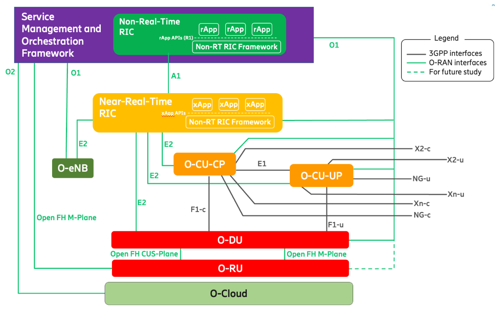
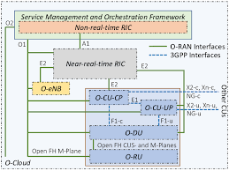

# O-RAN Fundamentals
For decades, the Radio Access Network (RAN) are the part of the network that connects your phone to the cell tower, but it is mostly a "black box". If you bought a base station from Vendor A, every single screw, cable, and line of code had to come from Vendor A. O-RAN (Open Radio Access Network) is the movement to crack that box open.

## What is O-RAN
O-RAN refers to the standards and architecture defined by the O-RAN ALLIANCE. It transforms the traditional, monolithic base station into a modular system where hardware and software are separated, and different parts can come from different vendors.
- Traditional RAN: A proprietary "all-in-one" solution (Locked).
- O-RAN: A "Lego-like" system where you can use a Radio Unit from Vendor A, a server from Vendor B, and management software from Vendor C (Open).

## Why O-RAN
Traditional RAN architecture (the image below) is a monolithic black box. If an operator uses a specific vendor's antenna, they are forced to use that same vendor's Base Band Unit (BBU) and software. 


This leads to several major issues that O-RAN solves:

### 1. Avoid Vendor Lock-in
Operators were tired of getting stuck with one supplier for a long time. If a vendor's price goes up, tech lagged, etc, so did the final product.

### 2. Cost Efficiency (CapEx/OpEx)
By using "Whitebox" (generic) hardware instead of specialized proprietary gear, operators can significantly lower costs.

### 3. Faster Innovation
In a closed system, you wait for your vendor to release a feature. In an open system, a startup can develop a specific "app" for the network and deploy it instantly.

### Agility of 5G Use Cases
5G isn't just for phones, it's for factories, cars, and VR. O-RAN allows the network to be "sliced" and customized for these specific needs using software.

## Four Pillars Component Of O-RAN
The O-RAN ALLIANCE built their vision on four key technical principles. Think of these as the basics of the architecture:

### Pillar 1: OPEN (Open Interfaces)
This is the "handshake." O-RAN defines standardized, open interfaces (like the Open Fronthaul) so that components from different vendors can talk to each other. By using this principle, vendor A's radio unit must work together with vendor B's processor unit.

### Pillar 2: Disaggregated (Horizontal & Vertical)
Disaggregation means breaking the "big box" into smaller, functional pieces.
- Horizontal Disaggregation: Splitting the hardware from the software.
- Vertical Disaggregation: Splitting the base station (gNB) into three logical parts:
    - CU (Centralized Unit): Handles the "brainy," non-real-time tasks.
    - DU (Distributed Unit): Handles the time-sensitive data processing.
    - RU (Radio Unit): The physical antenna part that sends/receives waves.


### Pillar 3: Intelligent (RAN Intelligent Controller - RIC)
This is the "secret sauce." O-RAN introduces the RIC, which acts like an Operating System for the RAN.
- It uses AI and Machine Learning to automate the network.
- xApps and rApps: These are third-party applications that can run on the RIC to do things like "Energy Saving Mode" or "Massive MIMO Optimization" automatically.

### Pillar 4: Cloud-Native (Virtualization)
O-RAN isn't built on "boxes"; it's built on the cloud. The CU and DU functions are turned into software (VNFs or CNFs) that run on standard commercial off-the-shelf (COTS) servers (like those from Dell, HP, or AWS).The Benefit is that you can scale the network up or down just like a website scales its server capacity.

# O-RAN Architecture
O-RAN disaggregates the traditional RAN into radio, distributed, centralized, and intelligent control components, connected via open interfaces. Here is the visuals for O-RAN Logical Architecture


### O-RU (O-RAN Radio Unit)
Handles radio frequency (RF) and lower physical layer processing. Its functions are:
1. RF transmission & reception
2. Beamforming
3. Low-PHY processing
4. Digital front-end (DFE)

#### Interfaces : Open Fronthaul → O-DU

#### Key Characteristics
- Real-time, hardware-centric
- Time-sensitive (tight latency & sync)
- Vendor-independent via open fronthaul

### O-DU (O-RAN Distributed Unit)
Performs real-time baseband processing close to the radio. Its Functions are:
1. High-PHY
2. MAC
3. Parts of RLC
4. Scheduling & HARQ

#### Interfaces
- Open Fronthaul ↔ O-RU
- F1 ↔ O-CU
- E2 ↔ Near-RT RIC
- O1 ↔ SMO

#### Key Characteristics
- Real-time constraints (≈ sub-millisecond)
- Often deployed at edge/cloud-edge
- Central point for RAN control


### O-CU (O-RAN Centralized Unit)
Split into Control Plane (CP) and User Plane (UP).

### O-CU-CP (Control Plane)
Manages signaling and mobility control. Its functions are:
1. RRC
2.  SDAP (control)
3.  PDCP (control)

#### Interfaces
- F1-C ↔ O-DU
- O1 ↔ SMO

### O-CU-UP (User Plane)
Handles user data forwarding. Its functions are:
1. PDCP (user data)
2. Packet routing & QoS enforcement

#### Interfaces
- F1-U ↔ O-DU
- O1 ↔ SMO

### Near-RT RIC (Near-Real-Time RAN Intelligent Controller)
Provides real-time RAN optimization and control (10 ms – 1 s). Its functions are:
1. RAN optimization
2.  QoS control
3. Mobility management
4. Interference mitigation

It uses xApps (Microservices) application

#### Interfaces
- E2 ↔ O-CU / O-DU
- A1 ↔ Non-RT RIC

#### Key Characteristics
- Event-driven control loops
- ML-assisted decision making
- Centralized intelligence for multi-vendor RAN

### Non-RT RIC (Non-Real-Time RAN Intelligent Controller)
Performs long-term optimization and policy management (>1 s). Its functions are:
1. Policy generation
2. ML model training
3. Performance analytics
4. AI lifecycle management

It uses rApps application.  

#### Interfaces
- A1 ↔ Near-RT RIC
- O1 / O2 ↔ SMO

#### Key Characteristics
- Strategic, not time-critical
- Integrated into SMO
- Data-driven optimization

### SMO (Service Management & Orchestration)
End-to-end management, orchestration, and lifecycle control of O-RAN. It functions are:
1. Fault, Configuration, Accounting, Performance, Security (FCAPS)
2. Network function lifecycle management
3. Infrastructure orchestration
4. Hosts Non-RT RIC

#### Interfaces
- O1 → Management & monitoring
- O2 → Cloud / infrastructure control

#### Key Characteristics
- Central authority of O-RAN
- Cloud-native (Kubernetes, containers)
- Vendor-agnostic management

# RAN Functional Split (O-RAN / 5G NR)
RAN functions are split across O-RU, O-DU, and O-CU to balance latency, scalability, and flexibility.

```
O-RU        O-DU              O-CU
│           │                 │
│ Low-PHY   │ High-PHY        │ PDCP
│           │ MAC             │ RRC
│ RF        │ RLC (part)      │ SDAP
```

## PHY (Physical Layer)

### Low-PHY (O-RU)
Handles time-critical signal processing closest to RF. Its functions are:
1. FFT / IFFT
2. Cyclic prefix handling
3. Digital beamforming
4. Precoding
5. IQ sample processing

Its in O-RU because of the ultra-low latency, tight synchronization, and hardare acceleration needed.

### High-PHY (O-DU)
Processes channel-dependent PHY tasks. Its functions are:
1. Channel coding / decoding
2. Modulation / demodulation
3. Rate matching
4. HARQ feedback processing

Its on O-DU because its still real-time, but less hardware-tight and also allows centralized scheduling decisions

## MAC (Medium Access Control)
Controls radio resource allocation. Its functitons are:
1. Scheduling (UL / DL)
2. HARQ management
3. Logical channel prioritization
4. Multiplexing / demultiplexing

Its highly time-critical (1 ms TTI), main target for RIC optimization via E2.

## RLC (Radio Link Control)
Sometimes often located in O-DU, sometimes split with O-CU. Its for ensures reliable data transfer over radio. Its functions are:
1. Segmentation & reassembly
2. ARQ (Acknowledged Mode)
3. In-sequence delivery
4. Error recovery

It have 3 modes, they are:
1. AM (Acknowledged Mode)
2. UM (Unacknowledged Mode)
3. TM (Transparent Mode)

##  PPDCP (Packet Data Convergence Protocol)
Located on O-CU. It handles IP-level processing & security. It functions are:
1. Header compression (ROHC)
2. Ciphering & integrity protection
3. Packet reordering
4. Handover support

## RRC (Radio Resource Control)
Located on O-CU-CP. Controls connection and mobility. Its functions are:
1. RRC connection setup / release
2. UE mobility & handover
3. Measurement configuration
4. Security key management

## Layer-By-Layer Table
| Layer        | Location  | Purpose            | Time Sensitivity |
| ------------ | --------- | ------------------ | ---------------- |
| **Low-PHY**  | O-RU      | Signal processing  | Ultra-high       |
| **High-PHY** | O-DU      | Channel processing | Very high        |
| **MAC**      | O-DU      | Scheduling         | Very high        |
| **RLC**      | O-DU / CU | Reliability        | Medium           |
| **PDCP**     | O-CU      | Security & IP      | Medium           |
| **RRC**      | O-CU-CP   | Control & mobility | Low              |


# Interfaces & Control Plane 
O-RAN separates radio processing, control intelligence, and management using standardized interfaces and time-based control loops.



## Open Fronthaul
Located between **O-RU ↔ O-DU**. Transport radio signals and timing. 

#### Carries
- IQ samples
- Beamforming data
- Timing & synchronization (PTP)

#### Characteristics
- Ultra-low latency
- High bandwidth
- Deterministic timing

#### Typical Tech
- Ethernet
- eCPRI
- IEEE 1588v2 (PTP)

#### Why it matters
- Enables multi-vendor RU/DU
- Tight latency & sync constraints
- Critical security and performance boundary

## E2 Interface
Located near-RT RIC ↔ O-CU / O-DU. Real-time RAN control & telemetry

#### Carries
- RAN measurements
- Control commands
- Scheduling & QoS adjustments

#### Timescale
10 ms – 1 s

#### Protocols
- E2AP
- E2 Service Models (SMs)
- SCTP + TLS

#### Why it matters
- Direct influence on MAC / PHY behavior
- Primary interface for xApps

## A1 Interface
Located between Non-RT RIC ↔ Near-RT RIC. It purpose are for Policy and AI/ML control. 

#### Carries
- RAN policies
- Optimization objectives
- ML models & parameters

#### Timescale
> 1 s

#### Protocols
- REST APIs
- Secure transport (TLS)

#### Why it matters
- Governs how Near-RT RIC behaves
- Policy misuse affects entire RAN

## O1 Interface
Located between SMO ↔ O-RU / O-DU / O-CU / RIC. Its for Management & monitoring. 

#### Carries
- Configuration
- Performance metrics
-  Fault & alarms
- Logs & telemetry

#### Timescale
- Minutes → hours

#### Protocols
- NETCONF / RESTCONF
- YANG models

#### Why it matters
- Operational visibility
- Centralized management plane

## O2 Interface
Located between SMO ↔ Cloud Infrastructure (NFVI / Kubernetes). Infrastructure orchestration

#### Carries
- CNF / VNF lifecycle commands
- Resource allocation
- Scaling & placement

#### Timescale
- Seconds → minutes

#### Protocols
- Cloud APIs
- Kubernetes APIs

#### Why it matters
- Connects telecom functions to cloud resources
- Infrastructure compromise = systemic risk

## RIC Control Loops
O-RAN introduces closed-loop control based on timescales.

### Non-RT RIC Control Loop
#### Timescale:
> 1 second

#### Functions
- Long-term optimization
- Policy generation
- ML model training
- Analytics & reporting

#### Output
- Policies & models via A1

#### Hosted in
- SMO

### Near-RT RIC Control Loop
### Timescale:
> 10 ms – 1 second

#### Functions
- Real-time RAN optimization
- QoS enforcement
- Mobility & interference control

#### Input / Output
- Measurements via E2
- Control actions via E2

## Appplications in RIC
### xApps (Near-RT RIC)
Its purpose are to execute real-time control logic

#### Characteristics
- Event-driven
- Microservices
- Operate on E2 data

#### Examples
- QoS optimization
- Traffic steering
- Load balancing

#### Impact
- Directly afects radio behavior

### rApps (Non-RT RIC)
Its purpose are to execute non-real-time intelligence.

####  Characteristics
- Data-driven
- ML / analytics focused
- Policy-oriented

#### Examples
- Traffic forecasting
- Network planning
- ML model training

#### Impact
- Indirect, strategic control


