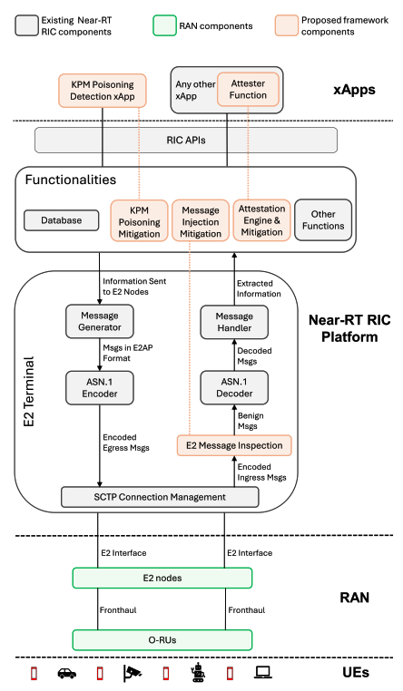
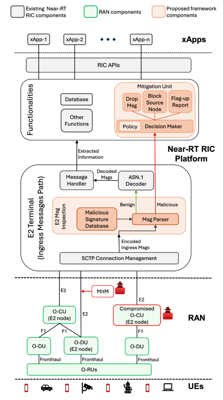
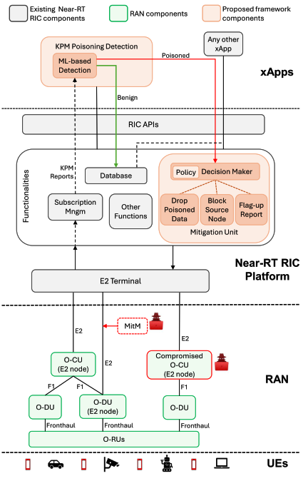
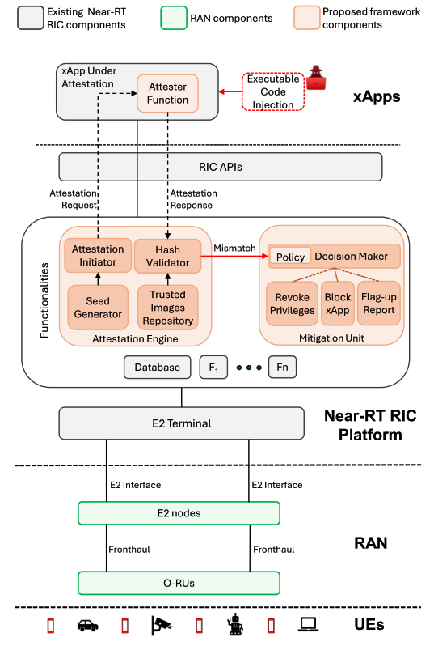
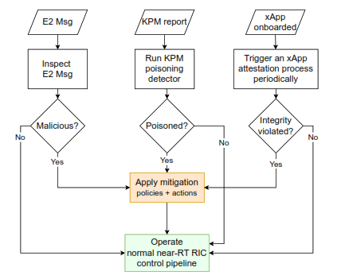
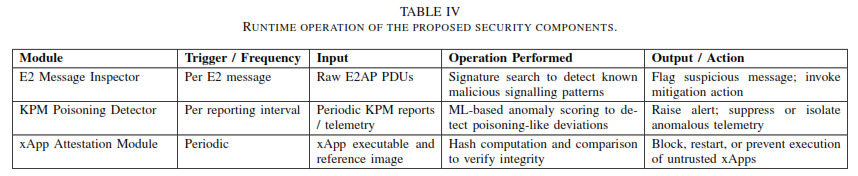
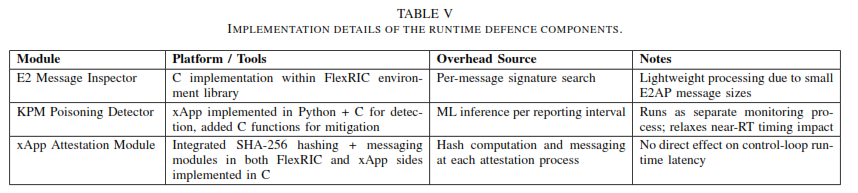
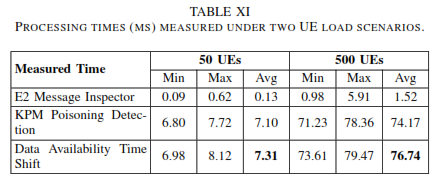

# Towards a Multi-Layer Defence Framework for Securing Near-Real-Time Operations in Open RAN

Author = Alimohammadi, H., Mayhoub, S., Chatzimiltis, *et al.*  
Year = 2025

## Abstract
Securing near-real-time (near-RT) control in Open RAN is becoming more important as attacks increasingly target the system while it is already running. However, most existing security mechanisms focus on onboarding, authentication, or confguration, and do little to protect the near-RT control loop during live operation. In the paper, they focus specifically on runtime security of the near-RT RIC (RAN Intelligent Controller). They group operational-time threats into 3 practical categories; message level, data level, and control logic level and design a multi layer defence framework that places lightweight detection and mitigation mechanisms at each of these points. Their impplementation includes a 
1. signature-based E2 message inspection module for detecting malicious signalling, 
2. a telemetry poisoning detector based on temporal anomaly detection using and LSTM model, 
3. and a runtime xApp attestation mechanism based on execution-time hash verification.

The framework is implemented on an Open RAN testbed using FlexRIC and a commercial RAN emulator.
 
Experimental results show that the proposed safeguards achieve effective detection while staying within near-RT timing constraints, introducing less than 80 ms of overhead even in scenarios with 500 UEs. Overall, this work shows that layered, policy-driven untime protection for the near-RT RIC is both feasible and practical, and provides a foundation for extending Open RAN security beyond static, pre-runtime defences

## System Model & Architecture

### A. System Model
They consider an Open RAN architecture where the RAN is disaggregated into O-RUs, O-DUs, and O-CUs, following the 3GPP NR Functional split (7.2). The near-real-time RIC operates at sub-second timescales (10 ms & 1 s) and interacts with the RAN through the standardised E2 interface. Control and optimisation logic is implemented in xApps, which run on top of the near-RT RIC platform and consume telematry data from E2 nodes to make control decisions.  
Within this system, the near-RT RIC sits directly in the operational control loop: it receives E2 signalling and telemetry (e.g., KPM reports), processes this information through xApps, and issues control actions that can affect scheduling, mobility, and resource allocation. Because of this position, any manipulation of inputs or control logic at runtime can immediately impact network behaviour.
In the paper, they focus on runtime threats that originate outside the near-RT RIC platform itself. They assume that the internal RIC platform is trusted and secured using mechanisms defined by O-RAN Alliance specifications (e.g., secure onboarding, authentication, and platform hardening). Threats that require compromising the RIC operating system or infrastructure are therefore out of scope. Instead, we consider adversaries that influence the near-RT control loop through external interfaces or components, such as compromised E2 nodes, man-in-the-middle (MitM) attacks on the E2 interface, or tampered xApps.

### B. Architectural Design Principles
To address threats mentioned in the paper, they design a multi-layer runtime defence architecture that aligns protection mechanisms with their corresponding threat surfaces. The key ideas of design principles are:
1. Layered Protection: Each threat category is handled by a dedicated detection mechanism placed as close as possible to the point where the threat manifests.
2. Runtime operation: All safeguards operate during live execution and do not rely solely on pre-deployment validation
3. Low overhead: Detection and mitigation must stay within near-RT timing constraints
4. Modularity and extensibility: Components can be deployed independently and extended to support future threat types.

### C. Proposed Architecture

    
     
    <em>Figure 1. Architecture of the proposed runtime security framework </em>

Figure 1 illustrates how the proposed defence components integrate into the near-RT RIC architecture. The framework consists of three detection modules, each paired with a policy-driven mitigation unit deployed within the near-RT RIC platform:
- A message-level E2 inspection module placed at the E2 ingress, intercepting incoming messages before they reach the RIC message handler.
- A data-level telemetry poisoning detector, implemented as a standalone xApp that analyses KPM reports and provides verified telemetry to other xApps.
- A control logic-level runtime xApp attestation mechanism, where the near-RT RIC periodically verifies the integrity of executing xApps.

All mitigation actions such as dropping messages, isolating telemetry, or revoking xApp privileges are handled centrally by the near-RT RIC platform based on operator-defined policies. This separation between detection and mitigation allows flexible responses without modifying detection logic.

### E2 Message Inspection 
This part focuses on protecting the E2 interface. All E2 messages entering the near-RT RIC are checked before they are processed further. The idea is that some attacks use messages that are still protocol-compliant, so basic ASN.1 validation is not enough.

    
     
    <em>E2 message inspection and associated mitigation</em>

Incoming E2 messages are inspected at the byte level and compared against a set of known malicious signatures. These signatures are patterns that have been observed to cause harmful behaviour once the message is decoded or consumed by xApps. If a match is found, the message is marked as malicious and does not enter the normal RIC processing pipeline.  
The detection logic is kept simple and fast, since E2 messages are relatively small. Mitigation is handled separately and can include dropping the message or blocking the source E2 node. This inspection step adds very little delay and does not affect near-real-time operation.

### KPM Poisoning Detection (And Mitigation)
This component deals with attacks that target telemetry instead of signalling. Even if E2 messages are valid, the values inside KPM reports can be manipulated to mislead xApps.

    
     
    <em>KPM poisoning detection and mitigation.</em>

The poisoning detector is implemented as a separate xApp that subscribes to KPM reports. It observes how KPM values evolve over time and learns normal temporal patterns. Instead of checking individual values, it looks for abnormal behaviour across sequences of measurements.  
An LSTM model is used to capture these temporal dependencies. When incoming telemetry deviates significantly from learned patterns, it is flagged as suspicious. Poisoned data can then be discarded or isolated so that other xApps do not act on it. 
This detection runs within the near-RT time window and remains under the allowed latency budget, even when the number of UEs increases.

### xApp Attestation and Integrity Violation Mitigation
This part focuses on the integrity of xApps themselves. Since xApps can be developed by third parties and run continuously, there is a risk that their code is modified at runtime.

    
     
    <em>xApp attestation and integrity violation mitigation.</em>

The near-RT RIC periodically challenges running xApps to prove that their code has not been altered. Each challenge includes a random seed, which the xApp uses to compute a hash over its runtime memory. The RIC compares this hash with a reference value generated from a trusted version of the xApp.  
If the values do not match, the xApp is considered compromised. The RIC can then revoke its permissions or stop it entirely. This process runs outside the critical control path, so it does not interfere with real-time decision making.

### Summary of Runtime Behaviour
All three components operate at the same time and protect different parts of the near-RT control loop. E2 message inspection filters malicious signalling, KPM poisoning detection ensures telemetry can be trusted, and runtime attestation checks that xApps themselves remain intact.
Together, these mechanisms provide continuous protection while the system is running, without relying only on pre-deployment security checks and without violating near-real-time constraints.

## Security Assumptions
In the paper, they make several assumptions to clearly define the threat model and the scope of the proposed runtime defences.  
1. **The near-RT RIC Platform itself is assumed to be trusted**. This includes the underlying operating system, container runtime, and core RIC services.
2. **They assume that external RAN components are not fully trusted.** This includes E2 nodes such as O-DUs and O-CUs. These components may be compromised, misconfigured, or behave maliciously, either intentionally or due to software faults. As a result, signalling and telemetry arriving at the near-RT RIC cannot be blindly trusted.
3. **E2 interface is treated as a potential attack surface.** Even though secure transport may be used, we assume that attackers may still inject or manipulate E2 messages, for example through compromised nodes or man-in-the-middle scenarios. Therefore, E2 messages are considered untrusted until validated at runtime.
4. **Telemetry data (KPM reports) is assumed to be untrusted by default.** The paper assumes that attackers can poison performance measurements in ways that remain protocol-compliant but still mislead control logic. This is why telemetry must be checked during operation rather than trusted implicitly.
5. **xApps are assumed to be semi-trusted.** They are trusted at deployment time, but not assumed to remain trustworthy throughout execution. Since xApps may be third-party and long-running, the paper assumes they can be modified or tampered with at runtime, which motivates the need for continuous attestation.
6. **The attacker is assumed to operate during system runtime, not just before deployment.** The attacker’s goal is to influence the near-RT control loop by manipulating messages, data, or control logic, rather than by taking down the infrastructure entirely.

## Threat Model / Attack Scenario
Based on how the near-RT contorl loop operates, they model runtime threats along 3 main surfaces:

### 1. Message-Level Threats
These threats target the signalling path between E2 nodes and the near-RT RIC. An attacker may inject syntactically valid but semantically malicious E2 messages that exploit weaknesses in message handling or downstream logic. Because these messages are protocol-compliant, basic validation is often insufficient to detect them.

### 2. Data-Level Threats
Data-Level threats aim to manipulate telemetry used by xApps, such as Key Performance Measurements (KPMs). By poisoning or falsifying these inputs, an attacker can mislead ML-based or rule-based control logic, causing suboptimal or harmful decisions even though the signalling itself appears legitimate.

### 3. Control Logic-Level Threats
These threat catogories are complementary rather than overlapping. Each targets a different stage of the near-RT execution pipeline, which means that no single protection mechanisms can address all of them effectively.

## Methodology And Implementation Details
This section explains how each defence component was implemented on a real Open RAN testbed and evaluates whether it actually works under near-real-time constraints. The E2E Runtime workflow look like this figure below.

    
     
    <em>E2E Runtime Workflow</em>

    
     
    <em>Runtime Operation Of The Proposed Security Components</em>

    
     
    <em>Table V. Implementation DEtaails Of The Runtime Defence Components</em>

---

### A. E2 Message Inspector
The E2 message inspector is implemented directly at the ingress of the near-RT RIC, before incoming messages are decoded and forwarded to xApps. The inspection is done on the raw E2 message payload, treating it as a byte stream rather than relying on ASN.1 decoding.  
The detection mechanism uses a signature-based approach. Each incoming message is compared against a database of predefined malicious patterns. These patterns correspond to known attack behaviours that are still syntactically valid at the protocol level but can trigger unintended behaviour once processed.  
The inspector was evaluated using different E2 message types, including E2 Setup, RIC Indication, and RIC Control messages. Since RIC Indication messages dominate near-RT traffic, they were the main focus for latency measurements.

#### Results

    
     
    <em>Processing Times Measured Under Two UE Load Scenarios</em>

- Average inspection latency for RIC Indication messages stays well below 1 ms.
- Larger messages, such as E2 Setup messages, incur higher inspection time, but these are exchanged outside the near-RT control loop.
- The inspector does not cause measurable degradation to near-RT performance.

The results show that signature-based inspection is practical at the E2 ingress and can filter malicious signalling without violating timing requirements.

---

### B. KPM Poisoning Detection

    
     
    <em>KPM Poisoning Dataset Features</em>

The KPM poisoning detector is implemented as a dedicated xApp running on the near-RT RIC. It subscribes to periodic KPM reports from E2 nodes and analyses telemetry over time rather than relying on single snapshots.
 
An LSTM-based model is used to learn normal temporal patterns in KPM values. During operation, incoming telemetry sequences are compared against the learned model, and deviations beyond a defined threshold are flagged as poisoning attempts. Here are some evaluation of the LSTM-based model in performance detection

    
     
    <em>Detection Performance Metrics Of LSTM Across Different Amplification Factors (AF)</em>

Those components are:
1. AF (Amplification Factor): Represents the intensity of the attack (1.2x to 1.5x normal values).
2. ADR (Attack Detection Rate): The model is extremely effective, catching between 97.99% and 99.40% of attacks.
3. FPR (False Positive Rate): Very low (0.01% - 0.02%), meaning it rarely accidentally blocks legitimate traffic.
4. Latency: Consistently 0.15 ms, which is very fast and suitable for real-time loops.
 

The evaluation was performed by injecting poisoned KPM data into the telemetry stream while varying the number of connected UEs.

#### Results

    
     
    <em>Processing Times Measured Under Two UE Load Scenarios</em>

- With 50 UEs, the additional processing delay introduced by the detector remains under 8 ms.
- With 500 UEs, the delay increases but stays below 80 ms, which is still within near-RT constraints.
- The detector successfully identifies anomalous telemetry patterns caused by poisoning attacks while allowing normal fluctuations to pass.

---

### C. Runtime xApp Attestation
Runtime xApp attestation is implemented as a challenge–response mechanism between the near-RT RIC and running xApps. Each xApp includes a lightweight attester function that responds to integrity challenges issued by the RIC.

For each challenge, the RIC sends a random seed. The xApp uses this seed to compute a hash over its runtime memory. The RIC independently computes the expected hash based on a trusted reference image of the xApp. A mismatch indicates runtime tampering.

The attestation process is executed periodically and runs outside the near-RT control path.

#### Results

    
     
    <em>xApp Attestation Latency</em>

    
     
    <em>xApp Attestation Latency per MB Of xApp Size</em>

- The very first time they check the xApp (Round 1), it takes a long time (35-40ms). This is because the computer has to load everything into cache. From Round 2 onwards, it drops drastically
- Hash computation time scales linearly with xApp size.
- After warm-up, the measured cost is approximately 0.67 ms per MB of xApp memory.
- Because attestation is decoupled from the control loop, it does not affect near-RT decision latency.

This shows that continuous integrity verification of xApps is feasible without interfering with live RAN operation.

---

## Key Concepts 
- Runtime security as the main focus
    - The paper treats security during live operation as a core problem, not just something handled at onboarding or deployment.
    - Attacks are assumed to happen while the near-RT control loop is active.
- Layered runtime threat model for the near-RT RIC
    - Runtime threats are grouped into three levels:
        - Message-level (E2 signalling)
        - Data-level (KPM telemetry)
        - Control logic-level (xApps)
    - Each layer maps directly to a stage in the near-RT control loop.
- Signature-based E2 message inspection at ingress
    - Raw E2 messages are inspected before decoding.
    - Detects malicious patterns that are still ASN.1-compliant.
    - Acts as a first filter before messages reach xApps.
- Runtime KPM poisoning detection using temporal analysis
    - Telemetry is not trusted by default.
    - An LSTM-based model detects abnormal temporal behaviour in KPM reports.
    - Implemented as an xApp so it integrates naturally into the RIC.
- Continuous runtime xApp attestation
    - xApps are verified repeatedly during execution, not just at onboarding.
    - Uses challenge–response hashing over runtime memory.
    - Detects code injection or runtime tampering.
- Separation of detection and mitigation
    - Detection components only flag suspicious behaviour.
    - Mitigation actions (drop, block, revoke) are policy-driven and handled by the RIC.
    - Makes the systm flexible and easier to extend.

## Terminologies To Study
- near-RT RIC (Near-Real-Time RAN Intelligent Controller)
    - Operates at ~10 ms–1 s timescales.
    - Hosts xApps and interacts with the RAN via the E2 interface.

- xApp
    - Near-RT RIC applications that implement control or optimization logic.
    - Can be ML-based or rule-based.

- E2 Interface
    - Standardized interface between near-RT RIC and E2 nodes (O-DU /   O-CU).
    - Uses ASN.1 encoding and supports control, indication, and setup messages.

- E2 Node
    - RAN components (O-DU / O-CU) that communicate with the RIC over E2.

- KPM (Key Performance Measurement)
    - Telemetry reports sent over E2.
    - Includes metrics such as throughput, latency, and radio resource usage.

- ASN.1 Encoding
    - Used for E2 message definition and serialization.
    - Messages can be syntactically valid but semantically malicious.

- SMO (Service Management and Orchestration)
    - Management-layer component in O-RAN architecture.
    - Receives alerts or reports from the near-RT RIC.

- LSTM (Long Short-Term Memory)
    - Used for temporal anomaly detection in KPM poisoning detection.

- Runtime Attestation
    - Integrity verification during execution, not only at deployment.
    - Uses challenge–response and hashing over runtime memory.

## Standard References
- O-RAN Alliance Specifications
- 3GPP Specifications (NR / RAN Architecture)
- O-RAN E2 Service Models
- FlexRIC
- Machine Learning for Anomaly Detection (LSTM-based)
- Runtime Integrity and Attestation Mechanisms

## Open Questions / Gaps

### A. What they didn’t test

- Adaptive or learning attackers
    - The paper evaluates fixed attack patterns (known signatures, injected poisoning).
    - It doesn’t test attackers that adapt over time to evade signatures or anomaly thresholds.

- Zero-day E2 message attacks
    - The E2 inspector relies on predefined malicious signatures.
    - There’s no evaluation of previously unseen or obfuscated E2 attack patterns.

- Multiple malicious xApps acting together
    - Runtime attestation is tested on individual xApps.
    - Coordinated attacks involving multiple compromised xApps are not explored.
- Very high-load or carrier-scale scenarios
    - Experiments go up to 500 UEs.
    - Performance at thousands of UEs or multi-cell dense deployments is not evaluated.

- False positives under extreme but legitimate traffic changes
    - KPM poisoning detection is evaluated with injected anomalies.
    - Scenarios like flash crowds or rapid mobility spikes are not deeply tested.

---

### What feels unrealistic
- Trusted near-RT RIC platform assumption
    - The paper assumes the RIC OS and infrastructure are fully trusted.
    - In real deployments, partial compromise or misconfiguration could happen.

- Clean separation between detection and mitigation
    - Policy-driven mitigation is assumed to work smoothly.
    - In practice, operators may struggle to define correct policies without causing service impact.

---

### What could be done in a real lab or future work
- Test against adaptive and stealthy attackers
    - Introduce attackers that slowly poison telemetry or evolve E2 messages to avoid detection.
- Combine signature-based and anomaly-based E2 inspection
- Evaluate larger-scale deployments

---

# Paper 2 Title

## Abstract
(What problem, what angle, why it matters)

## System Model & Architecture
(What part of O-RAN / WG11 they touch: RIC, E2, xApps, data flow)

## Security Assumptions
(What they assume is trusted / untrusted)

## Threat Model / Attack Scenario
Threat Model / Attack Scenario

## Methodology
How they did the research

## Validation & Evaluation
How they prove it works

## Key Concepts 
New ideas or mechanisms introduced

## Terminologies To Study
Protocols, acronyms, interfaces i don’t fully know yet

## Standard References
Protocols, acronyms, interfaces you don’t fully know yet

## Open Questions / Gaps
- What they didn’t test
- What feels unrealistic
- What could be done in a real lab

# Paper 3 Title

## Abstract
(What problem, what angle, why it matters)

## System Model & Architecture
(What part of O-RAN / WG11 they touch: RIC, E2, xApps, data flow)

## Security Assumptions
(What they assume is trusted / untrusted)

## Threat Model / Attack Scenario
Threat Model / Attack Scenario

## Methodology
How they did the research

## Validation & Evaluation
How they prove it works

## Key Concepts 
New ideas or mechanisms introduced

## Terminologies To Study
Protocols, acronyms, interfaces i don’t fully know yet

## Standard References
Protocols, acronyms, interfaces you don’t fully know yet

## Open Questions / Gaps
- What they didn’t test
- What feels unrealistic
- What could be done in a real lab